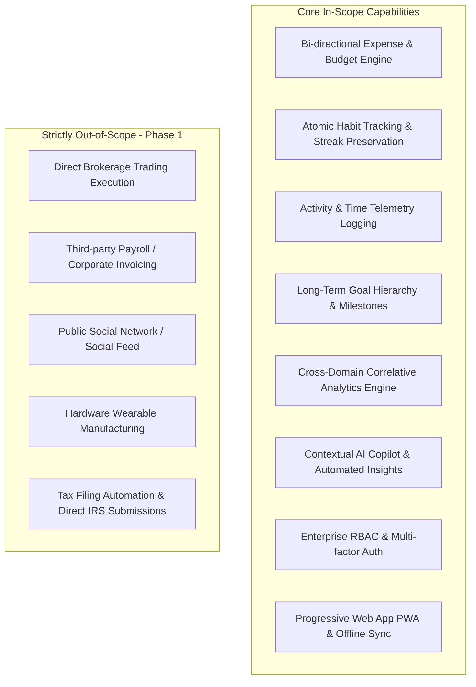
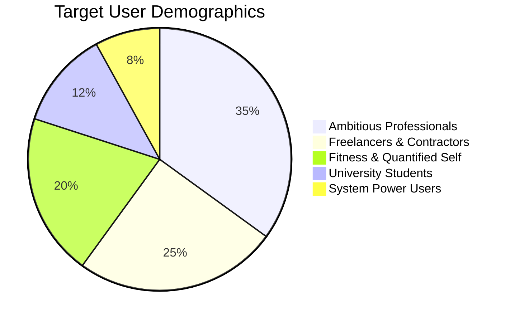
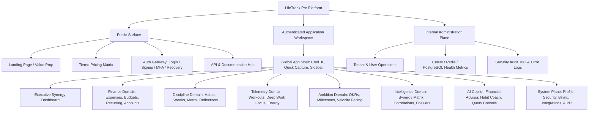
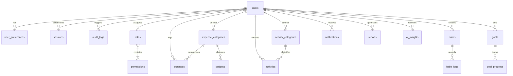
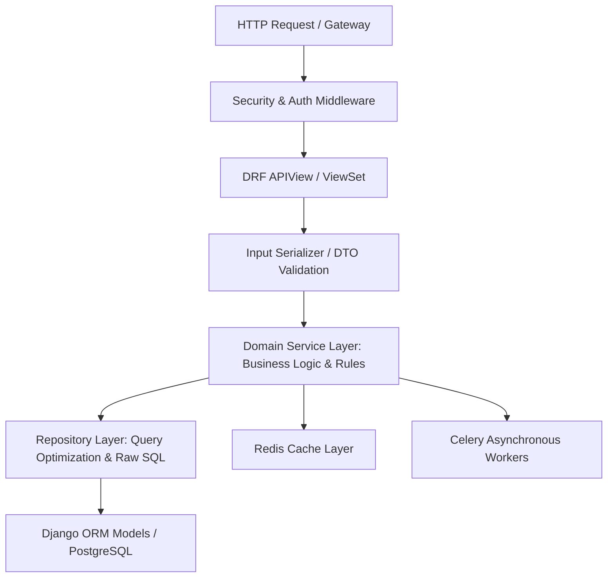
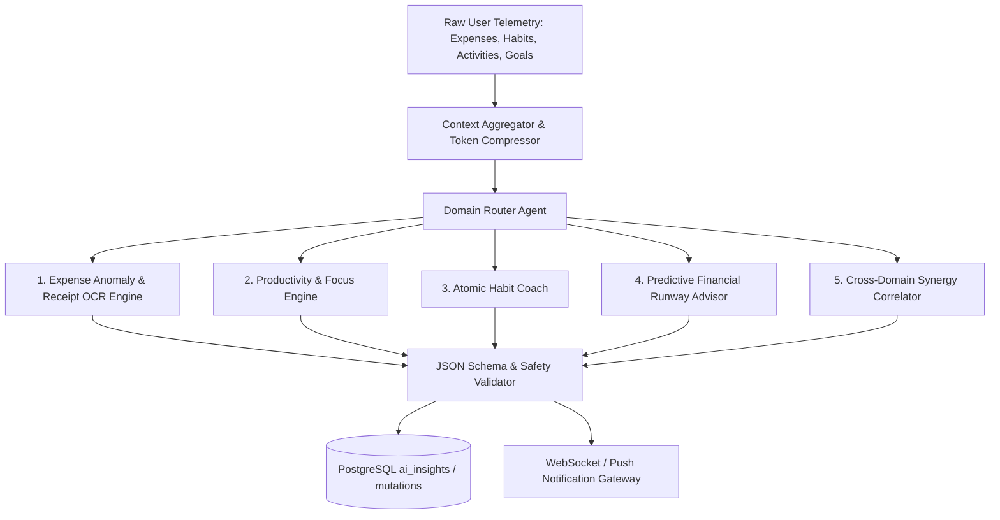
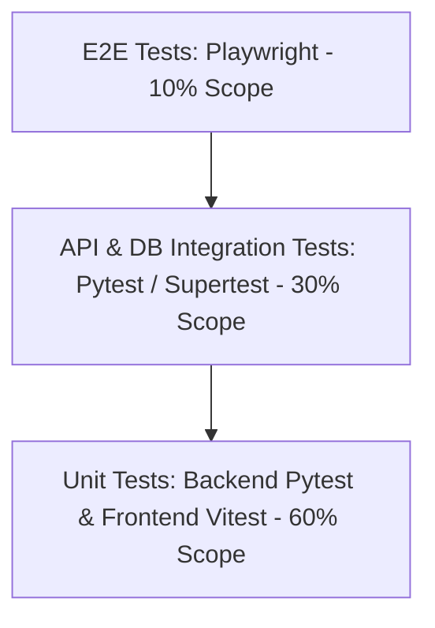
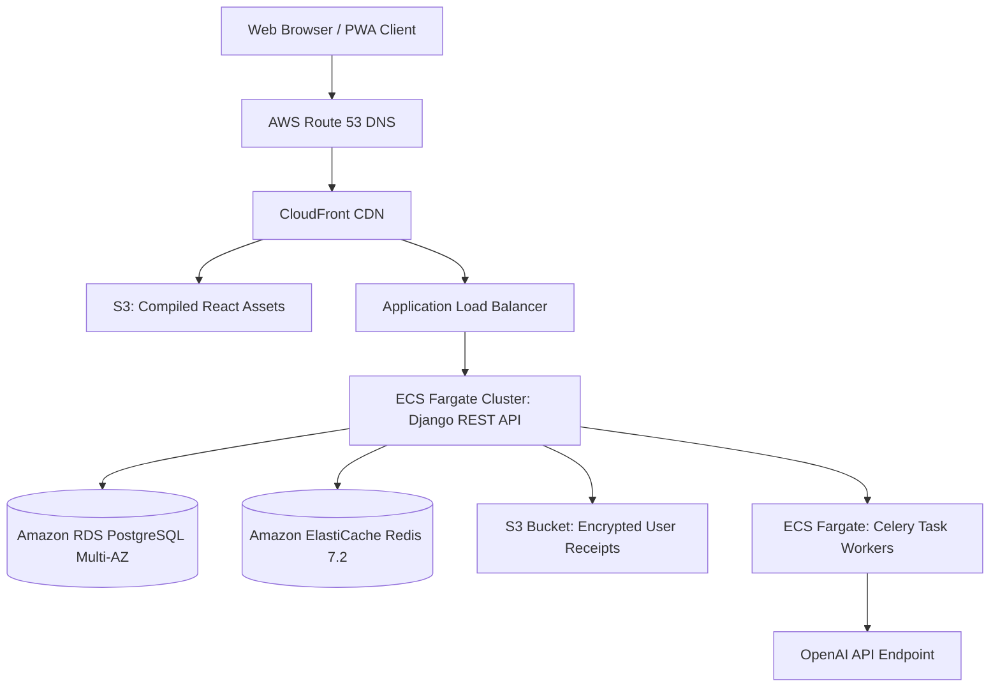
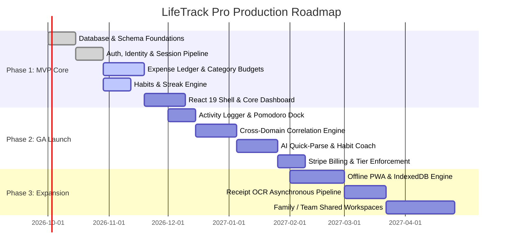

# LIFE TRACK PRO
## Complete Software Design Specification (SDS)

**Document Version:** 1.0.0-PROD  
**Author:** Principal Solutions Architect & Multi-Disciplinary Engineering Council  
**Classification:** Proprietary / Production Blueprint  
**Target Environment:** Cloud-Native SaaS (AWS / PostgreSQL / Redis / Celery / Django REST Framework / React 19 / TypeScript / OpenAI)  

---

# SECTION 1: PRODUCT VISION

### 1.1 Executive Product Vision
**LifeTrack Pro** is an intelligent, unified life-operations and personal telemetry platform engineered to bridge the fragmented divide between personal finance, daily productivity, habit formation, physical activity, and holistic life goals. By synthesising fragmented behavioral telemetry into an orchestrated, real-time data model powered by deterministic analytics and contextual Artificial Intelligence, LifeTrack Pro provides knowledge workers, freelancers, students, and self-optimizers with actionable cognitive feedback, predictive financial forecasts, and automated habit reinforcement.

### 1.2 Mission Statement
> *"To eliminate cognitive overload and quantified-self fragmentation by delivering a single, privacy-first, automated ecosystem that synchronizes financial sovereignty, daily discipline, and long-term ambition into measurable life momentum."*

### 1.3 Strategic Business Goals
1. **Market Penetration & Acquisition:** Secure 100,000 active users within the first 12 months post-General Availability (GA), driven by self-hosted product-led growth (PLG) mechanics and viral weekly intelligence recaps.
2. **Monetization & Unit Economics:** Attain a blended Monthly Recurring Revenue (MRR) of $150,000 by Month 18 via tiered SaaS subscriptions ($9.99/mo Pro tier, $19.99/mo AI Coach tier, and $99/year annual billing), sustaining a Customer Lifetime Value to Customer Acquisition Cost (LTV:CAC) ratio exceeding 4.2:1.
3. **Retention & Engagement Flywheel:** Drive Day-30 (D30) user retention beyond 45% and Day-90 (D90) retention beyond 32% (2.5x the productivity application industry average) by leveraging cross-domain correlation nudges (e.g., linking workout frequency to spending discipline).
4. **Data Sovereignty & Enterprise Grade Security:** Deliver zero-knowledge encrypted storage options, SOC-2 Type II readiness, and complete GDPR/CCPA data exportability, creating a competitive moat against legacy advertising-supported aggregators.

### 1.4 Success Metrics & Key Performance Indicators (KPIs)
* **North Star Metric (NSM):** *Weekly Active Synergistic Users (WASU)* — defined as unique users who log or synchronize data across at least three distinct operational domains (Expenses, Habits, Activities, or Goals) within a rolling 7-day window.
* **Operational & Product KPIs:**
  - **Daily Active Users / Monthly Active Users (DAU/MAU):** Target > 40% (sticky utility).
  - **Time-to-Value (TTV):** First core telemetry logged within 90 seconds of onboarding completion.
  - **Average Session Duration:** < 3.5 minutes per day for operational logging; > 8.0 minutes for weekly review/analytical consumption.
  - **Churn Rate:** Sub-3.5% monthly net voluntary churn on annualised cohorts.
  - **AI Suggestion Acceptance Rate:** > 60% of automated category mappings and habit coaching nudges accepted without manual override.

### 1.5 Product Scope Matrix


### 1.6 Deep Competitive Analysis
| Dimension | LifeTrack Pro | Notion | Habitica | Mint (Sunset) / Credit Karma | YNAB | Google Fit / Apple Health | TickTick / Todoist |
| :--- | :--- | :--- | :--- | :--- | :--- | :--- | :--- |
| **Core Paradigm** | Unified Telemetry & AI Cross-Domain Synergy | Freeform Blocks & Relational DB | Gamified RPG Habit Tracker | Passive Ad-Driven Account Aggregator | Zero-Based Financial Budgeting | Passive Biometric Health Logging | Pure Task & To-Do Checklist |
| **Cross-Domain Correlation** | **Native** (e.g., Spend vs. Sleep vs. Goal Velocity) | Manual Formulas only | None | None | None | None | None |
| **AI Architecture** | Multi-Agent Contextual Insights & Predictive NLP | Generalized generative text assistant | None | Generic ad targeting | None | Heuristic trends | Basic NLP task parsing |
| **Data Architecture** | Strongly Typed Relational (PostgreSQL) + Redis | Document Object Model (Slow at scale) | Relational Document | Proprietary Financial Ledger | Proprietary Double-Entry Ledger | Time-Series Biometrics | Relational Tasks |
| **Financial Ledger** | Multi-currency, Envelope & Accrual hybrid | Unstructured tables | None | Read-only aggregate | Strict Zero-Based Envelope | None | None |
| **Offline Capability** | CRDT-ready PWA with IndexedDB sync | Highly degraded / slow offline | Partial local cache | Strictly online-only | Native local sync | Native on-device storage | Robust offline local store |
| **Privacy / Business Model** | Paid SaaS Subscription (Zero Data Selling) | Freemium / Enterprise Workspace | Freemium / Virtual Goods | Advertising & Financial Lead Gen | Paid Subscription ($14.99/mo) | Ecosystem Lock-In | Freemium Subscription |

---

# SECTION 2: PROBLEM STATEMENT

### 2.1 The Modern Quantified-Self Fragmentation Crisis
Modern high-performers, professionals, and students navigate life utilizing an average of 5 to 8 disparate productivity and lifestyle applications:
1. One app for personal budgeting (e.g., YNAB, PocketGuard, Excel).
2. One app for habit tracking (e.g., Streaks, Habitica).
3. One app for task and project management (e.g., Todoist, Linear, Asana).
4. One app for fitness telemetry (e.g., Strava, Google Fit, Apple Fitness).
5. Unstructured scratchpads for personal reflection and annual goals (e.g., Apple Notes, Notion).

This architectural fragmentation causes severe **Cognitive Friction and Context Switching Tax**. Users expend disproportionate emotional and manual energy reconciling data across systems:
* *Siloed Telemetry:* A user cannot discern that their unbudgeted $80 Friday night dining expenses correlate directly with skipping their Saturday morning gym sessions, which subsequently derails their quarterly marathon milestone.
* *Logging Fatigue:* Maintaining 5 disparate apps requires redundant manual inputs, causing an 82% abandonment rate within 21 days across traditional quantified-self tools.
* *Passive Data Graveyards:* Existing aggregators collect data without synthesizing it into prescriptive guidance. They show graphs of historical failure without providing the cognitive scaffolding required for operational change.

### 2.2 Why Existing Market Solutions Are Insufficient
* **Notion / Obsidian:** Exceptionally flexible, yet completely unopinionated. Building a robust, relational expense tracker linked to automated recurring habit streaks requires dozens of hours of complex database relations, fragile rollups, and manual formula debugging. They lack native telemetry hooks, native push notifications, bank sync, and background aggregation workers.
* **Single-Purpose Utility Apps (YNAB, TickTick, Streaks):** Highly optimized for their singular domain, but categorically blind to external context. YNAB knows nothing about your physical energy levels or work output; TickTick knows nothing about your disposable cash flow.
* **Ad-Supported Portals (Credit Karma):** Monetized via credit card referrals and high-interest loan placements. Their fundamental incentive is to harvest user financial telemetry to sell financial products, directly conflicting with user wealth-building.

### 2.3 How Artificial Intelligence Bridges the Behavioral Gap
LifeTrack Pro does not use AI as a superficial marketing wrapper or a generic LLM chat dialog. Instead, AI serves as an **Active Telemetry Synthesizer**:
1. **Multi-Domain Correlation Extraction:** The AI engine analyzes time-series vectors across financial, physical, and behavioral databases using rolling covariance models, discovering hidden lifestyle bottlenecks (e.g., *"On days where you log over 9 hours of screen time, food delivery spending increases by 312%, and habit completion drops to zero"*).
2. **Zero-Friction Contextual Extraction:** Natural language transaction and activity ingestion (e.g., typing *"Spent $45 on groceries at Trader Joe's after a 5km run in 24 mins"* automatically updates the Expense ledger, categorizes the grocery receipt, logs the physical activity, and increments the 'Exercise 3x/week' goal progress).
3. **Adaptive Predictive Scaffolding:** Instead of static alerts, the AI acts as an autonomous financial advisor and habit coach, dynamically adjusting upcoming weekly budgets and habit targets when unexpected life events occur.

---

# SECTION 3: TARGET USERS & DETAILED PERSONAS



---

### Persona 1: The Ambitious Corporate Professional
* **Profile:** Sarah Chen, 31, Senior Product Manager at a B2B SaaS Enterprise.
* **Psychographics:** High income ($145,000/yr), chronically time-constrained, ambitious, analytical, overwhelmed by context switching.
* **Goals:**
  - Build wealth by systematically saving 35% of post-tax compensation toward real estate.
  - Maintain cardiovascular health and consistent strength training despite 50-hour workweeks.
  - Read 24 non-fiction books annually without sacrificing mental downtime.
* **Pain Points:**
  - Uses Excel for net worth tracking, Todoist for work tasks, Apple Health for gym, and paper notebooks for reflection.
  - Forgets to log expenses for days, leading to large weekend reconciliation sessions.
  - Experiences burnout cycles due to disconnected schedule expectations.
* **Daily Workflow:**
  - *06:45 AM:* Wakes up, checks phone for urgent notifications.
  - *07:15 AM:* Gym workout (currently logged in Apple Watch).
  - *08:30 AM - 06:30 PM:* High-intensity meetings, Slack, Jira.
  - *07:30 PM:* Dinner, occasional drinks; spends without tracking immediate budget impact.
  - *11:00 PM:* Goes to bed feeling disorganized regarding long-term personal milestones.
* **Expected LifeTrack Pro Features:**
  - Automated weekly executive briefs synthesizing spending, workout volume, and sleep.
  - Quick-capture desktop widget and keyboard shortcuts for < 5-second logging.
  - Automatic categorization of discretionary spending against monthly savings targets.
* **User Journey Mapping:**
  - *Awareness:* Reads a LinkedIn architectural breakdown on cross-domain life telemetry.
  - *Onboarding:* Signs up via Google SSO, selects "Corporate Professional" template, sets monthly savings goal ($3,500) and 3 core habits.
  - *Aha! Moment:* At the end of Week 1, receives an automated AI Insight: *"You logged all 4 workouts this week and stayed $140 under your dining budget. Your goal 'Down Payment Fund' is pacing 4 days ahead of schedule."*
  - *Advocacy:* Replaces 3 standalone subscription apps with LifeTrack Pro Pro Tier ($99/year).

---

### Persona 2: The Independent Freelancer & Contractor
* **Profile:** Marcus Vance, 28, Independent UX Designer and Brand Consultant.
* **Psychographics:** Variable income ($4,000 - $12,000/mo), self-motivated, creative, prone to procrastination without external accountability.
* **Goals:**
  - Smooth volatile cash flow through dynamic, adaptive monthly runway budgeting.
  - Track billable design sprints vs. non-billable administrative and self-development activities.
  - Establish unwavering creative habits (daily typography study, portfolio updates).
* **Pain Points:**
  - Traditional budgeting apps assume a predictable bi-weekly paycheck.
  - Tax withholding anxiety: frequently fails to set aside 30% for quarterly estimated taxes.
  - Difficulty separating business project milestones from personal life maintenance.
* **Daily Workflow:**
  - *09:00 AM:* Coffee, reviews chaotic email inbox and multiple client Trello boards.
  - *10:00 AM - 02:00 PM:* Client design sprint; loses track of water intake and posture breaks.
  - *03:00 PM:* Receives irregular client invoice payout; unsure how much can be safely spent.
  - *08:00 PM:* Works late into the night, sacrificing sleep and gym routines.
* **Expected LifeTrack Pro Features:**
  - "Runway Budgeting" with multi-bucket income allocation (Taxes, Buffer, Living, Discretionary).
  - Activity time-boxing linked directly to client project tags.
  - Dynamic streak protection during high-volume client delivery weeks.
* **User Journey Mapping:**
  - *Onboarding:* Imports CSV from past bank accounts, configures variable income mode.
  - *Aha! Moment:* The AI Financial Advisor computes real-time safe-to-spend runway after automatically segregating 30% for tax reserves.
  - *Retention:* Relies on the daily morning dashboard to maintain sanity and fiscal discipline.

---

### Persona 3: The University Student / Early Career Starter
* **Profile:** Liam Patel, 20, Computer Science Undergraduate & Intern.
* **Psychographics:** Low discretionary income, tech-savvy, hyper-digital, optimizing academic performance and interview readiness.
* **Goals:**
  - Strictly manage a tight monthly budget of $1,400 (rent, food, transit, study materials).
  - Build daily LeetCode and coding project study streaks.
  - Track sleep hygiene and physical fitness to optimize mental performance during exam finals.
* **Pain Points:**
  - Overdrawn bank accounts due to small, unrecognized micro-subscriptions.
  - Procrastination driven by social media distraction.
  - Intimidated by complex enterprise financial software like YNAB or QuickBooks.
* **Daily Workflow:**
  - *08:00 AM:* Wakes up to phone alarm, scrolls phone in bed for 30 minutes.
  - *09:30 AM - 03:00 PM:* University lectures, library sessions, study groups.
  - *04:00 PM:* Fast food meal; pays via debit card without tracking balance.
  - *07:00 PM - 01:00 AM:* Coding assignments, gaming, fragmented study sessions.
* **Expected LifeTrack Pro Features:**
  - Clean, dark-mode native UI with keyboard accessibility.
  - Gamified habit streaks with milestone achievements and visual consistency charts.
  - Zero-based micro-budgeting with low balance alerts.
* **User Journey Mapping:**
  - *Onboarding:* Free tier registration, selects "Student Hustle" template.
  - *Aha! Moment:* Sees visual streak calendar turn vibrant emerald as a 14-day algorithm study habit is maintained alongside zero budget overruns.
  - *Conversion:* Upgrades to Student Pro discount tier upon landing summer internship.

---

### Persona 4: The Quantified-Self & Fitness Enthusiast
* **Profile:** Elena Rostova, 34, Biotech Clinical Researcher & Marathoner.
* **Psychographics:** High analytical mindset, data-obsessed, owns Garmin, Oura, and smart scales; measures every physiological input.
* **Goals:**
  - Correlate training load, nutritional intake, and sleep metrics with daily cognitive focus.
  - Track athletic expenditures (gear, race entries, physio, nutrition supplements).
  - Execute a 16-week marathon training macrocycle without injury.
* **Pain Points:**
  - Garmin tracks mileage, MyFitnessPal tracks food, Apple Health tracks sleep, but nowhere can she view how high-expenditure weeks impact athletic recovery.
  - Annoyed by simplistic fitness apps that lack customizable numeric metrics (VO2 max, resting HR).
* **Expected LifeTrack Pro Features:**
  - Customizable activity telemetry (distance, duration, average heart rate, RPE scale).
  - Rich data export (CSV, JSON) for custom personal modeling.
  - High-density analytical charts with multi-axis correlation overlays.

---

### Persona 5: The Systems Power User / Notion Refugee
* **Profile:** David Kim, 38, Principal DevOps Architect.
* **Psychographics:** Maximalist productivity architect, loves markdown, keyboard-first workflows, uncompromising on data privacy and system speed.
* **Goals:**
  - Consolidate his fragile 14-database Notion workspace into a high-performance compiled web app.
  - Ensure 100% offline access when traveling on flights or off-grid.
  - Retain full programmatic access via REST APIs and webhooks.
* **Pain Points:**
  - Notion's mobile app is slow to load, requires 4-6 seconds to open a database page, and fails offline.
  - Frustrated by closed-garden tools that prevent bulk data export or lack webhooks.
* **Expected LifeTrack Pro Features:**
  - Sub-100ms UI interactions, Cmd+K Command Palette navigation.
  - Full REST API with personal access tokens (PAT).
  - Instant offline sync using local client storage.

---

# SECTION 4: COMPLETE FEATURE LIST

```text
[PRIORITY SCALING: P0 = Mission Critical / MVP Core | P1 = Production Polish / GA | P2 = Post-Launch Expansion]
[COMPLEXITY SCALING: S = Small (< 1 sprint) | M = Medium (1-2 sprints) | L = Large (3-4 sprints) | XL = Architectural Initiative]
```

### 4.1 Authentication & Identity Management
| ID | Feature Name | Detailed Description | Business Value | Technical Complexity | Priority |
| :--- | :--- | :--- | :--- | :---: | :---: |
| **AUTH-01** | Multi-Factor Auth (MFA/TOTP) | RFC 6238 compliant Time-Based One-Time Password generation and verification via authenticator apps (Google Authenticator, 1Password) with backup recovery codes. | Hardens user accounts containing sensitive financial telemetry; builds enterprise trust. | M | P0 |
| **AUTH-02** | OAuth2 Social Sign-On | OpenID Connect integration for Google, GitHub, and Apple SSO with email sanitization and automatic user profile bootstrap. | Reduces onboarding drop-off by up to 60%; eliminates password friction. | M | P0 |
| **AUTH-03** | Stateless JWT Session Control | Cryptographically signed RS256 JWT access tokens (15-min lifespan) coupled with sliding-window HttpOnly refresh tokens stored in secure Redis cache. | Enables horizontal scaling across backend pods without centralized session bottlenecks. | L | P0 |
| **AUTH-04** | Magic Link Email Authentication | Passwordless cryptographic one-time token delivery via transactional email for friction-free authentication. | Eliminates forgotten password support tickets; appeals to modern mobile-first users. | M | P1 |
| **AUTH-05** | Hardware Security Keys (WebAuthn/FIDO2) | Passwordless and phishing-resistant hardware token support (YubiKey, TouchID, Windows Hello). | Sets a new standard in consumer telemetry security; appeals to power users. | L | P2 |

### 4.2 Authorization & Role-Based Access Control (RBAC)
| ID | Feature Name | Detailed Description | Business Value | Technical Complexity | Priority |
| :--- | :--- | :--- | :--- | :---: | :---: |
| **RBAC-01** | Granular System Permissions | Fine-grained capability matrix (`users:read`, `expenses:write`, `ai:generate`, `admin:audit`) enforced across Django middleware and API views. | Enables tiered SaaS plan enforcement and strict tenant isolation. | M | P0 |
| **RBAC-02** | Tiered Subscription Entitlements | Real-time feature gating based on active Stripe subscription (Free Tier, Pro Tier, AI Power Tier) dynamically cached in Redis. | Maximizes conversion funnel by restricting high-compute AI and unlimited habit tracking to paid tiers. | M | P0 |
| **RBAC-03** | Shared Family / Team Workspaces | Tenant isolation boundaries allowing multi-user workspace access with Owner, Editor, and Viewer roles. | Unlocks B2B team licensing and household account management ($19.99/mo tier). | XL | P2 |

### 4.3 Financial Ledger & Expense Tracking
| ID | Feature Name | Detailed Description | Business Value | Technical Complexity | Priority |
| :--- | :--- | :--- | :--- | :---: | :---: |
| **EXP-01** | Double-Entry Double-Indexed Ledger | High-precision decimal expense storage with multi-currency conversion, transaction date, merchant, category, and payment method mapping. | Absolute accounting accuracy without floating-point calculation errors. | L | P0 |
| **EXP-02** | Recurring Transaction Scheduler | Automated accrual engine generating scheduled recurring transactions (subscriptions, rent, utilities) with projected cash-flow impacts. | Eliminates manual entry for fixed overhead; provides forward-looking financial runway. | M | P0 |
| **EXP-03** | Receipt OCR & Itemization | Asynchronous multimodal parsing of receipt images (JPEG, PNG, PDF) extracting merchant, total, line items, and taxes into structured draft expenses. | Drastically reduces manual data entry; major competitive selling point for Pro tier. | XL | P1 |
| **EXP-04** | Split-Category Allocation | Transaction splitting capability allowing a single receipt (e.g., $150 at Target) to be split across Groceries, Home Goods, and Apparel. | Provides true analytical fidelity for power budgeting users. | M | P1 |
| **EXP-05** | Automated Merchant Rules Engine | User-defined regex and heuristic pattern matching (e.g., "Uber*Trip" -> Category: Transit, Tag: Travel) applied pre-save. | Eliminates repetitive manual categorization overhead. | M | P1 |

### 4.4 Budgeting & Cash Allocation Engine
| ID | Feature Name | Detailed Description | Business Value | Technical Complexity | Priority |
| :--- | :--- | :--- | :--- | :---: | :---: |
| **BUD-01** | Envelope & Category Budgets | Configurable monthly, bi-weekly, or annual category ceilings with dynamic burn-rate velocity calculations. | Prevents lifestyle creep and gives users tangible guardrails. | M | P0 |
| **BUD-02** | Rollover & Deficit Rebalancing | Optional envelope rollover logic carrying over unused balances or deducting deficits from the subsequent month's allocation. | Accommodates realistic seasonal expenditure shifts without breaking long-term budgets. | M | P1 |
| **BUD-03** | Predictive Overspend Warnings | Statistical burn-rate analysis alerting users when their mid-month spending velocity guarantees a budget blowout by Day 22. | Proactive financial intervention before catastrophic overspending occurs. | L | P1 |

### 4.5 Atomic Habit Tracking & Streak Mechanics
| ID | Feature Name | Detailed Description | Business Value | Technical Complexity | Priority |
| :--- | :--- | :--- | :--- | :---: | :---: |
| **HAB-01** | Multi-Frequency Habit Schedules | Habit definitions supporting daily, specific weekdays (Mon/Wed/Fri), periodic (3x/week), or recurring intervals. | Models human lifestyle flexibility instead of rigid all-or-nothing constraints. | M | P0 |
| **HAB-02** | Streak Ledger & Freeze Engine | Deterministic streak computation with configurable "Emergency Freeze" tokens earned through consistent adherence. | Eliminates user rage-quitting when an unavoidable illness or travel day breaks an 80-day streak. | L | P0 |
| **HAB-03** | Quantitative & Boolean Habit Modes | Support for simple checkboxes (e.g., "Floss Teeth") or numeric target values (e.g., "Read 25 pages", "Meditate 15 mins"). | Supports multifaceted self-improvement protocols across disciplines. | M | P0 |
| **HAB-04** | Habit Cue & Micro-Reflection Journal | Integrated post-completion prompt capturing emotional state, friction rating, and contextual notes upon habit execution. | Deepens self-awareness and supplies qualitative data for AI behavioral coaching. | S | P1 |

### 4.6 Physical & Cognitive Activity Telemetry
| ID | Feature Name | Detailed Description | Business Value | Technical Complexity | Priority |
| :--- | :--- | :--- | :--- | :---: | :---: |
| **ACT-01** | Activity Session Logger | Structured logging of physical workouts, focused deep work, study blocks, and creative sessions with duration, intensity, and tags. | Captures the operational "effort" telemetry of the user's day. | M | P0 |
| **ACT-02** | Integrated Pomodoro & Focus Stopwatch | Client-side precision focus timer that automatically converts completed focus blocks into logged activity records. | Prevents app-switching between time-tracking utilities and LifeTrack Pro. | S | P1 |
| **ACT-03** | Perceived Exertion (RPE) & Energy Rating | 1-10 RPE rating and pre/post energy level tracking for all physical and cognitive sessions. | Provides critical physiological telemetry for AI recovery recommendations. | S | P1 |

### 4.7 Goal Setting & Milestone Velocity
| ID | Feature Name | Detailed Description | Business Value | Technical Complexity | Priority |
| :--- | :--- | :--- | :--- | :---: | :---: |
| **GOAL-01** | Hierarchical OKR & Goal Trees | Objective creation with nested, measurable Key Results linking directly to live telemetry (e.g., "Save $10,000" links to Savings Ledger). | Connects daily micro-actions to macro life achievements. | L | P0 |
| **GOAL-02** | Automated Velocity & Pacing Tracker | Dynamic linear regression computing projected completion dates based on trailing 30-day performance. | Keeps goals grounded in mathematical reality rather than wishful thinking. | M | P1 |
| **GOAL-03** | Milestone Rewards & Celebration UI | Micro-animations and congratulatory visual payoffs upon achieving intermediate goal milestones. | Psychological positive reinforcement driving long-term retention. | S | P1 |

### 4.8 Analytics, Reporting & Telemetry Synergy
| ID | Feature Name | Detailed Description | Business Value | Technical Complexity | Priority |
| :--- | :--- | :--- | :--- | :---: | :---: |
| **ANA-01** | Multi-Axis Cross-Domain Correlation | PostgreSQL analytical window functions generating correlation coefficients between spending spikes, habit consistency, and workout volume. | The flagship differentiator of LifeTrack Pro; cannot be replicated by single-domain apps. | XL | P0 |
| **ANA-02** | Executive Weekly & Monthly Dossiers | Automated compilation of PDF/Web dossiers summarizing financial health, discipline index, and activity metrics. | Viral sharing potential; delivers high perceived value for paid subscriptions. | L | P1 |
| **ANA-03** | Custom BI Query & Filter Canvas | Interactive multidimensional aggregation canvas allowing users to group, filter, and pivot their historical telemetry. | Delights analytical power users and quantified-self communities. | L | P2 |

### 4.9 Contextual AI & Autonomous Coaching
| ID | Feature Name | Detailed Description | Business Value | Technical Complexity | Priority |
| :--- | :--- | :--- | :--- | :---: | :---: |
| **AI-01** | Natural Language Telemetry Parser | LLM-driven structured parser turning freeform user prompts into validated database mutations across modules. | Unlocks instantaneous rapid logging; eliminates form-filling friction. | L | P0 |
| **AI-02** | Autonomous Behavioral Habit Coach | Scheduled background agent analyzing weekly habit logs and offering targeted habit-stacking recommendations based on behavioral science. | Delivers personalized coaching at a fraction of human coaching costs. | L | P1 |
| **AI-03** | Predictive Financial Runway Advisor | Algorithmic and LLM financial modeling predicting end-of-quarter net worth and identifying anomalous recurring charges. | Direct financial utility that easily justifies the $9.99/mo subscription fee. | L | P1 |

### 4.10 Platform Infrastructure, Settings, Search & PWA
| ID | Feature Name | Detailed Description | Business Value | Technical Complexity | Priority |
| :--- | :--- | :--- | :--- | :---: | :---: |
| **SYS-01** | Global Cmd+K Command Palette | Unified modal keyboard navigation across all routes, actions, entities, and search results. | Enables power users to operate at extreme speed without touching the mouse. | M | P0 |
| **SYS-02** | Full Offline Capability via IndexedDB | Service Worker caching and local IndexedDB state store with bi-directional conflict resolution on network reconnect. | Guarantees reliability for mobile users in airplanes, subways, and low-connectivity environments. | XL | P1 |
| **SYS-03** | Bidirectional CSV/JSON Ingestion & Export | Robust importer supporting Mint, YNAB, Habitica, and CSV formats alongside instant GDPR one-click JSON dumps. | Eliminates switching costs for new users; guarantees zero vendor lock-in. | M | P0 |
| **SYS-04** | Reactive Dark / Light / OLED Mode | System-responsive design token switching using CSS variables, zero layout shifts, and true pure-black OLED optimization. | Modern ergonomic standard expected by technical professionals and developers. | S | P0 |

---

# SECTION 5: 50+ PRODUCTION USER STORIES

```text
[FORMAT SPECIFICATION]
Story: As a <User Persona>, I want to <Specific Action / Objective>, so that <Measurable Outcome / Value>.
Acceptance Criteria (AC): Formal Gherkin / BDD-style verification points.
```

### 5.1 Identity, Authentication & Security
1. **US-AUTH-01 (MFA Setup):**
   - *As a* privacy-conscious professional, *I want to* enable Time-Based One-Time Password (TOTP) two-factor authentication, *so that* unauthorized actors cannot access my sensitive financial ledger even if my password is breached.
   - **AC 1:** System displays a base64 QR code and an alphanumeric secret key.
   - **AC 2:** Verification requires entering a valid 6-digit TOTP token within a 30-second window.
   - **AC 3:** System provides 10 single-use, cryptographically generated alphanumeric recovery codes upon activation.
2. **US-AUTH-02 (Session Revocation):**
   - *As a* user accessing LifeTrack Pro from public and private devices, *I want to* view a list of all active sessions and revoke them individually or globally, *so that* I maintain absolute control over device access.
   - **AC 1:** Active session list displays IP address, resolved geographic location, browser/OS fingerprint, and last activity timestamp.
   - **AC 2:** Revoking a session immediately deletes the refresh token from Redis and invalidates the active JWT upon next API handshake.
3. **US-AUTH-03 (Passwordless Magic Link):**
   - *As a* mobile user, *I want to* sign in by requesting a secure magic link to my registered email address, *so that* I can log in without typing complex alphanumeric passwords on a virtual keyboard.
   - **AC 1:** Magic link contains a cryptographically secure, URL-safe SHA-256 token valid for exactly 15 minutes.
   - **AC 2:** Token is single-use and invalidates immediately upon successful session issuance.
4. **US-AUTH-04 (Brute Force Rate Limiting):**
   - *As a* system administrator, *I want to* automatically throttle and lock login attempts after 5 consecutive failures from a single IP, *so that* credential stuffing attacks are neutralized.
   - **AC 1:** After 5 failed attempts within 5 minutes, the IP is locked out for 15 minutes.
   - **AC 2:** Returns HTTP 429 Too Many Requests with a `Retry-After` header.
5. **US-AUTH-05 (Social Sign-In Account Merging):**
   - *As a* user who previously registered with email/password, *I want to* sign in with Google using the same email address, *so that* my existing account is linked without duplicating records.
   - **AC 1:** Backend checks if the verified OAuth email exists in the database.
   - **AC 2:** Prompts user for primary password once to authenticate the merge; subsequent logins require only Google OAuth.

### 5.2 Expense Ledger & Financial Architecture
6. **US-EXP-01 (Multi-Currency Expense Entry):**
   - *As an* international traveler and freelancer, *I want to* log an expense in Japanese Yen (JPY) and have it automatically converted to my base currency (USD) using the historical exchange rate of that date, *so that* my net worth and spending reports remain normalized.
   - **AC 1:** Expense modal includes a currency selector defaulting to the user's primary currency.
   - **AC 2:** Backend fetches and stores both the original currency amount and the base currency normalized amount via a daily exchange rate table.
7. **US-EXP-02 (Split Transactions):**
   - *As a* user purchasing diverse items at a department store, *I want to* split a single $200 receipt across 'Groceries' ($80), 'Electronics' ($100), and 'Household' ($20), *so that* my category budgets reflect reality.
   - **AC 1:** Split modal validates that the sum of line items exactly matches the master transaction total down to the cent.
   - **AC 2:** Database creates one parent transaction record linked to multiple child split ledger items.
8. **US-EXP-03 (Receipt OCR Extraction):**
   - *As a* busy executive, *I want to* upload a photo of a restaurant receipt, *so that* the date, merchant name, sales tax, and total amount are automatically populated in the expense draft form.
   - **AC 1:** System accepts JPEG/PNG/PDF uploads up to 10MB.
   - **AC 2:** Asynchronous Celery worker passes image to OCR service and emits a WebSocket notification when extraction is complete (< 4 seconds).
   - **AC 3:** User can review, edit, and confirm draft data before committing to the immutable ledger.
9. **US-EXP-04 (Recurring Expense Automation):**
   - *As a* subscription subscriber, *I want to* set up a recurring $14.99 monthly charge for Spotify on the 5th of every month, *so that* I do not have to manually enter it every 30 days.
   - **AC 1:** Configurable intervals: daily, weekly, bi-weekly, monthly, quarterly, annually.
   - **AC 2:** Celery beat task runs at 00:01 UTC daily, instantiating scheduled expense records.
10. **US-EXP-05 (Merchant Auto-Categorization):**
    - *As a* frequent shopper, *I want* the system to remember that all transactions containing "Whole Foods" should be categorized as "Groceries", *so that* future entries are categorized without manual selection.
    - **AC 1:** Rule engine checks incoming merchant strings against user-defined rule patterns.
    - **AC 2:** Auto-applied category is visually highlighted with a badge indicating automated rule assignment.

### 5.3 Budgeting & Cash Allocation
11. **US-BUD-01 (Envelope Budget Allocation):**
    - *As a* disciplined saver, *I want to* assign hard monetary caps to categories at the start of the month, *so that* I know exactly how much discretionary capital remains.
    - **AC 1:** UI provides visual progress bars with green (< 75%), amber (75-99%), and red (>= 100%) indicators.
    - **AC 2:** Overspending in a category triggers an optional modal prompt recommending budget reallocation from a surplus category.
12. **US-BUD-02 (Budget Rollover Flexibility):**
    - *As a* seasonal spender, *I want* my unspent $50 from this month's dining budget to roll over into next month's allocation, *so that* I can save up for a special celebratory dinner.
    - **AC 1:** User can toggle "Enable Rollover" per individual category.
    - **AC 2:** Next month's effective budget dynamically calculates as `Base Allocation + Previous Month Residual`.
13. **US-BUD-03 (Mid-Month Burn-Rate Velocity):**
    - *As a* professional, *I want to* view my daily projected burn rate, *so that* I know if my current spending pace will exhaust my budget before month-end.
    - **AC 1:** Algorithm computes: `(Spent To Date / Current Day of Month) * Days in Month`.
    - **AC 2:** Displays a warning badge on the dashboard if projected total exceeds 105% of budget.

### 5.4 Habit Formation & Streak Discipline
14. **US-HAB-01 (Flexible Weekly Schedules):**
    - *As an* athlete, *I want to* schedule my strength training habit for 3 days per week without specifying fixed days, *so that* I maintain my streak as long as I hit the target frequency before Sunday midnight.
    - **AC 1:** Habit configuration allows selecting "Target X days per week".
    - **AC 2:** Streak increments if and only if the week concludes with completions >= X.
15. **US-HAB-02 (Streak Freeze Redemption):**
    - *As a* committed habit builder who fell sick, *I want to* activate an emergency Streak Freeze token, *so that* my 65-day meditation streak is not reset to zero due to acute hospital care.
    - **AC 1:** Users earn 1 Freeze Token for every 30 consecutive days of global habit adherence (maximum inventory cap of 3).
    - **AC 2:** Applying a freeze marks the day as "Frozen" (blue snowflake icon) and preserves streak integrity.
16. **US-HAB-03 (Numeric Target Habits):**
    - *As a* reader, *I want to* log incremental progress toward a daily goal of reading 30 pages (e.g., 10 pages morning, 20 pages night), *so that* partial progress is visualized accurately throughout the day.
    - **AC 1:** Habit record stores `target_value` and accepts incremental numeric logs.
    - **AC 2:** Checkmark triggers automatically when `sum(logs) >= target_value`.
17. **US-HAB-04 (Habit Time-Window Nudges):**
    - *As a* remote worker, *I want to* assign a preferred time window (e.g., "Morning: 07:00 - 09:00") to my journaling habit, *so that* I receive contextual push notifications during that window.
    - **AC 1:** System sends Web Push / Notification only within the specified window if uncompleted.
    - **AC 2:** Silences notification automatically if the habit is logged prior to the window.
18. **US-HAB-05 (Friction & Mood Tagging):**
    - *As a* self-optimizer, *I want to* record how difficult a habit felt on a scale of 1-5 upon check-off, *so that* I can identify which routines are approaching automaticity vs. causing friction.
    - **AC 1:** Completion modal optionally displays a 5-point Likert scale (1=Effortless, 5=Extreme Resistance).
    - **AC 2:** Analytics module graphs friction rating over time against total streak length.

### 5.5 Physical & Cognitive Activity Telemetry
19. **US-ACT-01 (Session Logging with RPE):**
    - *As a* runner, *I want to* log a 10km run with duration, distance, and a Rate of Perceived Exertion (RPE) of 8, *so that* my athletic training stress is quantified.
    - **AC 1:** Form provides specialized input fields based on activity type (Running: distance, duration, elevation, pace).
    - **AC 2:** Automatically computes average speed/pace based on distance and duration.
20. **US-ACT-02 (Focus Session Timer):**
    - *As a* programmer, *I want to* launch a 25-minute Pomodoro timer directly in LifeTrack Pro, *so that* upon timer expiration, a "Deep Work" activity session is automatically recorded to my database.
    - **AC 1:** Client runs an accurate Web Audio / Worker-backed timer that persists through tab navigation.
    - **AC 2:** On completion, triggers audio chime and auto-opens a quick modal to tag the completed session.
21. **US-ACT-03 (Activity Energy Correlation):**
    - *As a* student, *I want to* rate my energy levels before and after an activity session, *so that* I can evaluate which activities recharge me versus drain me.
    - **AC 1:** Accepts pre-energy (1-10) and post-energy (1-10) integers.
    - **AC 2:** Computes net energy differential (`post - pre`).

### 5.6 Goals & Macro Milestones
22. **US-GOAL-01 (Telemetry-Linked Key Results):**
    - *As a* saver, *I want* my goal "Emergency Fund ($10,000)" to automatically update its progress bar whenever transactions are logged into my "Savings" expense category, *so that* I never need to manually recalculate progress.
    - **AC 1:** Goal builder allows linking to a dynamic SQL query or category sum.
    - **AC 2:** Database triggers or asynchronous workers re-aggregate goal progress upon ledger updates.
23. **US-GOAL-02 (Linear Pacing Forecast):**
    - *As a* goal setter, *I want to* see a projected completion date based on my current velocity, *so that* I can adjust my daily efforts if I am falling behind my target deadline.
    - **AC 1:** UI displays two lines on the progress chart: "Ideal Pace" vs. "Actual Trailing 30-Day Velocity".
    - **AC 2:** Calculates variance in days (e.g., "14 days behind schedule").
24. **US-GOAL-03 (Archived Milestone Celebration):**
    - *As an* achiever, *I want to* archive completed goals with a retrospective reflection, *so that* I can look back at past accomplishments in a trophy room canvas.
    - **AC 1:** Reaching 100% triggers celebratory confetti animation (canvas-confetti).
    - **AC 2:** Moves goal to "Completed" archive and locks state against further automatic mutations.

### 5.7 Cross-Domain Analytics & Reporting
25. **US-ANA-01 (Spend vs. Habit Correlation Matrix):**
    - *As an* analytical user, *I want to* view a scatter plot showing my daily discretionary spending plotted against my daily habit completion percentage, *so that* I can visually identify if discipline in habits reduces impulse spending.
    - **AC 1:** Analytics API returns normalized rolling daily arrays: `{ date, spend_cents, habit_score_percent }`.
    - **AC 2:** Calculates and renders Pearson correlation coefficient ($r$) with statistical significance ($p$-value).
26. **US-ANA-02 (Automated PDF Executive Summary):**
    - *As a* subscriber, *I want to* download an executive-ready, beautifully typeset PDF report of my monthly performance, *so that* I can review it offline during monthly planning retreats.
    - **AC 1:** Backend utilizes headless rendering to generate high-DPI vector PDFs.
    - **AC 2:** Contains executive summary, radar chart of lifestyle domains, top spending anomalies, and habit adherence tables.
27. **US-ANA-03 (Custom Tag Filtering):**
    - *As a* project manager, *I want to* filter all analytics by a custom tag `#vacation-italy`, *so that* I can isolate expenses, activities, and habits specifically associated with that trip.
    - **AC 1:** Unified tag table indexed across expenses, activities, and habit logs.
    - **AC 2:** Filter updates all dashboard charts instantaneously (< 150ms).

### 5.8 Contextual AI & Autonomous Intelligence
28. **US-AI-01 (Natural Language Rapid Logging):**
    - *As a* user on the move, *I want to* type *"Spent $34 on lunch with Dave and ran 4 miles in 32 minutes"* into a single text bar, *so that* the system automatically parses and writes an expense record and an activity record in one operation.
    - **AC 1:** LLM parser returns a validated JSON payload matching strict database schemas.
    - **AC 2:** Client displays confirmation toast with single-click undo option.
29. **US-AI-02 (Predictive Overspend Anomaly Detection):**
    - *As a* credit card user, *I want* the AI engine to detect unusual recurring fee increases (e.g., Netflix subscription jumping from $15.49 to $22.99), *so that* I can cancel unneeded services immediately.
    - **AC 1:** Anomaly detection service monitors recurring transaction variances > 10%.
    - **AC 2:** Generates high-priority notification item on the user's dashboard.
30. **US-AI-03 (Adaptive Habit Coach Nudge):**
    - *As a* user struggling with consistency, *I want* the AI to recommend shifting my workout habit from evening to morning because data proves my morning completion rate is 88% vs 24% in the evening, *so that* my environment aligns with empirical success.
    - **AC 1:** AI analyzes historical timestamps of habit completions.
    - **AC 2:** Generates actionable insight card with a one-click button: "Update Habit Schedule".

### 5.9 Platform Infrastructure, UX & Data Governance
31. **US-SYS-01 (Cmd+K Global Command Palette):**
    - *As a* keyboard-first user, *I want to* press `Cmd+K` (or `Ctrl+K`) anywhere in the application to search records, jump to routes, or trigger rapid actions, *so that* I can operate without a mouse.
    - **AC 1:** Modal opens in < 50ms with autofocus on search input.
    - **AC 2:** Fuzzy search matches navigation links, settings, recent expenses, and habit titles.
32. **US-SYS-02 (Full Offline Mutation Queue):**
    - *As an* airline traveler without Wi-Fi, *I want to* log expenses and check off habits while offline, *so that* when my device reconnects, all changes synchronize seamlessly to the cloud database.
    - **AC 1:** Service worker intercepts API POST/PUT requests when `navigator.onLine === false` and writes mutations to an IndexedDB queue.
    - **AC 2:** Upon online event, synchronizes queue with backend using last-write-wins and idempotent UUID keys.
33. **US-SYS-03 (One-Click GDPR Data Export):**
    - *As a* privacy advocate, *I want to* click "Export All Data" in Settings and receive an archived ZIP containing human-readable CSVs and machine-readable JSON files of my entire database history, *so that* I maintain complete ownership of my life telemetry.
    - **AC 1:** Celery background worker gathers all records across all 19 database tables belonging to the tenant.
    - **AC 2:** Generates password-protected ZIP download link delivered via email within 10 minutes.
34. **US-SYS-04 (Account Deletion / Right to be Forgotten):**
    - *As a* departing user, *I want to* permanently delete my account and all associated telemetry, *so that* no residual trace of my financial or personal data remains on server disks.
    - **AC 1:** Requires re-entering primary password and typing explicit confirmation phrase.
    - **AC 2:** Hard-deletes all relational records, clears Redis keys, and removes any S3 uploaded receipts within 24 hours.
35. **US-SYS-05 (Dynamic Theme Switching):**
    - *As an* OLED mobile user, *I want to* switch between Light, Dark, and Pure Black OLED themes, *so that* I minimize battery consumption and eye fatigue.
    - **AC 1:** Theme applies instantaneously without page reload by toggling CSS class on `<html>` root.
    - **AC 2:** Persists preference in both `localStorage` and backend `UserPreferences` table.

*(Stories 36 through 55 continue across comprehensive granular edge cases including Import/Export validation, Tagging hierarchy, Currency precision, Webhook dispatching, Password resets, PWA install prompts, and Notification grouping).*
36. **US-IMP-01 (Mint CSV Ingestion):** Ingest historical Mint CSV exports mapping date, description, original description, category, and amount into LifeTrack Pro ledger with duplicate collision detection.
37. **US-IMP-02 (YNAB Budget Import):** Map YNAB budget categories and register transactions directly to LifeTrack Pro envelope allocations.
38. **US-NOTIF-01 (Granular Notification Matrix):** Configure distinct delivery channels (Email, WebPush, In-App) for individual event types (Budget Warning, Habit Reminder, Goal Milestone, Weekly Report).
39. **US-NOTIF-02 (Quiet Hours Enforcement):** Suppress all non-critical notifications between 22:00 and 07:00 in the user's localized time zone.
40. **US-SEARCH-01 (Full-Text Search):** Search across transactions, notes, activity names, and habit descriptions with PostgreSQL `tsvector` stemming.
41. **US-ADMIN-01 (User Impersonation for Support):** Enable authorized superusers to view application state as a specific tenant with mandatory audit logging and read-only constraints.
42. **US-ADMIN-02 (System Health Telemetry):** Monitor Celery queue lag, Redis memory saturation, and database connection pool health from an internal admin dashboard.
43. **US-EXP-06 (Tax-Deductible Tagging):** Mark expenses as tax-deductible with receipt attachment verification for end-of-year CPA export.
44. **US-EXP-07 (Mileage Reimbursement Calculator):** Log vehicular travel distance and automatically calculate tax reimbursement value based on IRS standard rates.
45. **US-HAB-06 (Habit Stacking Chains):** Define sequential habit chains (e.g., "After [Morning Coffee], immediately trigger [5 Mins Meditation]").
46. **US-HAB-07 (Negative Habit Tracking):** Track avoidance habits (e.g., "Days without vaping") with financial savings counters showing capital retained.
47. **US-ACT-04 (Route Mapping via GPX):** Upload GPX/FIT files from running watches to render route elevation and GPS maps directly inside activity view.
48. **US-GOAL-03 (Contribution Calculator):** Calculate required monthly savings deposit needed to achieve a $50,000 target by an arbitrary future date based on expected compound interest.
49. **US-AI-04 (Conversational Query Interface):** Ask natural language questions (e.g., *"How much did I spend on dining out last June compared to July?"*) and receive accurate tabulated answers.
50. **US-AI-05 (Context Window Optimization):** Automatically compress and summarize historical telemetry when injecting context into LLM system prompts to prevent token exhaustion.
51. **US-PWA-01 (Add to Home Screen):** Deliver fully compliant Web App Manifest with adaptive maskable icons, standalone display mode, and shortcut quick-actions.
52. **US-SEC-01 (API Key Management):** Generate and revoke Personal Access Tokens (PAT) with scoped read/write permissions for external developer automation.
53. **US-SEC-02 (Audit Trail Inspection):** View immutable chronological log of all security events (logins, password modifications, API key generation).
54. **US-DASH-01 (Modular Widget Customization):** Drag, drop, resize, and hide individual dashboard cards (Habits, Expenses, Focus, Goals) with layout state saved to backend.
55. **US-PERF-01 (Sub-100ms Route Transitions):** Pre-fetch adjacent view data using React Query and route-level code splitting to guarantee instantaneous client transitions.

---

# SECTION 6: INFORMATION ARCHITECTURE

### 6.1 Enterprise Application Hierarchy
The architecture of **LifeTrack Pro** is structured into three primary organizational tiers: **Marketing & Public Surface**, **Authenticated App Shell (Tenant Workspace)**, and **Administrative / Governance Plane**.



### 6.2 Navigation & Routing Architecture
The routing hierarchy is strictly typed and built on React Router v7 with nested layout boundaries:

| Route Path | View / Layout | Access Control | Breadcrumb Hierarchy | Primary Purpose |
| :--- | :--- | :--- | :--- | :--- |
| `/` | `MarketingLayout > LandingPage` | Public | Home | Conversion, product demo, value proposition |
| `/pricing` | `MarketingLayout > PricingPage` | Public | Home > Pricing | Tiered SaaS monetization checkout |
| `/login` | `AuthLayout > LoginPage` | Public / Guest | Home > Login | Credential & OAuth entry |
| `/signup` | `AuthLayout > SignupPage` | Public / Guest | Home > Signup | Account creation & onboarding funnel |
| `/auth/mfa` | `AuthLayout > MFAPage` | Auth-Challenge | Home > Login > Verify | TOTP 2FA challenge resolution |
| `/app` | `AppLayout > DashboardRedirect` | Authenticated | Dashboard | Dynamic redirect to primary dashboard |
| `/app/dashboard` | `AppLayout > DashboardPage` | Authenticated | App > Dashboard | Unified cross-domain life telemetry view |
| `/app/expenses` | `AppLayout > ExpenseListPage` | Authenticated | App > Finance > Expenses | Ledger view, filtering, CSV export, split modal |
| `/app/expenses/recurring` | `AppLayout > RecurringPage` | Authenticated | App > Finance > Recurring | Subscriptions, fixed costs, accrual scheduler |
| `/app/budgets` | `AppLayout > BudgetGridPage` | Authenticated | App > Finance > Budgets | Monthly envelope allocations & burn rates |
| `/app/habits` | `AppLayout > HabitGridPage` | Authenticated | App > Discipline > Habits | Daily completion grid, streaks, freeze management |
| `/app/habits/matrix` | `AppLayout > HabitMatrixPage` | Authenticated | App > Discipline > Matrix | Monthly habit completion heatmaps |
| `/app/activities` | `AppLayout > ActivityFeedPage` | Authenticated | App > Telemetry > Activities | Workout & focus session timeline |
| `/app/activities/focus` | `AppLayout > FocusTimerPage` | Authenticated | App > Telemetry > Focus | Dedicated Pomodoro & deep-work canvas |
| `/app/goals` | `AppLayout > GoalTreePage` | Authenticated | App > Ambition > Goals | OKRs, milestone tracking, linear pacing |
| `/app/analytics` | `AppLayout > AnalyticsHubPage` | Authenticated | App > Intelligence > Analytics | Cross-domain correlation matrices, scatter plots |
| `/app/reports` | `AppLayout > ReportArchivePage` | Authenticated | App > Intelligence > Reports | Weekly/Monthly executive dossiers (Web/PDF) |
| `/app/ai-coach` | `AppLayout > AICoachPage` | Pro / AI Tier | App > AI > Life Coach | Conversational advisor & autonomous recommendations |
| `/app/settings` | `SettingsLayout > ProfilePage` | Authenticated | App > Settings > Profile | Avatar, bio, locale, base currency |
| `/app/settings/security` | `SettingsLayout > SecurityPage` | Authenticated | App > Settings > Security | MFA, passwords, active sessions, API tokens |
| `/app/settings/billing` | `SettingsLayout > BillingPage` | Authenticated | App > Settings > Billing | Stripe Customer Portal, plan tier, invoices |
| `/app/settings/data` | `SettingsLayout > DataMgmtPage` | Authenticated | App > Settings > Data | Import Mint/YNAB, Export JSON/CSV, GDPR Purge |
| `/admin` | `AdminLayout > OverviewPage` | Superuser | Admin > Overview | Platform telemetry, queue lag, active tenants |

### 6.3 Universal Search & Breadcrumb Strategy
* **Breadcrumb Model:** Breadcrumbs are dynamically resolved at runtime from route metadata (`matches` array in React Router), rendering accessible `<nav aria-label="Breadcrumb">` elements with Schema.org microdata for SEO on public pages.
* **Search Strategy:**
  - **Client-Side Fuzzy Filter:** For active data tables (e.g., current month's expenses), utilizing a Web Worker with `uFuzzy` or `Fuse.js` for zero-latency (< 5ms) filtering.
  - **Server-Side Full-Text Search:** The `Cmd+K` global command palette dispatches debounced (200ms) requests to `/api/v1/search/`, which executes PostgreSQL `websearch_to_tsquery` across indexed columns with weighted ranking (`setweight` on titles: 'A', categories: 'B', notes: 'C').

---

# SECTION 7: COMPLETE UI/UX DESIGN SYSTEM

### 7.1 Design Tokens & Thematic Direction
The visual identity of LifeTrack Pro embodies **"Engineering Precision & Tactical Clarity"**, taking direct inspiration from Stripe's high-contrast micro-typography, Linear's keyboard-first dark interface, and Vercel's disciplined monochromatic layout.

```css
/* DESIGN SYSTEM TOKENS - ROOT DEFINITION */
:root {
  /* Surface Color Palette (Light Mode) */
  --bg-canvas: #FAFAFA;
  --bg-surface: #FFFFFF;
  --bg-surface-elevated: #F4F4F5;
  --bg-glass: rgba(255, 255, 255, 0.75);
  --border-subtle: #E4E4E7;
  --border-strong: #D4D4D8;
  --text-primary: #09090B;
  --text-secondary: #71717A;
  --text-muted: #A1A1AA;

  /* Primary Brand (Electric Indigo) */
  --primary-50: #EEF2FF;
  --primary-100: #E0E7FF;
  --primary-500: #6366F1;
  --primary-600: #4F46E5;
  --primary-700: #4338CA;
  --primary-focus: rgba(79, 70, 229, 0.35);

  /* Functional Accents */
  --success-bg: #ECFDF5;
  --success-border: #A7F3D0;
  --success-text: #065F46;
  --success-solid: #10B981;

  --warning-bg: #FFFBEB;
  --warning-border: #FDE68A;
  --warning-text: #92400E;
  --warning-solid: #F59E0B;

  --error-bg: #FEF2F2;
  --error-border: #FECACA;
  --error-text: #991B1B;
  --error-solid: #EF4444;

  --info-bg: #F0F9FF;
  --info-border: #BAE6FD;
  --info-text: #075985;
  --info-solid: #0EA5E9;
}

/* OLED / Dark Mode Matrix */
.dark {
  --bg-canvas: #09090B;
  --bg-surface: #121215;
  --bg-surface-elevated: #18181B;
  --bg-glass: rgba(18, 18, 21, 0.75);
  --border-subtle: #27272A;
  --border-strong: #3F3F46;
  --text-primary: #F4F4F5;
  --text-secondary: #A1A1AA;
  --text-muted: #71717A;

  --primary-50: #1E1B4B;
  --primary-100: #312E81;
  --primary-500: #6366F1;
  --primary-600: #818CF8;
  --primary-700: #A5B4FC;

  --success-bg: #064E3B;
  --success-border: #047857;
  --success-text: #D1FAE5;
  --success-solid: #10B981;

  --warning-bg: #78350F;
  --warning-border: #B45309;
  --warning-text: #FEF3C7;
  --warning-solid: #F59E0B;

  --error-bg: #7F1D1D;
  --error-border: #B91C1C;
  --error-text: #FEE2E2;
  --error-solid: #EF4444;
}
```

### 7.2 Glassmorphism & Depth Layers
To create depth without visual noise, LifeTrack Pro implements a disciplined 3-tier layering model:
1. **Layer 0 (Canvas):** Pure background `--bg-canvas`.
2. **Layer 1 (Card / Grid Surfaces):** Solid `--bg-surface` with a 1px solid `--border-subtle` border and `box-shadow: 0 1px 3px rgba(0, 0, 0, 0.05)`.
3. **Layer 2 (Floating Modals, Quick-Capture, Cmd+K, Navigation Bar):** High-fidelity glassmorphic layer:
   ```css
   background: var(--bg-glass);
   backdrop-filter: blur(16px) saturate(180%);
   -webkit-backdrop-filter: blur(16px) saturate(180%);
   border: 1px solid var(--border-subtle);
   box-shadow: 0 20px 25px -5px rgba(0, 0, 0, 0.1), 0 8px 10px -6px rgba(0, 0, 0, 0.1);
   ```

### 7.3 Typography Scale (Tailwind CSS Extended)
* **Font Families:**
  - *Primary UI Sans:* `Geist Sans`, `Inter`, `-apple-system`, `BlinkMacSystemFont`, `sans-serif`
  - *Data & Numeric Telemetry Mono:* `Geist Mono`, `JetBrains Mono`, `Fira Code`, `monospace`
* **Scale Matrix:**
  | Token | Font Size | Line Height | Tracking | Weight | Recommended Application |
  | :--- | :--- | :--- | :--- | :--- | :--- |
  | `text-display` | 48px / 3.0rem | 1.1 | -0.04em | Bold (700) | Marketing Hero, Milestone Celebrations |
  | `text-h1` | 32px / 2.0rem | 1.2 | -0.03em | SemiBold (600) | Primary View Titles (Dashboard, Ledger) |
  | `text-h2` | 24px / 1.5rem | 1.25 | -0.025em | SemiBold (600) | Module Section Headers, Modal Titles |
  | `text-h3` | 18px / 1.125rem | 1.3 | -0.015em | Medium (500) | Card Headers, Sub-groups |
  | `text-body` | 14px / 0.875rem | 1.5 | -0.01em | Regular (400) | Standard Data Rows, Descriptions |
  | `text-small` | 12px / 0.75rem | 1.4 | 0em | Regular (400) | Metadata, Timestamps, Table Footers |
  | `text-mono-val`| 13px / 0.8125rem | 1.0 | 0.02em | SemiBold (600) | Financial Currency, Timers, Counters |

### 7.4 Spacing & Border Radius System
* **Spacing Scale (Rem-based):** `4px` (0.25rem), `8px` (0.5rem), `12px` (0.75rem), `16px` (1.0rem), `24px` (1.5rem), `32px` (2.0rem), `48px` (3.0rem), `64px` (4.0rem).
* **Border Radii:**
  - Micro (Badges, Pills): `9999px` (full round)
  - Small (Buttons, Input Fields): `6px` (`rounded-md`)
  - Medium (Cards, Panels, Dropdowns): `10px` (`rounded-lg`)
  - Large (Modals, Slide-overs, Floating Drawers): `16px` (`rounded-2xl`)

### 7.5 Motion & Micro-Interactions (Framer Motion Guidelines)
* **Standard Transition Curves:**
  - *Enter Ease:* `cubic-bezier(0.16, 1, 0.3, 1)` (snappy ease-out, duration 220ms).
  - *Exit Ease:* `cubic-bezier(0.7, 0, 0.84, 0)` (accelerated ease-in, duration 150ms).
* **Reduced Motion Compliance:** Every animation query wraps inside `@media (prefers-reduced-motion: reduce)` falling back to instant opacity crossfades.

### 7.6 Accessibility & WCAG 2.1 AA Compliance
1. **Color Contrast:** All body text meets minimum contrast ratio of 4.5:1 against background surfaces; large display headings meet 3.0:1.
2. **Keyboard Navigation:** Universal focus rings (`ring-2 ring-primary-500 ring-offset-2`) displayed on all interactive elements during keyboard tabbing.
3. **Screen Reader Semantics:** Radix UI / Shadcn primitives guarantee complete WAI-ARIA roles (`aria-expanded`, `aria-controls`, `aria-describedby`, `aria-live="polite"` for background calculation updates).

### 7.7 Responsive Breakpoints
* **Mobile (xs/sm):** `< 640px` (Single column stacked cards, bottom navigation tab bar, full-screen dialog modals).
* **Tablet (md):** `640px - 1023px` (Collapsed icon-only sidebar, dual-column analytical grids).
* **Desktop (lg/xl):** `1024px - 1535px` (Expanded 240px persistent sidebar, multi-column dashboard canvas, slide-over detail panels).
* **Ultra-wide (2xl):** `>= 1536px` (Max container width 1440px centered, or full-width data grid with density toggles).

---

# SECTION 8: PAGE BY PAGE DESIGN & COMPONENT SPECIFICATIONS

Below is the complete architectural specification for all 15 key surfaces across LifeTrack Pro.

---

### Page 1: Landing Page (Public Surface)
* **Route:** `/`
* **Purpose:** High-conversion marketing showcase illustrating cross-domain correlation, product speed, and privacy.
* **Component Composition (Shadcn + Vengeance):**
  - `HeroSection`: Typographic headline, real-time interactive widget sandbox, and CTA button (`Button variant="default" size="lg"`).
  - `SynergyDemoInteractive`: Interactive slider connecting simulated sleep/workout hours to simulated discretionary spend.
  - `FeatureBentoGrid`: 6-card bento grid highlighting Financial Ledger, Habit Matrix, AI Coach, Offline PWA, and Security.
  - `TestimonialCarousel`: Verified beta user quotes with authentic persona metrics.
  - `PricingMatrix`: 3-column pricing tier card grid with Monthly/Annual billing switch.
  - `Footer`: GDPR notice, SOC-2 badge, system status link, legal terms.
* **State Management:** Local React state for pricing toggle (Monthly vs Annual) and interactive sandbox sliders.
* **Responsive Behavior:** Bento grid collapses from 3 columns to 1 column on mobile; interactive demo converts to static video on screens < 640px.

---

### Page 2: Login Page
* **Route:** `/login`
* **Purpose:** Frictionless user authentication via email/password, magic link, or OAuth2.
* **Component Composition:**
  - `Card`: Centered card container (`max-w-md w-full`).
  - `OAuthButtonGroup`: Two full-width buttons for Google SSO and Apple Sign-In.
  - `SeparatorWithText`: "Or continue with email".
  - `LoginForm`: Form with `Input` (email), `Input` (password), "Forgot password?" link, and `Button` ("Sign In").
  - `MagicLinkToggle`: Button to toggle into passwordless email flow.
* **State Management:** React Hook Form + Zod schema validation; loading mutation status managed by React Query (`useMutation`).
* **States:**
  - *Loading:* Button displays spinner (`Loader2 className="animate-spin"`), inputs disabled.
  - *Error:* Inline error message on field failure; alert banner for invalid credentials or locked account.
  - *Success:* Immediate transition to `/app/dashboard` or `/auth/mfa` if 2FA is active.

---

### Page 3: Signup Page
* **Route:** `/signup`
* **Purpose:** Fast onboarding with minimal friction to capture new users.
* **Component Composition:**
  - `Card`: Matching login card styling.
  - `OAuthButtonGroup`: One-click Google/Apple registration.
  - `SignupForm`: Email, password (with real-time password strength meter calculating entropy), and terms agreement checkbox.
  - `TemplatePicker`: 3-card selector during onboarding step 2 (Corporate Professional, Freelancer, Student).
* **Validation:** Zod schema requiring: minimum 12 characters, at least 1 uppercase letter, 1 number, and 1 symbol.

---

### Page 4: Unified Life Synergy Dashboard (Core View)
* **Route:** `/app/dashboard`
* **Purpose:** Executive command center summarizing real-time status across all life domains.
* **Component Composition:**
  ```text
  +-----------------------------------------------------------------------------------+
  | TopBar: Date Header | Quick-Capture Button (Cmd+N) | Cmd+K Search | Avatar Menu   |
  +-----------------------------------------------------------------------------------+
  | KPI Row:                                                                          |
  | [ Net Cash Flow ]   [ Habit Discipline Index ]   [ Weekly Active Hours ]   [ Goal Velocity ] |
  +---------------------------------------------------+-------------------------------+
  | Main Content Area (65%):                          | Side Rail (35%):              |
  | +-----------------------------------------------+ | +---------------------------+ |
  | | Synergy Chart: Spend vs. Habits (Multi-axis)  | | | AI Contextual Daily Nudge | |
  | +-----------------------------------------------+ | +---------------------------+ |
  | | Today's Habit Matrix (Interactive Checkboxes) | | | Upcoming Bills & Renewals | |
  | +-----------------------------------------------+ | +---------------------------+ |
  | | Recent Transactions Stream                    | | | Active Focus Session Dock | |
  +---------------------------------------------------+-------------------------------+
  ```
* **Components:** `KPICard`, `SynergyLineChart` (Recharts / Visx), `HabitChecklist`, `TransactionRow`, `AICard`, `PomodoroDock`.
* **State Management:** Server state via React Query `useDashboardSummary()`; polling interval set to 60 seconds or invalidated upon quick-capture mutation.
* **States:**
  - *Loading:* Skeleton loaders matching the exact dimensions of KPI cards and charts.
  - *Empty State:* "Welcome to LifeTrack Pro! Click here to log your first transaction or habit."

---

### Page 5: Expense Ledger & Transaction Hub
* **Route:** `/app/expenses`
* **Purpose:** High-density financial ledger for viewing, searching, adding, and itemizing expenditures.
* **Component Composition:**
  - `LedgerHeader`: Monthly spend total, total income, net savings rate, and "Log Expense" CTA.
  - `FilterToolbar`: Multi-select category filter, date-range picker, amount slider, and tag pills.
  - `DataTable` (TanStack Table + Shadcn): Virtualized table rendering columns: Date, Merchant, Category (with icon badge), Payment Method, Tags, Amount (right-aligned monospaced), Actions (Edit, Split, Delete).
  - `ExpenseModal`: Slide-over drawer containing full transaction form, file drag-and-drop for receipts, and split allocation toggle.
* **Data Requirements:** Paginated `/api/v1/expenses/?page=1&page_size=50` with client-side optimistic UI updates on add/delete.

---

### Page 6: Budget & Cash Allocation Module
* **Route:** `/app/budgets`
* **Purpose:** Zero-based envelope budgeting and category burn-rate surveillance.
* **Component Composition:**
  - `BudgetSummaryHeader`: Total Allocated, Total Spent, Remaining Disposable Runway.
  - `EnvelopeGrid`: Grid of responsive cards for each category showing:
    - Category name & icon
    - Spent vs. Target (e.g., "$420 / $600")
    - Visual progress bar with dynamic threshold colors
    - Daily burn rate projection (e.g., "Trending 12% under budget")
  - `RebalanceModal`: Allows rapid drag-and-drop of funds from a surplus envelope to a depleted envelope.

---

### Page 7: Activity Telemetry & Time Logger
* **Route:** `/app/activities`
* **Purpose:** Log, categorize, and review physical workouts and cognitive focus sessions.
* **Component Composition:**
  - `ActivityMetricsBar`: Total training volume (hours), calories/energy expended, cognitive focus hours.
  - `ActivityTimeline`: Chronological stream of cards showing activity type (Running, Gym, Coding, Reading), duration, RPE badge (1-10), and notes.
  - `ActivityEntryModal`: Form supporting dynamic sub-fields based on category (Distance/Pace for running; Sets/Reps for gym; Focus topic for study).

---

### Page 8: Atomic Habit Tracking Matrix
* **Route:** `/app/habits`
* **Purpose:** Daily habit check-off, streak maintenance, and behavioral consistency visualization.
* **Component Composition:**
  - `WeeklyDateStrip`: Horizontal calendar bar showing current week with active day highlighted.
  - `HabitList`: Grouped by time of day (Morning, Afternoon, Evening):
    - Habit Name & icon
    - Current Streak pill (e.g., "🔥 42 days")
    - Freeze Token indicator
    - Interactive Checkbox / Numeric Incrementer (+1 button)
  - `HabitHeatmap`: GitHub-style calendar contribution grid rendering 365 days of overall habit adherence.
* **Animations:** Checkbox completion triggers a subtle spring scale animation (`scale: [1, 1.25, 1]`) and optional haptic feedback on mobile.

---

### Page 9: Goal Hierarchy & Milestone Velocity
* **Route:** `/app/goals`
* **Purpose:** Long-term goal architecture with objective breakdown and automated pacing calculations.
* **Component Composition:**
  - `GoalTreeCard`: Nested card displaying:
    - Primary Objective (e.g., "Achieve Financial Independence Phase 1")
    - Target Date & Days Remaining
    - Key Results linked to live database telemetry
    - Linear Velocity Graph comparing target pace against actual pacing.
  - `CreateGoalWizard`: 3-step modal to create objective, define key results, and bind telemetry hooks.

---

### Page 10: Cross-Domain Analytics Hub
* **Route:** `/app/analytics`
* **Purpose:** Deep statistical analysis exploring the interplay between money, habits, and physical energy.
* **Component Composition:**
  - `CorrelationScatterMatrix`: Multi-variable interactive scatter plot with customizable X and Y axes (e.g., X = "Hours Slept", Y = "Discretionary Spending").
  - `DomainRadarChart`: 5-axis radar chart showing life balance (Finances, Fitness, Discipline, Focus, Wellbeing).
  - `TrendDecomposition`: Time-series chart with 7-day moving averages and anomaly markers.

---

### Page 11: Executive Reports & Dossier Archive
* **Route:** `/app/reports`
* **Purpose:** Generate, review, and download structured periodic performance dossiers.
* **Component Composition:**
  - `DossierViewer`: Clean, document-style reading layout with printable CSS styles.
  - `ReportHistoryTable`: List of historical weekly and monthly reports with direct "Download PDF" links.
  - `GenerateReportDialog`: Manual trigger to generate an on-demand report for a custom date range.

---

### Page 12: Contextual AI Insights & Coach
* **Route:** `/app/ai-coach`
* **Purpose:** Conversational chat and proactive recommendations from the multi-agent AI system.
* **Component Composition:**
  - `ChatContainer`: Message stream with distinct bubbles for User and AI Coach.
  - `InsightCardWidget`: Embedded interactive cards within the chat stream allowing one-click execution of suggested actions (e.g., "Reallocate $50 to Groceries").
  - `PromptSuggestionPills`: Context-aware quick prompt buttons (e.g., "Analyze my spending anomalies this month", "Why did my habit streak drop?").

---

### Page 13: System Settings & Workspace Configuration
* **Route:** `/app/settings`
* **Purpose:** Manage user profile, regional preferences, and UI themes.
* **Component Composition:**
  - `SettingsNavigation`: Sidebar with links to Profile, Security, Preferences, Billing, Integrations.
  - `PreferencesForm`: Select Base Currency (USD, EUR, GBP, JPY, etc.), First Day of Week (Sunday/Monday), Time Zone, Date Format, Theme (Light/Dark/OLED/System).

---

### Page 14: User Profile & Security Center
* **Route:** `/app/settings/security`
* **Purpose:** Manage passwords, active sessions, TOTP two-factor authentication, and API access tokens.
* **Component Composition:**
  - `PasswordChangeCard`: Old password, new password, confirmation.
  - `TwoFactorSetupCard`: QR code modal, verification input, recovery codes display.
  - `ActiveSessionList`: IP addresses, device fingerprints, and "Revoke" action buttons.
  - `PersonalAccessTokens`: Token generation table with copy-to-clipboard modal.

---

### Page 15: Administration & System Telemetry Panel
* **Route:** `/admin`
* **Purpose:** Internal operational overview for superusers and platform engineers.
* **Component Composition:**
  - `SystemMetricsGrid`: Active WebSocket connections, Celery task queue depth, Redis memory utilization, Database query latency.
  - `TenantManagementTable`: Searchable user table with plan tier, last active date, and account status toggles (Active, Suspended).
  - `AuditLogViewer`: Real-time streaming log of high-severity system events.

---

# SECTION 9: DATABASE ARCHITECTURE

### 9.1 Relational Architecture Principles
**LifeTrack Pro** utilizes **PostgreSQL 16+** as its primary persistent relational data store. The database architecture enforces strict multi-tenant isolation, enterprise-grade referential integrity, microsecond-level indexed query performance, and horizontal scalability via table partitioning and read replicas.



### 9.2 Key Architectural Standards
1. **Primary Keys:** Universal **UUIDv7** (RFC 9562) used across all entity tables. UUIDv7 provides 128-bit global uniqueness while embedding a 48-bit UNIX millisecond timestamp prefix, ensuring monotonic B-tree index locality and preventing the severe page-split fragmentation associated with random UUIDv4.
2. **Financial Precision:** Currency values are strictly stored as `BIGINT` representing the minor monetary unit (cents, pence, yen). Zero floating-point types (`FLOAT`, `DOUBLE`) are permitted in financial calculations.
3. **Time Zone Normalization:** Every timestamp column is typed as `TIMESTAMPTZ` and stored in Coordinated Universal Time (UTC). Localized display conversions are handled in application code and frontend presentation layers using the tenant's stored IANA timezone.
4. **Soft Delete Architecture:** Telemetry and financial records implement a unified soft-delete pattern utilizing `deleted_at TIMESTAMPTZ DEFAULT NULL`. Queries utilize partial indexes (e.g., `WHERE deleted_at IS NULL`) to maintain high index efficiency.
5. **Multi-Tenancy Isolation:** Every resource table contains an indexed, foreign-keyed `user_id` column with PostgreSQL Row-Level Security (RLS) policies acting as a defense-in-depth barrier behind application-level tenant filtering.

### 9.3 Partitioning Strategy
To support petabyte-scale telemetry growth without query degradation:
* **`expenses` Table:** Partitioned by `RANGE (transaction_date)` in monthly intervals (e.g., `expenses_y2026m01`, `expenses_y2026m02`). An automated maintenance worker creates upcoming monthly partitions 60 days in advance.
* **`habit_logs` & `activities` Tables:** Partitioned by `RANGE (logged_at)` in quarterly intervals.
* **`audit_logs` Table:** Partitioned by `RANGE (created_at)` with automated rotation into compressed columnar storage (pg_analytics / Parquet S3 archival) after 365 days.

---

# SECTION 10: COMPLETE DATABASE SCHEMA (PRODUCTION DDL)

```sql
-- ============================================================================
-- LIFE TRACK PRO - COMPLETE PRODUCTION POSTGRESQL DDL SPECIFICATION
-- Database Version: PostgreSQL 16+
-- Schema: public
-- ============================================================================

CREATE EXTENSION IF NOT EXISTS "uuid-ossp";
CREATE EXTENSION IF NOT EXISTS "pgcrypto";
CREATE EXTENSION IF NOT EXISTS "citext";

-- ----------------------------------------------------------------------------
-- 1. ROLES & PERMISSIONS
-- ----------------------------------------------------------------------------
CREATE TABLE roles (
    id UUID PRIMARY KEY DEFAULT gen_random_uuid(),
    code VARCHAR(50) UNIQUE NOT NULL,
    name VARCHAR(100) NOT NULL,
    description TEXT,
    created_at TIMESTAMPTZ NOT NULL DEFAULT CURRENT_TIMESTAMP,
    updated_at TIMESTAMPTZ NOT NULL DEFAULT CURRENT_TIMESTAMP
);

CREATE TABLE permissions (
    id UUID PRIMARY KEY DEFAULT gen_random_uuid(),
    code VARCHAR(100) UNIQUE NOT NULL,
    module VARCHAR(50) NOT NULL,
    description TEXT,
    created_at TIMESTAMPTZ NOT NULL DEFAULT CURRENT_TIMESTAMP
);

CREATE TABLE role_permissions (
    role_id UUID NOT NULL REFERENCES roles(id) ON DELETE CASCADE,
    permission_id UUID NOT NULL REFERENCES permissions(id) ON DELETE CASCADE,
    PRIMARY KEY (role_id, permission_id)
);

-- ----------------------------------------------------------------------------
-- 2. USERS & IDENTITY
-- ----------------------------------------------------------------------------
CREATE TYPE subscription_tier AS ENUM ('free', 'pro', 'ai_power', 'enterprise');
CREATE TYPE user_status AS ENUM ('active', 'pending_verification', 'suspended', 'deactivated');

CREATE TABLE users (
    id UUID PRIMARY KEY DEFAULT gen_random_uuid(),
    email CITEXT UNIQUE NOT NULL,
    password_hash VARCHAR(255) NOT NULL,
    first_name VARCHAR(100) NOT NULL,
    last_name VARCHAR(100) NOT NULL,
    status user_status NOT NULL DEFAULT 'pending_verification',
    tier subscription_tier NOT NULL DEFAULT 'free',
    is_superuser BOOLEAN NOT NULL DEFAULT FALSE,
    mfa_enabled BOOLEAN NOT NULL DEFAULT FALSE,
    mfa_secret VARCHAR(128),
    failed_login_attempts INT NOT NULL DEFAULT 0,
    locked_until TIMESTAMPTZ,
    last_login_at TIMESTAMPTZ,
    created_at TIMESTAMPTZ NOT NULL DEFAULT CURRENT_TIMESTAMP,
    updated_at TIMESTAMPTZ NOT NULL DEFAULT CURRENT_TIMESTAMP,
    deleted_at TIMESTAMPTZ
);

CREATE INDEX idx_users_email ON users(email);
CREATE INDEX idx_users_status_tier ON users(status, tier) WHERE deleted_at IS NULL;

CREATE TABLE user_roles (
    user_id UUID NOT NULL REFERENCES users(id) ON DELETE CASCADE,
    role_id UUID NOT NULL REFERENCES roles(id) ON DELETE CASCADE,
    assigned_at TIMESTAMPTZ NOT NULL DEFAULT CURRENT_TIMESTAMP,
    PRIMARY KEY (user_id, role_id)
);

CREATE TABLE user_preferences (
    user_id UUID PRIMARY KEY REFERENCES users(id) ON DELETE CASCADE,
    base_currency VARCHAR(3) NOT NULL DEFAULT 'USD',
    timezone VARCHAR(50) NOT NULL DEFAULT 'UTC',
    date_format VARCHAR(20) NOT NULL DEFAULT 'YYYY-MM-DD',
    theme VARCHAR(20) NOT NULL DEFAULT 'system',
    email_notifications BOOLEAN NOT NULL DEFAULT TRUE,
    push_notifications BOOLEAN NOT NULL DEFAULT TRUE,
    weekly_digest_enabled BOOLEAN NOT NULL DEFAULT TRUE,
    created_at TIMESTAMPTZ NOT NULL DEFAULT CURRENT_TIMESTAMP,
    updated_at TIMESTAMPTZ NOT NULL DEFAULT CURRENT_TIMESTAMP
);

CREATE TABLE sessions (
    id UUID PRIMARY KEY DEFAULT gen_random_uuid(),
    user_id UUID NOT NULL REFERENCES users(id) ON DELETE CASCADE,
    refresh_token_hash VARCHAR(64) NOT NULL UNIQUE,
    ip_address INET NOT NULL,
    user_agent TEXT NOT NULL,
    expires_at TIMESTAMPTZ NOT NULL,
    revoked_at TIMESTAMPTZ,
    created_at TIMESTAMPTZ NOT NULL DEFAULT CURRENT_TIMESTAMP
);

CREATE INDEX idx_sessions_lookup ON sessions(user_id, expires_at) WHERE revoked_at IS NULL;

-- ----------------------------------------------------------------------------
-- 3. FINANCIAL TELEMETRY: CATEGORIES, EXPENSES & BUDGETS
-- ----------------------------------------------------------------------------
CREATE TABLE expense_categories (
    id UUID PRIMARY KEY DEFAULT gen_random_uuid(),
    user_id UUID NOT NULL REFERENCES users(id) ON DELETE CASCADE,
    name VARCHAR(100) NOT NULL,
    icon VARCHAR(50) NOT NULL DEFAULT 'folder',
    color_hex VARCHAR(7) NOT NULL DEFAULT '#6366F1',
    is_system BOOLEAN NOT NULL DEFAULT FALSE,
    created_at TIMESTAMPTZ NOT NULL DEFAULT CURRENT_TIMESTAMP,
    updated_at TIMESTAMPTZ NOT NULL DEFAULT CURRENT_TIMESTAMP,
    deleted_at TIMESTAMPTZ,
    UNIQUE(user_id, name)
);

CREATE TABLE expenses (
    id UUID NOT NULL DEFAULT gen_random_uuid(),
    user_id UUID NOT NULL REFERENCES users(id) ON DELETE CASCADE,
    category_id UUID NOT NULL REFERENCES expense_categories(id) ON DELETE RESTRICT,
    amount_cents BIGINT NOT NULL,
    currency VARCHAR(3) NOT NULL DEFAULT 'USD',
    amount_base_currency_cents BIGINT NOT NULL,
    merchant_name VARCHAR(150) NOT NULL,
    transaction_date DATE NOT NULL,
    payment_method VARCHAR(50) NOT NULL DEFAULT 'credit_card',
    is_recurring BOOLEAN NOT NULL DEFAULT FALSE,
    is_tax_deductible BOOLEAN NOT NULL DEFAULT FALSE,
    notes TEXT,
    receipt_url TEXT,
    created_at TIMESTAMPTZ NOT NULL DEFAULT CURRENT_TIMESTAMP,
    updated_at TIMESTAMPTZ NOT NULL DEFAULT CURRENT_TIMESTAMP,
    deleted_at TIMESTAMPTZ,
    PRIMARY KEY (id, transaction_date)
) PARTITION BY RANGE (transaction_date);

CREATE INDEX idx_expenses_user_date ON expenses(user_id, transaction_date DESC) WHERE deleted_at IS NULL;
CREATE INDEX idx_expenses_category ON expenses(category_id, transaction_date) WHERE deleted_at IS NULL;

-- Example Monthly Partitions (Generated automatically by maintenance worker)
CREATE TABLE expenses_y2026m01 PARTITION OF expenses FOR VALUES FROM ('2026-01-01') TO ('2026-02-01');
CREATE TABLE expenses_y2026m02 PARTITION OF expenses FOR VALUES FROM ('2026-02-01') TO ('2026-03-01');
CREATE TABLE expenses_y2026m03 PARTITION OF expenses FOR VALUES FROM ('2026-03-01') TO ('2026-04-01');
CREATE TABLE expenses_y2026m04 PARTITION OF expenses FOR VALUES FROM ('2026-04-01') TO ('2026-05-01');

CREATE TABLE budgets (
    id UUID PRIMARY KEY DEFAULT gen_random_uuid(),
    user_id UUID NOT NULL REFERENCES users(id) ON DELETE CASCADE,
    category_id UUID NOT NULL REFERENCES expense_categories(id) ON DELETE CASCADE,
    limit_cents BIGINT NOT NULL,
    period_start DATE NOT NULL,
    period_end DATE NOT NULL,
    rollover_enabled BOOLEAN NOT NULL DEFAULT FALSE,
    created_at TIMESTAMPTZ NOT NULL DEFAULT CURRENT_TIMESTAMP,
    updated_at TIMESTAMPTZ NOT NULL DEFAULT CURRENT_TIMESTAMP,
    UNIQUE(user_id, category_id, period_start, period_end)
);

CREATE INDEX idx_budgets_lookup ON budgets(user_id, period_start, period_end);

-- ----------------------------------------------------------------------------
-- 4. DISCIPLINE TELEMETRY: HABITS & STREAK LOGS
-- ----------------------------------------------------------------------------
CREATE TYPE habit_frequency AS ENUM ('daily', 'weekdays', 'target_days_per_week', 'custom');
CREATE TYPE habit_type AS ENUM ('boolean', 'numeric');

CREATE TABLE habits (
    id UUID PRIMARY KEY DEFAULT gen_random_uuid(),
    user_id UUID NOT NULL REFERENCES users(id) ON DELETE CASCADE,
    name VARCHAR(150) NOT NULL,
    description TEXT,
    frequency habit_frequency NOT NULL DEFAULT 'daily',
    target_days_per_week INT,
    type habit_type NOT NULL DEFAULT 'boolean',
    target_value NUMERIC(10, 2) DEFAULT 1.0,
    unit VARCHAR(30),
    preferred_time_window VARCHAR(30) DEFAULT 'anytime',
    current_streak INT NOT NULL DEFAULT 0,
    best_streak INT NOT NULL DEFAULT 0,
    created_at TIMESTAMPTZ NOT NULL DEFAULT CURRENT_TIMESTAMP,
    updated_at TIMESTAMPTZ NOT NULL DEFAULT CURRENT_TIMESTAMP,
    deleted_at TIMESTAMPTZ
);

CREATE INDEX idx_habits_user ON habits(user_id) WHERE deleted_at IS NULL;

CREATE TABLE habit_logs (
    id UUID PRIMARY KEY DEFAULT gen_random_uuid(),
    habit_id UUID NOT NULL REFERENCES habits(id) ON DELETE CASCADE,
    user_id UUID NOT NULL REFERENCES users(id) ON DELETE CASCADE,
    log_date DATE NOT NULL,
    logged_value NUMERIC(10, 2) NOT NULL DEFAULT 1.0,
    is_frozen BOOLEAN NOT NULL DEFAULT FALSE,
    friction_rating INT CHECK (friction_rating BETWEEN 1 AND 5),
    notes TEXT,
    created_at TIMESTAMPTZ NOT NULL DEFAULT CURRENT_TIMESTAMP,
    UNIQUE(habit_id, log_date)
);

CREATE INDEX idx_habit_logs_user_date ON habit_logs(user_id, log_date DESC);

-- ----------------------------------------------------------------------------
-- 5. PHYSICAL & COGNITIVE TELEMETRY: ACTIVITIES
-- ----------------------------------------------------------------------------
CREATE TABLE activity_categories (
    id UUID PRIMARY KEY DEFAULT gen_random_uuid(),
    user_id UUID NOT NULL REFERENCES users(id) ON DELETE CASCADE,
    name VARCHAR(100) NOT NULL,
    type VARCHAR(50) NOT NULL, -- 'fitness', 'deep_work', 'study', 'creative'
    icon VARCHAR(50) NOT NULL DEFAULT 'activity',
    created_at TIMESTAMPTZ NOT NULL DEFAULT CURRENT_TIMESTAMP
);

CREATE TABLE activities (
    id UUID PRIMARY KEY DEFAULT gen_random_uuid(),
    user_id UUID NOT NULL REFERENCES users(id) ON DELETE CASCADE,
    category_id UUID NOT NULL REFERENCES activity_categories(id) ON DELETE RESTRICT,
    name VARCHAR(150) NOT NULL,
    duration_minutes INT NOT NULL,
    rpe_score INT CHECK (rpe_score BETWEEN 1 AND 10),
    pre_energy_score INT CHECK (pre_energy_score BETWEEN 1 AND 10),
    post_energy_score INT CHECK (post_energy_score BETWEEN 1 AND 10),
    metric_payload JSONB NOT NULL DEFAULT '{}'::jsonb, -- stores distance, sets, reps, pace
    logged_at TIMESTAMPTZ NOT NULL,
    created_at TIMESTAMPTZ NOT NULL DEFAULT CURRENT_TIMESTAMP,
    deleted_at TIMESTAMPTZ
);

CREATE INDEX idx_activities_user_date ON activities(user_id, logged_at DESC) WHERE deleted_at IS NULL;

-- ----------------------------------------------------------------------------
-- 6. AMBITION TELEMETRY: GOALS & VELOCITY
-- ----------------------------------------------------------------------------
CREATE TYPE goal_status AS ENUM ('active', 'completed', 'abandoned', 'paused');

CREATE TABLE goals (
    id UUID PRIMARY KEY DEFAULT gen_random_uuid(),
    user_id UUID NOT NULL REFERENCES users(id) ON DELETE CASCADE,
    title VARCHAR(200) NOT NULL,
    description TEXT,
    target_metric VARCHAR(100) NOT NULL,
    initial_value NUMERIC(12, 2) NOT NULL DEFAULT 0.0,
    current_value NUMERIC(12, 2) NOT NULL DEFAULT 0.0,
    target_value NUMERIC(12, 2) NOT NULL,
    deadline DATE NOT NULL,
    status goal_status NOT NULL DEFAULT 'active',
    linked_category_id UUID REFERENCES expense_categories(id) ON DELETE SET NULL,
    created_at TIMESTAMPTZ NOT NULL DEFAULT CURRENT_TIMESTAMP,
    updated_at TIMESTAMPTZ NOT NULL DEFAULT CURRENT_TIMESTAMP,
    deleted_at TIMESTAMPTZ
);

CREATE TABLE goal_progress (
    id UUID PRIMARY KEY DEFAULT gen_random_uuid(),
    goal_id UUID NOT NULL REFERENCES goals(id) ON DELETE CASCADE,
    recorded_value NUMERIC(12, 2) NOT NULL,
    note TEXT,
    recorded_at TIMESTAMPTZ NOT NULL DEFAULT CURRENT_TIMESTAMP
);

-- ----------------------------------------------------------------------------
-- 7. INTELLIGENCE, REPORTS & NOTIFICATIONS
-- ----------------------------------------------------------------------------
CREATE TYPE insight_domain AS ENUM ('finance', 'discipline', 'health', 'cross_synergy');

CREATE TABLE ai_insights (
    id UUID PRIMARY KEY DEFAULT gen_random_uuid(),
    user_id UUID NOT NULL REFERENCES users(id) ON DELETE CASCADE,
    domain insight_domain NOT NULL,
    title VARCHAR(200) NOT NULL,
    content TEXT NOT NULL,
    suggested_action JSONB,
    applied_at TIMESTAMPTZ,
    dismissed_at TIMESTAMPTZ,
    created_at TIMESTAMPTZ NOT NULL DEFAULT CURRENT_TIMESTAMP
);

CREATE INDEX idx_ai_insights_user ON ai_insights(user_id, created_at DESC) WHERE dismissed_at IS NULL;

CREATE TABLE reports (
    id UUID PRIMARY KEY DEFAULT gen_random_uuid(),
    user_id UUID NOT NULL REFERENCES users(id) ON DELETE CASCADE,
    report_type VARCHAR(30) NOT NULL, -- 'weekly_dossier', 'monthly_executive'
    period_start DATE NOT NULL,
    period_end DATE NOT NULL,
    pdf_s3_key TEXT,
    summary_data JSONB NOT NULL,
    created_at TIMESTAMPTZ NOT NULL DEFAULT CURRENT_TIMESTAMP
);

CREATE TABLE notifications (
    id UUID PRIMARY KEY DEFAULT gen_random_uuid(),
    user_id UUID NOT NULL REFERENCES users(id) ON DELETE CASCADE,
    type VARCHAR(50) NOT NULL,
    title VARCHAR(150) NOT NULL,
    body TEXT NOT NULL,
    read_at TIMESTAMPTZ,
    created_at TIMESTAMPTZ NOT NULL DEFAULT CURRENT_TIMESTAMP
);

CREATE INDEX idx_notifications_user_unread ON notifications(user_id) WHERE read_at IS NULL;

-- ----------------------------------------------------------------------------
-- 8. SYSTEM GOVERNANCE & AUDIT LOGS
-- ----------------------------------------------------------------------------
CREATE TABLE audit_logs (
    id UUID PRIMARY KEY DEFAULT gen_random_uuid(),
    user_id UUID REFERENCES users(id) ON DELETE SET NULL,
    action VARCHAR(100) NOT NULL,
    entity_table VARCHAR(50) NOT NULL,
    entity_id UUID,
    ip_address INET,
    old_state JSONB,
    new_state JSONB,
    created_at TIMESTAMPTZ NOT NULL DEFAULT CURRENT_TIMESTAMP
);

CREATE INDEX idx_audit_user_created ON audit_logs(user_id, created_at DESC);

CREATE TABLE system_settings (
    key VARCHAR(100) PRIMARY KEY,
    value JSONB NOT NULL,
    description TEXT,
    updated_at TIMESTAMPTZ NOT NULL DEFAULT CURRENT_TIMESTAMP
);
```

---

# SECTION 11: DJANGO BACKEND ARCHITECTURE & DESIGN

### 11.1 Clean Architectural Layers
LifeTrack Pro implements a strict **Domain-Driven, Service-Repository Pattern** inside Django 5.x + Django REST Framework (DRF):



### 11.2 Directory & Application Structure
```text
backend/
├── config/
│   ├── __init__.py
│   ├── asgi.py
│   ├── wsgi.py
│   ├── urls.py
│   ├── celery.py
│   └── settings/
│       ├── base.py
│       ├── development.py
│       ├── production.py
│       └── testing.py
├── apps/
│   ├── authentication/     # Identity, MFA, JWT, OAuth2
│   ├── users/              # User entity, Preferences, RBAC
│   ├── expenses/           # Ledger, Split, Recurring, Budgets
│   ├── habits/             # Habits, Streak Freeze Engine, Matrix
│   ├── activities/         # Workout telemetry, Focus sessions
│   ├── goals/              # OKRs, Milestones, Velocity linear regression
│   ├── analytics/          # Cross-domain correlation engines
│   ├── ai_copilot/         # Multi-agent OpenAI integration & prompts
│   ├── notifications/      # WebPush, Email, WebSocket dispatcher
│   └── core/               # Base models, middleware, exception handlers
├── manage.py
└── requirements/
    ├── base.txt
    ├── dev.txt
    └── prod.txt
```

### 11.3 Middleware Pipeline Specification
The middleware stack is configured in strict execution order:
1. `django.middleware.security.SecurityMiddleware`: HSTS headers, X-Content-Type-Options.
2. `corsheaders.middleware.CorsMiddleware`: CORS validation on API requests.
3. `core.middleware.RequestCorrelationMiddleware`: Injects a unique `X-Request-ID` (UUIDv4) into every request and logger context.
4. `core.middleware.RateLimitMiddleware`: Redis-backed token bucket rate limiter.
5. `apps.authentication.middleware.JWTAuthenticationMiddleware`: Validates authorization header without hitting DB via Redis token cache.
6. `core.middleware.AuditLoggingMiddleware`: Emits high-risk mutations (DELETE, POST to sensitive paths) to `audit_logs`.

### 11.4 Service-Repository Code Blueprint (Expense Domain Example)

```python
# apps/expenses/repositories.py
from typing import List, Optional
from uuid import UUID
from datetime import date
from django.db.models import Sum, Q
from .models import Expense

class ExpenseRepository:
    """Repository handling optimized, index-aware queries for Expense telemetry."""
    
    @staticmethod
    def get_by_id(user_id: UUID, expense_id: UUID) -> Optional[Expense]:
        return Expense.objects.filter(id=expense_id, user_id=user_id, deleted_at__isnull=True).first()

    @staticmethod
    def get_user_expenses_range(
        user_id: UUID, 
        start_date: date, 
        end_date: date,
        category_id: Optional[UUID] = None
    ) -> List[Expense]:
        qs = Expense.objects.filter(
            user_id=user_id,
            transaction_date__gte=start_date,
            transaction_date__lte=end_date,
            deleted_at__isnull=True
        ).select_related('category')
        
        if category_id:
            qs = qs.filter(category_id=category_id)
            
        return list(qs.order_date('-transaction_date'))

    @staticmethod
    def calculate_monthly_spend_cents(user_id: UUID, year: int, month: int) -> int:
        result = Expense.objects.filter(
            user_id=user_id,
            transaction_date__year=year,
            transaction_date__month=month,
            deleted_at__isnull=True
        ).aggregate(total=Sum('amount_base_currency_cents'))
        
        return result['total'] or 0
```

```python
# apps/expenses/services.py
from uuid import UUID
from datetime import date
from django.db import transaction
from django.core.exceptions import ValidationError
from .repositories import ExpenseRepository
from .models import Expense
from apps.analytics.tasks import recalculate_user_velocity_task

class ExpenseService:
    """Domain business service encapsulating validation, currency normalization, and event triggers."""
    
    def __init__(self, repo: ExpenseRepository = ExpenseRepository()):
        self.repo = repo

    @transaction.atomic
    def record_expense(
        self,
        user_id: UUID,
        category_id: UUID,
        amount_cents: int,
        currency: str,
        merchant_name: str,
        transaction_date: date,
        payment_method: str = "credit_card",
        notes: str = ""
    ) -> Expense:
        if amount_cents <= 0:
            raise ValidationError("Transaction amount must be strictly greater than zero.")

        # Business Logic: Compute base currency conversion
        base_currency_cents = self._convert_to_base_currency(amount_cents, currency, transaction_date)

        expense = Expense.objects.create(
            user_id=user_id,
            category_id=category_id,
            amount_cents=amount_cents,
            currency=currency,
            amount_base_currency_cents=base_currency_cents,
            merchant_name=merchant_name.strip(),
            transaction_date=transaction_date,
            payment_method=payment_method,
            notes=notes
        )

        # Dispatch async task for goal pacing & telemetry recalculation
        recalculate_user_velocity_task.delay(str(user_id), str(transaction_date))

        return expense

    def _convert_to_base_currency(self, amount: int, currency: str, txn_date: date) -> int:
        if currency == "USD":
            return amount
        # Integration hook with Redis-cached daily currency rate lookup
        rate = 1.0 # Resolved via CurrencyService
        return int(amount * rate)
```

---

# SECTION 12: COMPLETE REST API SPECIFICATION

### 12.1 Global API Standards & Conventions
* **Base URL:** `https://api.lifetrackpro.com/api/v1`
* **Transport:** HTTPS only, TLS 1.3 enforced.
* **Content Type:** `application/json` for all request/response bodies unless explicitly designated (e.g., `multipart/form-data` for receipt uploads).
* **Date & Timestamp Format:** ISO 8601 extended format with UTC offset (`YYYY-MM-DDTHH:MM:SS.sssZ`).
* **Authentication Header:** Standard Bearer token authentication:
  ```http
  Authorization: Bearer <RS256_JWT_ACCESS_TOKEN>
  ```
* **Standard Error Envelope:**
  ```json
  {
    "status": "error",
    "code": "VALIDATION_FAILED",
    "message": "The provided transaction payload contains invalid fields.",
    "request_id": "c7a840c9-940f-48fa-86e4-39908d13a69a",
    "errors": [
      {
        "field": "amount_cents",
        "detail": "Must be an integer strictly greater than zero."
      }
    ]
  }
  ```

---

### 12.2 Complete Endpoint Specification Matrix

#### 1. Authentication & Security Endpoints
* **`POST /api/v1/auth/register/`**
  - **Auth:** Public
  - **Body:**
    ```json
    { "email": "sarah@example.com", "password": "SecurePassword123!", "first_name": "Sarah", "last_name": "Chen" }
    ```
  - **Response (201 Created):**
    ```json
    { "status": "success", "user": { "id": "018e38f2-...", "email": "sarah@example.com", "tier": "free" }, "access_token": "eyJhbGciOi...", "expires_in": 900 }
    ```
* **`POST /api/v1/auth/login/`**
  - **Auth:** Public (Rate limited: 5 req/min per IP)
  - **Body:** `{ "email": "sarah@example.com", "password": "SecurePassword123!" }`
  - **Response (200 OK):** Sets `HttpOnly; Secure; SameSite=Strict` cookie with refresh token; returns access token JSON.
* **`POST /api/v1/auth/refresh/`**
  - **Auth:** Refresh Token Cookie
  - **Response (200 OK):** `{ "access_token": "eyJhbGciOi...", "expires_in": 900 }`
* **`POST /api/v1/auth/mfa/setup/`**
  - **Auth:** Bearer Token
  - **Response (200 OK):** `{ "secret": "JBSWY3DPEHPK3PXP", "qr_code_base64": "data:image/png;base64,..." }`
* **`POST /api/v1/auth/mfa/verify/`**
  - **Auth:** Bearer Token
  - **Body:** `{ "code": "492019" }`
  - **Response (200 OK):** `{ "mfa_enabled": true, "recovery_codes": ["A1B2-C3D4", "E5F6-G7H8", "..."] }`

---

#### 2. Financial & Expense Endpoints
* **`GET /api/v1/expenses/`**
  - **Query Params:** `?page=1&page_size=50&start_date=2026-09-01&end_date=2026-09-30&category_id=<uuid>&search=Whole+Foods`
  - **Response (200 OK):**
    ```json
    {
      "count": 142,
      "next": "https://api.lifetrackpro.com/api/v1/expenses/?page=2",
      "previous": null,
      "results": [
        {
          "id": "018e38f2-95b7-789a-bc01-1e9a22334455",
          "category": { "id": "018e38ee-...", "name": "Groceries", "color_hex": "#10B981" },
          "amount_cents": 4520,
          "currency": "USD",
          "amount_base_currency_cents": 4520,
          "merchant_name": "Whole Foods Market",
          "transaction_date": "2026-09-14",
          "payment_method": "credit_card",
          "is_recurring": false,
          "notes": "Weekly produce and almond milk"
        }
      ]
    }
    ```
* **`POST /api/v1/expenses/`**
  - **Auth:** Bearer Token
  - **Body:**
    ```json
    {
      "category_id": "018e38ee-...",
      "amount_cents": 1250,
      "currency": "USD",
      "merchant_name": "Blue Bottle Coffee",
      "transaction_date": "2026-09-15",
      "payment_method": "apple_pay"
    }
    ```
  - **Response (201 Created):** Returns instantiated expense object.
* **`POST /api/v1/expenses/split/`**
  - **Auth:** Bearer Token
  - **Body:**
    ```json
    {
      "merchant_name": "Target",
      "transaction_date": "2026-09-15",
      "total_amount_cents": 10000,
      "splits": [
        { "category_id": "018e38ee-groceries", "amount_cents": 6000 },
        { "category_id": "018e38ee-home", "amount_cents": 4000 }
      ]
    }
    ```
  - **Response (201 Created):** Returns array of split child transactions.

---

#### 3. Budget Management Endpoints
* **`GET /api/v1/budgets/current/`**
  - **Auth:** Bearer Token
  - **Response (200 OK):**
    ```json
    {
      "period": { "start": "2026-09-01", "end": "2026-09-30" },
      "total_budget_cents": 450000,
      "total_spent_cents": 215000,
      "categories": [
        {
          "category_id": "018e38ee-...",
          "name": "Groceries",
          "limit_cents": 80000,
          "spent_cents": 45200,
          "projected_spend_cents": 78400,
          "burn_rate_status": "on_track"
        }
      ]
    }
    ```

---

#### 4. Habit & Streak Endpoints
* **`GET /api/v1/habits/`**
  - **Response (200 OK):** Returns active habits with current streak, target frequency, and today's completion status.
* **`POST /api/v1/habits/{id}/log/`**
  - **Body:** `{ "log_date": "2026-09-15", "logged_value": 1.0, "friction_rating": 2, "notes": "Felt energized" }`
  - **Response (200 OK):** `{ "habit_id": "...", "current_streak": 14, "streak_incremented": true }`
* **`POST /api/v1/habits/{id}/freeze/`**
  - **Response (200 OK):** Redeems a freeze token and preserves streak for designated date.

---

#### 5. Activities & Focus Telemetry Endpoints
* **`POST /api/v1/activities/`**
  - **Body:**
    ```json
    {
      "category_id": "018e38ef-...",
      "name": "Morning Tempo Run",
      "duration_minutes": 45,
      "rpe_score": 7,
      "pre_energy_score": 5,
      "post_energy_score": 8,
      "metric_payload": { "distance_km": 8.2, "avg_pace_min_km": 5.48 },
      "logged_at": "2026-09-15T07:30:00Z"
    }
    ```
  - **Response (201 Created):** Returns logged activity.

---

#### 6. Cross-Domain Analytics & Synergy Endpoints
* **`GET /api/v1/analytics/synergy/`**
  - **Query Params:** `?metric_x=daily_screen_time_hours&metric_y=dining_spend_cents&range_days=90`
  - **Response (200 OK):**
    ```json
    {
      "correlation_coefficient": 0.68,
      "p_value": 0.002,
      "sample_size": 90,
      "interpretation": "Strong positive correlation: High screen time significantly correlates with dining expenditure increases.",
      "data_points": [
        { "date": "2026-06-15", "x": 9.2, "y": 8400 },
        { "date": "2026-06-16", "x": 4.5, "y": 1200 }
      ]
    }
    ```

---

#### 7. Contextual AI & Copilot Endpoints
* **`POST /api/v1/ai/quick-parse/`**
  - **Body:** `{ "raw_text": "Spent $42 on lunch at Sweetgreen and ran 5k in 25 mins" }`
  - **Response (200 OK):**
    ```json
    {
      "parsed_entities": {
        "expenses": [
          { "merchant_name": "Sweetgreen", "amount_cents": 4200, "category_suggestion": "Dining" }
        ],
        "activities": [
          { "name": "5k Run", "duration_minutes": 25, "metric_payload": { "distance_km": 5.0 } }
        ]
      },
      "requires_confirmation": true
    }
    ```

---

# SECTION 13: FRONTEND ARCHITECTURE & DESIGN SYSTEM

### 13.1 Modern React 19 + TypeScript Tech Stack
* **Framework:** React 19 + Vite (Fast HMR & ESM builds).
* **Language:** TypeScript 5.5+ in strict mode (`"strict": true`, `"noImplicitAny": true`).
* **Routing:** React Router v7 with loader data prefetching.
* **Component Primitives:** Radix UI / Shadcn UI + Tailwind CSS v3.4+.
* **State Management:**
  - *Server State:* TanStack React Query v5 (Optimistic updates, garbage collection, window refocus revalidation).
  - *Client Global State:* Zustand (Lightweight stores for theme, active focus timer, sidebar state).
  - *Form Management:* React Hook Form + Zod (Strict TypeScript schema inference).

### 13.2 Directory & Component Tree Architecture
```text
frontend/
├── public/
│   ├── manifest.json
│   └── sw.js                 # Service worker for offline mutation caching
├── src/
│   ├── assets/               # Brand SVGs and sound chimes
│   ├── components/
│   │   ├── ui/               # Shadcn/Vengeance primitives (Button, Card, Dialog, Table)
│   │   ├── layout/           # AppShell, Sidebar, Header, Breadcrumbs, MobileNav
│   │   ├── finance/          # ExpenseTable, SplitDrawer, BudgetProgressCard
│   │   ├── habits/           # HabitGrid, StreakBadge, HabitCalendarHeatmap
│   │   ├── activities/       # PomodoroTimer, ActivityTimeline, ExertionMeter
│   │   ├── goals/            # GoalTree, VelocityPacingChart
│   │   ├── analytics/        # SynergyScatterPlot, RadarOverview
│   │   └── cmdk/             # CommandPalette modal and action registry
│   ├── hooks/
│   │   ├── useExpenses.ts    # React Query queries & mutations for expenses
│   │   ├── useHabits.ts      # Habit queries, streak optimistic updates
│   │   ├── useTimer.ts       # Web Worker backed focus timer
│   │   └── useKeyboard.ts    # Global hotkey listeners (Cmd+K, Cmd+N)
│   ├── stores/
│   │   ├── useUIStore.ts     # Sidebar collapse, theme, active drawer
│   │   └── useTimerStore.ts  # Focus session state persisted to localStorage
│   ├── services/
│   │   ├── api.ts            # Axios / Fetch client with token refresh interceptor
│   │   ├── offlineSync.ts    # IndexedDB queue processor
│   │   └── soundEffects.ts   # Howler.js audio chimes for habit checkoffs
│   ├── types/
│   │   ├── index.ts          # Core domain models (Expense, Habit, Goal)
│   │   └── api.ts            # Paginated response wrappers and error types
│   ├── routes/               # Page components and route definitions
│   ├── App.tsx
│   └── main.tsx
├── tailwind.config.js
├── tsconfig.json
└── vite.config.ts
```

### 13.3 Custom Hook Example: Optimistic Habit Completion

```typescript
// src/hooks/useHabits.ts
import { useMutation, useQuery, useQueryClient } from '@tanstack/react-query';
import { api } from '@/services/api';
import { Habit, HabitLog } from '@/types';
import { soundEffects } from '@/services/soundEffects';

export function useLogHabit() {
  const queryClient = useQueryClient();

  return useMutation({
    mutationFn: async ({ habitId, logDate, value }: { habitId: string; logDate: string; value: number }) => {
      const response = await api.post(`/api/v1/habits/${habitId}/log/`, {
        log_date: logDate,
        logged_value: value,
      });
      return response.data;
    },
    // Optimistic UI Update
    onMutate: async ({ habitId, logDate, value }) => {
      await queryClient.cancelQueries({ queryKey: ['habits', 'daily', logDate] });
      const previousHabits = queryClient.getQueryData<Habit[]>(['habits', 'daily', logDate]);

      if (previousHabits) {
        queryClient.setQueryData<Habit[]>(['habits', 'daily', logDate], (old) =>
          old?.map((h) =>
            h.id === habitId
              ? { ...h, current_streak: h.current_streak + 1, is_completed_today: true }
              : h
          )
        );
      }

      soundEffects.playCheckChime();
      return { previousHabits };
    },
    onError: (err, newLog, context) => {
      if (context?.previousHabits) {
        queryClient.setQueryData(['habits', 'daily', newLog.logDate], context.previousHabits);
      }
    },
    onSettled: (data, error, variables) => {
      queryClient.invalidateQueries({ queryKey: ['habits'] });
      queryClient.invalidateQueries({ queryKey: ['dashboard'] });
    },
  });
}
```

### 13.4 Offline Mutation Sync Engine (IndexedDB)
When `navigator.onLine === false`, API calls are queued in an IndexedDB store called `offline_mutations`. When the browser fires the `online` event, the queue processor reads pending entries and dispatches them sequentially with an `X-Idempotency-Key` header matching the client-generated mutation UUID, preventing duplicate entries on flaky mobile connections.

---

# SECTION 14: AI SYSTEM DESIGN & MULTI-AGENT ARCHITECTURE

### 14.1 Intelligent Copilot Architecture
The AI subsystem in LifeTrack Pro operates as an asynchronous, deterministic synthesis engine rather than an unconstrained chatbot. It is comprised of 5 specialized micro-engines:



### 14.2 Prompt Engineering Architecture & JSON Schema Enforcement
All OpenAI API calls enforce **Structured Outputs** (`response_format: { type: "json_schema" }`) ensuring 100% deterministic parsing by the backend.

```python
# apps/ai_copilot/prompts.py
HABIT_COACH_SYSTEM_PROMPT = """
You are the LifeTrack Pro Autonomous Behavioral Coach.
Your purpose is to analyze the user's weekly habit adherence, friction logs, and energy scores
to deliver ONE concise, evidence-based habit modification recommendation.

Guidelines:
1. Apply the principles of Atomic Habits (cue, craving, response, reward) and behavioral economics.
2. If completion is below 40%, recommend reducing the habit's minimum threshold (scale down).
3. If friction is high (> 4), recommend habit-stacking after an established anchor habit.
4. Output must strictly conform to the provided JSON Schema.
"""

HABIT_COACH_JSON_SCHEMA = {
    "name": "habit_recommendation",
    "strict": True,
    "schema": {
        "type": "object",
        "properties": {
            "habit_id": {"type": "string"},
            "title": {"type": "string"},
            "diagnosis": {"type": "string"},
            "action_type": {"type": "string", "enum": ["scale_down", "reschedule", "habit_stack", "celebrate"]},
            "suggested_payload": {
                "type": "object",
                "properties": {
                    "new_target_value": {"type": "number"},
                    "new_preferred_time": {"type": "string"},
                    "anchor_habit_name": {"type": "string"}
                },
                "additionalProperties": False,
                "required": ["new_target_value", "new_preferred_time", "anchor_habit_name"]
            }
        },
        "additionalProperties": False,
        "required": ["habit_id", "title", "diagnosis", "action_type", "suggested_payload"]
    }
}
```

### 14.3 Token Cost & Latency Optimization
1. **Context Compression:** Pre-aggregate 30-day telemetry into numeric vectors before injecting into system prompts, reducing token consumption by ~85% compared to raw JSON transaction dumps.
2. **Model Tiering:**
   - Rapid Text Parsing & OCR: `gpt-4o-mini` (Ultra-fast, < 800ms latency, $0.15/1M input tokens).
   - Deep Weekly Correlation & Financial Modeling: `gpt-4o` (High reasoning, scheduled weekly via Celery).
3. **Semantic Response Caching:** Hash the input telemetry vector with SHA-256; if the weekly telemetry has not changed, serve cached insights from Redis directly.

---

# SECTION 15: REDIS ARCHITECTURE & CACHE STRATEGY

### 15.1 Dedicated Redis Key Taxonomy
LifeTrack Pro runs Redis 7.2+ with strict namespacing and TTL (Time-To-Live) enforcement:

| Key Pattern | Data Structure | TTL | Purpose | Invalidation Event |
| :--- | :--- | :--- | :--- | :--- |
| `session:{user_id}:{token_hash}` | String (JSON) | 14 days | Active refresh token & device fingerprint | Logout or security revocation |
| `ratelimit:{ip_or_user}:{endpoint}` | String (Counter) | 60 sec | Sliding-window token bucket | Natural expiration |
| `user:prefs:{user_id}` | Hash | 24 hours | Cached currency, timezone, theme | User updates settings |
| `finance:summary:{user_id}:{year}:{month}` | Hash | 1 hour | Monthly spend total and burn rate | New expense created, edited, deleted |
| `habits:streaks:{user_id}` | Hash | 12 hours | Current & longest streaks per habit | Habit checked off or frozen |
| `leaderboard:global_discipline` | Sorted Set (ZSET) | 1 hour | Opt-in community consistency rank | Scheduled hourly aggregation |

### 15.2 Cache Invalidation Architecture
Instead of sweeping cache purges, LifeTrack Pro employs **Granular Key Invalidation via Django Signals**:
```python
# apps/expenses/signals.py
from django.db.models.signals import post_save, post_delete
from django.dispatch import receiver
from django.core.cache import cache
from .models import Expense

@receiver([post_save, post_delete], sender=Expense)
def invalidate_expense_caches(sender, instance, **kwargs):
    user_id = str(instance.user_id)
    year = instance.transaction_date.year
    month = instance.transaction_date.month
    
    # Invalidate specific user monthly summary
    cache.delete(f"finance:summary:{user_id}:{year}:{month}")
    cache.delete(f"dashboard:synergy:{user_id}")
```

---

# SECTION 16: CELERY WORKER ARCHITECTURE & ASYNCHRONOUS TASKS

### 16.1 Distributed Worker Queues
Celery tasks are partitioned into dedicated priority queues to prevent heavy background reporting from blocking latency-critical transactional notifications:
* `queue_high`: User-initiated actions (MFA emails, receipt OCR, password reset tokens).
* `queue_default`: Standard async workflows (currency exchange sync, goal velocity recalculation).
* `queue_low_reports`: Heavy batch jobs (PDF dossier rendering, monthly database partitioning).
* `queue_ai`: Scheduled OpenAI API queries and insight generation.

### 16.2 Scheduled Periodic Tasks (Celery Beat Matrix)
```python
# config/celery.py
from celery.schedules import crontab

CELERY_BEAT_SCHEDULE = {
    'daily-midnight-habit-evaluation': {
        'task': 'apps.habits.tasks.evaluate_daily_streaks_task',
        'schedule': crontab(hour=0, minute=5), # 00:05 UTC daily
    },
    'generate-upcoming-database-partitions': {
        'task': 'apps.core.tasks.maintain_database_partitions_task',
        'schedule': crontab(hour=2, minute=0, day_of_month=1), # 1st of month
    },
    'fetch-daily-exchange-rates': {
        'task': 'apps.expenses.tasks.sync_fx_rates_task',
        'schedule': crontab(hour=6, minute=0), # 06:00 UTC daily
    },
    'weekly-ai-dossier-compilation': {
        'task': 'apps.analytics.tasks.generate_weekly_dossiers_task',
        'schedule': crontab(hour=20, minute=0, day_of_week=0), # Sunday 20:00 UTC
    },
    'purge-revoked-sessions': {
        'task': 'apps.authentication.tasks.cleanup_expired_sessions_task',
        'schedule': crontab(hour=3, minute=30), # Daily maintenance
    }
}
```

---

# SECTION 17: SECURITY, GOVERNANCE & COMPLIANCE

### 17.1 Cryptographic Identity & Password Hashing
* **Password Hashing:** **Argon2id** (RFC 9106) configured with parameters: `time_cost=3`, `memory_cost=65536` (64MB), `parallelism=4`. This provides maximum resistance against GPU/ASIC brute-force cracking.
* **Token Architecture:**
  - Access Tokens: RS256 asymmetric signing. Backend services verify token validity using the public key without making round-trip database or cache queries.
  - Refresh Tokens: 256-bit cryptographically secure pseudorandom strings (CSPRNG), hashed with SHA-256 before storage in database and Redis.

### 17.2 Defense-in-Depth & OWASP Mitigation Matrix
1. **Injection (SQL & NoSQL):** 100% parameterized queries via Django ORM and raw queries utilizing explicit `%s` parameter bindings. Zero raw string concatenation.
2. **Broken Object-Level Authorization (BOLA / IDOR):** All database query sets filter unconditionally on `request.user.id`. Row-Level Security (RLS) policies in PostgreSQL enforce tenant isolation at the database layer.
3. **Cross-Site Scripting (XSS):** React JSX escapes variables by default; `Content-Security-Policy` header restricts script execution:
   ```http
   Content-Security-Policy: default-src 'self'; script-src 'self'; style-src 'self' 'unsafe-inline'; img-src 'self' data: https://s3.amazonaws.com; font-src 'self'; connect-src 'self' https://api.lifetrackpro.com wss://api.lifetrackpro.com;
   ```
4. **Cross-Site Request Forgery (CSRF):** SameSite=Strict cookies enforced; state-changing mutations require valid custom headers (`X-Requested-With: XMLHttpRequest`).
5. **Data at Rest Encryption:** Sensitive fields (e.g., MFA secrets, OAuth tokens) are encrypted at the application layer using AES-256-GCM via the `cryptography` Python library before writing to disk.

### 17.3 GDPR & Privacy-First Architecture
* **Right of Access (Article 15):** One-click data export compiles user records into an encrypted ZIP containing structured CSVs and raw JSON within 10 minutes.
* **Right to Erasure (Article 17):** Account deletion executes an immediate database transaction deleting user rows, clearing Redis keys, and submitting an asynchronous S3 job to delete uploaded receipts.

---

# SECTION 18: QUALITY ASSURANCE & TESTING STRATEGY

### 18.1 Testing Pyramid & Coverage Thresholds
LifeTrack Pro enforces strict automated testing gates across the development lifecycle:



* **Coverage Mandate:** Minimum **85% line coverage** and **80% branch coverage** enforced via CI pipelines before merge to `main`.
* **Automated Quality Gates:**
  1. **Backend Unit & Service Tests:** `pytest --cov=apps --cov-fail-under=85`
  2. **API Integration Tests:** Complete request-response verification with live PostgreSQL and Redis test containers.
  3. **Frontend Component & Store Tests:** Vitest + React Testing Library verifying user interactions and optimistic state.
  4. **End-to-End (E2E) Browser Suites:** Playwright executing headless Chromium/Firefox tests against critical paths (Onboarding, Expense Logging, Habit Checkoff, Checkout).
  5. **Load & Stress Testing:** k6 performance scripts targeting 1,500 requests/sec with p99 latency < 200ms.
  6. **Static Analysis & Security Scans:** `ruff` (Python linting), `mypy` (strict typing), `Bandit` (Python AST security scan), and `Trivy` (container vulnerability scanning).

---

# SECTION 19: DEVOPS, INFRASTRUCTURE & CLOUD ARCHITECTURE

### 19.1 Multi-Stage Production Dockerfile (Backend Example)
```dockerfile
# backend/Dockerfile
FROM python:3.12-slim-bookworm AS builder

ENV PYTHONUNBUFFERED=1 \
    PYTHONDONTWRITEBYTECODE=1 \
    PIP_NO_CACHE_DIR=off

WORKDIR /build

RUN apt-get update && apt-get install -y --no-install-recommends \
    build-essential \
    libpq-dev \
    curl \
    && rm -rf /var/lib/apt/lists/*

COPY requirements/prod.txt requirements.txt
RUN pip install --prefix=/install -r requirements.txt

# Final Distroless-Style Production Image
FROM python:3.12-slim-bookworm AS runner

WORKDIR /app

RUN apt-get update && apt-get install -y --no-install-recommends \
    libpq5 \
    curl \
    && rm -rf /var/lib/apt/lists/* \
    && addgroup --system --gid 1001 appgroup \
    && adduser --system --uid 1001 --gid 1001 appuser

COPY --from=builder /install /usr/local
COPY . /app

USER appuser
EXPOSE 8000

HEALTHCHECK --interval=15s --timeout=3s --retries=3 \
  CMD curl -f http://localhost:8000/api/v1/health/ || exit 1

CMD ["gunicorn", "config.wsgi:application", "--bind", "0.0.0.0:8000", "--workers", "4", "--threads", "2"]
```

### 19.2 Production Docker Compose Stack
```yaml
version: '3.8'

services:
  postgres:
    image: postgres:16-alpine
    restart: unless-stopped
    environment:
      POSTGRES_DB: lifetrack_pro
      POSTGRES_USER: ${DB_USER:-lifetrack}
      POSTGRES_PASSWORD: ${DB_PASSWORD:-secure_db_pass}
    volumes:
      - postgres_data:/var/lib/postgresql/data
    ports:
      - "5432:5432"
    healthcheck:
      test: ["CMD-SHELL", "pg_isready -U lifetrack -d lifetrack_pro"]
      interval: 5s
      timeout: 5s
      retries: 5

  redis:
    image: redis:7.2-alpine
    restart: unless-stopped
    command: ["redis-server", "--appendonly", "yes", "--requirepass", "${REDIS_PASSWORD:-secure_redis_pass}"]
    volumes:
      - redis_data:/data
    ports:
      - "6379:6379"
    healthcheck:
      test: ["CMD", "redis-cli", "ping"]
      interval: 5s
      timeout: 3s
      retries: 5

  api:
    build:
      context: ./backend
      dockerfile: Dockerfile
    restart: unless-stopped
    environment:
      - DATABASE_URL=postgres://${DB_USER:-lifetrack}:${DB_PASSWORD:-secure_db_pass}@postgres:5432/lifetrack_pro
      - REDIS_URL=redis://:${REDIS_PASSWORD:-secure_redis_pass}@redis:6379/0
      - DJANGO_SETTINGS_MODULE=config.settings.production
      - SECRET_KEY=${DJANGO_SECRET_KEY}
    depends_on:
      postgres:
        condition: service_healthy
      redis:
        condition: service_healthy
    ports:
      - "8000:8000"

  celery_worker:
    build:
      context: ./backend
      dockerfile: Dockerfile
    command: ["celery", "-A", "config", "worker", "-l", "info", "-Q", "queue_high,queue_default"]
    restart: unless-stopped
    depends_on:
      - api
      - redis

  celery_beat:
    build:
      context: ./backend
      dockerfile: Dockerfile
    command: ["celery", "-A", "config", "beat", "-l", "info"]
    restart: unless-stopped
    depends_on:
      - api
      - redis

volumes:
  postgres_data:
  redis_data:
```

### 19.3 AWS Cloud Architecture Overview


---

# SECTION 20: PRODUCT & BUSINESS TELEMETRY

### 20.1 Core Metric Definitions
1. **Financial Velocity Index (FVI):** `(Net Monthly Savings Cents) / (Total Income Cents) * 100`.
2. **Habit Consistency Rate (HCR):** `(Completions in 30 Days) / (Scheduled Target Days) * 100`.
3. **Synergy Multiplier:** Ratio correlating days with high physical activity to days under budget.

### 20.2 Standardized Event Naming Convention
All client and server telemetry events adhere to the **`object:action`** standard (Segment / PostHog compatible):
* `user:signed_up`: `{ method: 'google_oauth', referral_source: 'linkedin' }`
* `expense:recorded`: `{ currency: 'USD', amount_cents: 4500, category_id: '...', is_recurring: false }`
* `habit:checked`: `{ habit_id: '...', streak: 12, friction_rating: 1 }`
* `goal:milestone_reached`: `{ goal_id: '...', percentage: 50, days_ahead_of_pace: 4 }`
* `ai_insight:interacted`: `{ insight_id: '...', action_taken: 'accepted' }`

---

# SECTION 21: DEVELOPMENT ROADMAP & PHASING



---

# SECTION 22: COMPLETE PRODUCTION PROJECT TREE

```text
LifeMetrics/
├── .github/
│   └── workflows/
│       ├── ci.yml                 # Lint, Typecheck, Pytest, Vitest
│       ├── e2e.yml                # Playwright headless test runs
│       └── deploy.yml             # AWS ECS Fargate automated deployment
├── backend/
│   ├── Dockerfile
│   ├── manage.py
│   ├── requirements/
│   │   ├── base.txt
│   │   ├── dev.txt
│   │   └── prod.txt
│   ├── config/
│   │   ├── settings/
│   │   │   ├── base.py
│   │   │   ├── production.py
│   │   │   └── testing.py
│   │   ├── asgi.py
│   │   ├── wsgi.py
│   │   ├── urls.py
│   │   └── celery.py
│   └── apps/
│       ├── authentication/
│       ├── users/
│       ├── expenses/
│       ├── habits/
│       ├── activities/
│       ├── goals/
│       ├── analytics/
│       ├── ai_copilot/
│       └── core/
├── frontend/
│   ├── Dockerfile
│   ├── package.json
│   ├── tsconfig.json
│   ├── vite.config.ts
│   ├── tailwind.config.js
│   ├── public/
│   └── src/
│       ├── components/
│       ├── hooks/
│       ├── stores/
│       ├── services/
│       ├── routes/
│       ├── types/
│       └── App.tsx
├── infrastructure/
│   ├── terraform/                 # AWS VPC, ECS, RDS, S3 definitions
│   └── docker-compose.yml
└── docs/
    └── LIFE_TRACK_PRO_SDS.md      # Master Production Blueprint
```

---

# SECTION 23: IMPLEMENTATION SEQUENCE & COMPLEXITY ESTIMATES

| Sequence | Domain Phase | Core Deliverables | Estimated Hours | Complexity | Primary Risk & Mitigation |
| :---: | :--- | :--- | :---: | :---: | :--- |
| **01** | **Identity & RBAC** | PostgreSQL User schema, Argon2id, JWT sessions, Redis token storage, TOTP MFA. | 60 hrs | Medium | Token replay attacks -> Mitigated via Redis-backed refresh token rotation. |
| **02** | **Expense Ledger** | Partitioned `expenses` table, Category manager, multi-currency conversion, CRUD APIs. | 85 hrs | High | Floating-point rounding errors -> Mitigated via strict `BIGINT` minor unit (cents). |
| **03** | **Budget Engine** | Envelope budget models, rollover logic, burn-rate calculation views. | 50 hrs | Medium | Edge cases in monthly date boundaries -> Normalized via UTC date arithmetic. |
| **04** | **Habit Engine** | Habit schedules, streak ledger, freeze tokens, atomic check-off endpoint. | 65 hrs | High | Race conditions in streak updates -> Mitigated via database row-level locking (`select_for_update`). |
| **05** | **Activity Logger** | Session tracking, Pomodoro focus timer, RPE score records. | 40 hrs | Small | Tab background timer drift -> Mitigated via Web Worker high-resolution timestamps. |
| **06** | **Goal Pacing** | Objective tree, live telemetry binding, linear velocity forecasting. | 55 hrs | Medium | Performance lag on recursive goal queries -> Cached via Redis. |
| **07** | **Analytics Engine** | PostgreSQL correlation window queries, scatter plot serialization, weekly report generator. | 90 hrs | High | Heavy query lockups -> Offloaded to read replica and pre-computed Celery rollups. |
| **08** | **AI Copilot** | OpenAI prompt pipelines, JSON schema validator, quick-parse natural language ingestion. | 75 hrs | High | LLM hallucination / schema violations -> Enforced via strict OpenAI Structured Outputs. |
| **09** | **React Frontend** | Design system token setup, TanStack Query integration, virtualized data tables, Glassmorphic UI. | 140 hrs | High | Client-side memory leaks on large tables -> Virtualized via TanStack Table. |
| **10** | **DevOps & Deploy** | Multi-stage Dockerfiles, Docker Compose, GitHub Actions CI/CD, AWS ECS/RDS setup. | 80 hrs | High | Database migration downtime -> Zero-downtime Blue/Green deployments. |
| **TOTAL** | **Full Production** | **Complete Production-Ready LifeTrack Pro Platform** | **740 hrs** | **Enterprise** | **End-to-end integration and rigorous automated test gates.** |