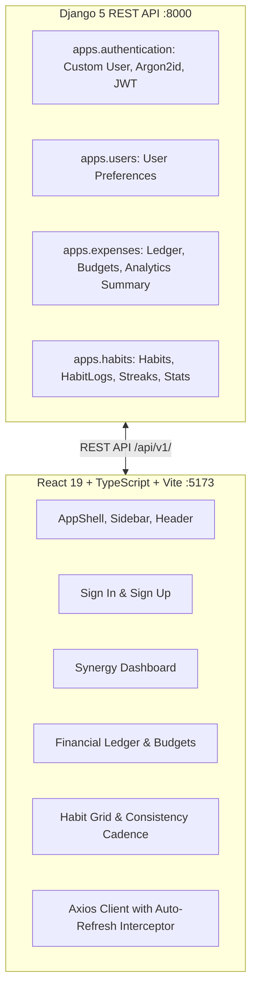

# LifeTrack Pro ⚡
> Intelligent personal telemetry OS synchronizing financial sovereignty, atomic habit discipline, and daily cognitive focus.

Built according to the enterprise [Software Design Specification (SDS)](./LIFE_TRACK_PRO_SDS.md).

---

## 🌟 Highlights & Features

- **Synergy Dashboard**: Real-time KPI cards for Net Financial Spend, Discipline Index, Habit Streaks, and Active Budgets.
- **Financial Ledger**:
  - Precision currency tracking (cents-level integer storage).
  - Monthly category budget enforcement with burn rate pacing (`% used`, `spent`, `remaining`).
  - Search, category filter badges, and transaction modal.
- **Atomic Habits & Discipline Matrix**:
  - Habit streak calculator tracking consecutive completions and all-time best streaks.
  - Streak tier progression (Diamond, Gold, Silver, Bronze).
  - 7-Day Consistency Cadence grid.
  - One-tap daily check-in with immediate feedback.
- **Enterprise Architecture**:
  - **Backend:** Django 5 REST Framework, Argon2id password hashing, SimpleJWT token refresh rotation, and PostgreSQL/SQLite dual-engine.
  - **Frontend:** React 19 + TypeScript + Vite + Tailwind CSS v4, dark-mode telemetry theme, and Axios client with auto-refresh interceptor.

---

## 🏗️ Architecture



---

## 🚀 Quick Start Guide

### Prerequisites
- Python 3.11+ (tested on Python 3.14)
- Node.js 18+ (tested on Node v24)
- Git

### 1. Clone the Repository
```bash
git clone https://github.com/tuxhar-sharma/LifeTrackPro.git
cd LifeTrackPro
```

### 2. Backend Setup (Django API)
```bash
cd backend
python -m venv venv

# On Windows:
.\venv\Scripts\activate
# On macOS / Linux:
source venv/bin/activate

pip install -r requirements/base.txt -r requirements/dev.txt
python manage.py migrate
python manage.py runserver 8000
```
> The Django backend will be live at `http://127.0.0.1:8000`.

### 3. Frontend Setup (React 19 + Vite)
In a second terminal:
```bash
cd frontend
npm install
npm run dev
```
> The frontend will be live at `http://localhost:5173`.

---

## 🧪 Running Automated Tests

Run backend unit and API tests with pytest:
```bash
cd backend
python -m pytest
```

Run frontend TypeScript check and build:
```bash
cd frontend
npm run build
```

---

## 👤 Default Demo Credentials
- **Email:** `alex@lifetrackpro.io`
- **Password:** `SecurePassword123!`
*(Or click the "✨ Click here to pre-fill demo account" button on the login screen)*

---

## 📄 License
MIT License.
