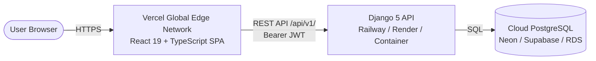

# LifeTrack Pro - Vercel & Production Deployment Guide

This guide provides step-by-step instructions to deploy **LifeTrack Pro** to production with **Vercel** (for the React 19 frontend) and a managed backend host (like **Railway**, **Render**, or **Fly.io** for the Django API).

---

## Architecture Overview



- **Frontend (Vercel)**: High-speed static edge delivery with instant client-side routing rewrites (`vercel.json`).
- **Backend (Render / Railway / Fly.io)**: Long-running Python WSGI worker (`gunicorn`) with persistent database connection and CORS configured for `*.vercel.app`.
- **Database (Neon / Supabase / Railway)**: Managed PostgreSQL 16+.

---

## Part 1: Deploying Frontend to Vercel

### Step 1: Import the Repository
1. Log in to your [Vercel Dashboard](https://vercel.com/dashboard).
2. Click **Add New...** → **Project**.
3. Select your GitHub repository: **`tuxhar-sharma/LifeTrackPro`**.

### Step 2: Configure Project Settings
Vercel will detect the repository configuration automatically thanks to the root [vercel.json](file:///c:/Users/Tushar%20Sharma/Desktop/LifeMetrics/vercel.json):
- **Framework Preset:** Vite
- **Root Directory:** `./` (or `frontend` — both work seamlessly)
- **Build Command:** `npm --prefix frontend run build` (auto-detected)
- **Output Directory:** `frontend/dist` (auto-detected)

### Step 3: Configure Environment Variables
Under **Environment Variables**, add:
| Key | Value | Description |
| :--- | :--- | :--- |
| `VITE_API_BASE_URL` | `https://your-django-backend.railway.app/api/v1` | URL of your deployed Django backend |

*(If testing locally or using a reverse proxy, you can omit this variable and it defaults to `/api/v1`)*

### Step 4: Deploy
Click **Deploy**. Your frontend will build in under 15 seconds and receive a production URL:
`https://lifetrack-pro-xxxx.vercel.app`

---

## Part 2: Deploying Django Backend (Railway / Render)

### Recommended: Railway (Zero-Config)
1. In your [Railway Dashboard](https://railway.app), click **New Project** → **Deploy from GitHub repo**.
2. Select **`LifeTrackPro`**.
3. In **Settings** → **Root Directory**, set to `backend`.
4. Click **Add a Service** → **Database** → **PostgreSQL**.
5. In the Django service **Variables**, add:
   - `DATABASE_URL`: `${{Postgres.DATABASE_URL}}` (automatic link)
   - `SECRET_KEY`: `<generate-a-strong-random-secret-key>`
   - `DEBUG`: `False`
   - `ALLOWED_HOSTS`: `.railway.app,.vercel.app`
6. In **Settings** → **Deploy**, set the Start Command:
   ```bash
   python manage.py migrate && gunicorn config.wsgi:application --bind 0.0.0.0:$PORT
   ```
7. Copy your Railway service public domain (e.g. `https://lifetrackpro-production.up.railway.app`) and paste it as `VITE_API_BASE_URL` in your Vercel project settings (`https://lifetrackpro-production.up.railway.app/api/v1`).

---

## Part 3: Verified Pre-Configurations in this Repository

This codebase is already pre-configured for Vercel:
1. **SPA Client-Side Routing:** Both [vercel.json](file:///c:/Users/Tushar%20Sharma/Desktop/LifeMetrics/vercel.json) and [frontend/vercel.json](file:///c:/Users/Tushar%20Sharma/Desktop/LifeMetrics/frontend/vercel.json) contain rewrite rules so direct visits to `/login`, `/register`, or `/app/dashboard` will never return 404.
2. **CORS Auto-Allowance:** `backend/config/settings/base.py` includes:
   ```python
   CORS_ALLOWED_ORIGIN_REGEXES = [
       r"^https:\/\/.*\.vercel\.app$",
   ]
   ```
   Every Vercel deployment preview or custom production domain on `.vercel.app` is permitted to communicate with your backend automatically.
3. **Static Files:** Whitenoise is bundled and configured for static asset streaming in production.
