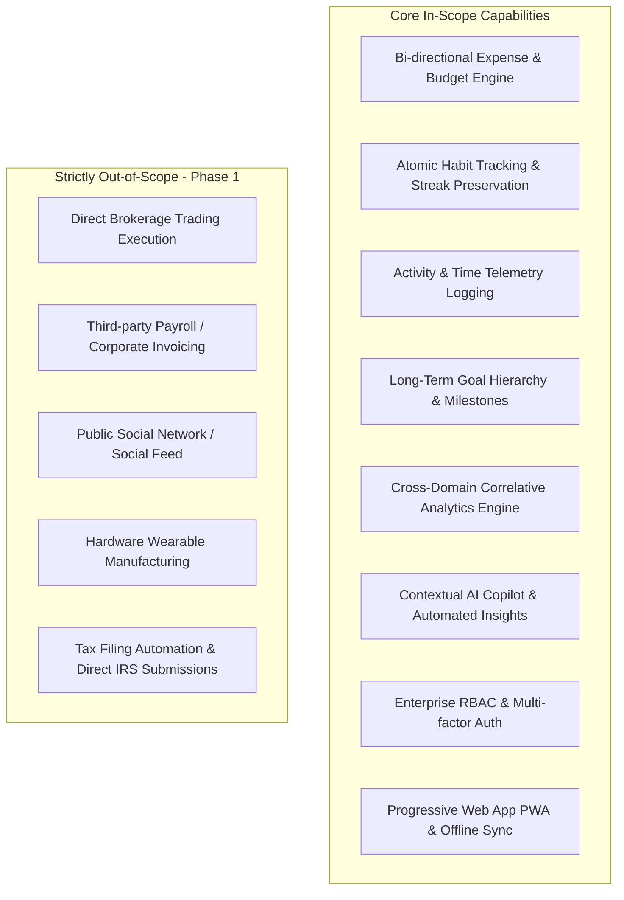
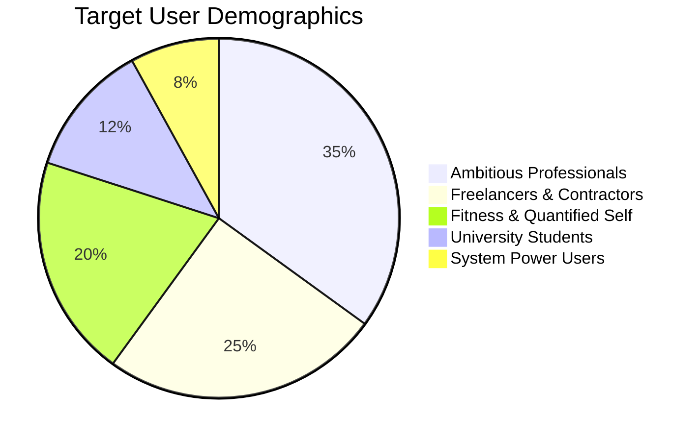

# LIFE TRACK PRO
## Complete Software Design Specification (SDS)

**Document Version:** 1.0.0-PROD  
**Author:** Principal Solutions Architect & Multi-Disciplinary Engineering Council  
**Classification:** Proprietary / Production Blueprint  
**Target Environment:** Cloud-Native SaaS (AWS / PostgreSQL / Redis / Celery / Django REST Framework / React 19 / TypeScript / OpenAI)  

---

# SECTION 1: PRODUCT VISION

### 1.1 Executive Product Vision
**LifeTrack Pro** is an intelligent, unified life-operations and personal telemetry platform engineered to bridge the fragmented divide between personal finance, daily productivity, habit formation, physical activity, and holistic life goals. By synthesising fragmented behavioral telemetry into an orchestrated, real-time data model powered by deterministic analytics and contextual Artificial Intelligence, LifeTrack Pro provides knowledge workers, freelancers, students, and self-optimizers with actionable cognitive feedback, predictive financial forecasts, and automated habit reinforcement.

### 1.2 Mission Statement
> *"To eliminate cognitive overload and quantified-self fragmentation by delivering a single, privacy-first, automated ecosystem that synchronizes financial sovereignty, daily discipline, and long-term ambition into measurable life momentum."*

### 1.3 Strategic Business Goals
1. **Market Penetration & Acquisition:** Secure 100,000 active users within the first 12 months post-General Availability (GA), driven by self-hosted product-led growth (PLG) mechanics and viral weekly intelligence recaps.
2. **Monetization & Unit Economics:** Attain a blended Monthly Recurring Revenue (MRR) of $150,000 by Month 18 via tiered SaaS subscriptions ($9.99/mo Pro tier, $19.99/mo AI Coach tier, and $99/year annual billing), sustaining a Customer Lifetime Value to Customer Acquisition Cost (LTV:CAC) ratio exceeding 4.2:1.
3. **Retention & Engagement Flywheel:** Drive Day-30 (D30) user retention beyond 45% and Day-90 (D90) retention beyond 32% (2.5x the productivity application industry average) by leveraging cross-domain correlation nudges (e.g., linking workout frequency to spending discipline).
4. **Data Sovereignty & Enterprise Grade Security:** Deliver zero-knowledge encrypted storage options, SOC-2 Type II readiness, and complete GDPR/CCPA data exportability, creating a competitive moat against legacy advertising-supported aggregators.

### 1.4 Success Metrics & Key Performance Indicators (KPIs)
* **North Star Metric (NSM):** *Weekly Active Synergistic Users (WASU)* — defined as unique users who log or synchronize data across at least three distinct operational domains (Expenses, Habits, Activities, or Goals) within a rolling 7-day window.
* **Operational & Product KPIs:**
  - **Daily Active Users / Monthly Active Users (DAU/MAU):** Target > 40% (sticky utility).
  - **Time-to-Value (TTV):** First core telemetry logged within 90 seconds of onboarding completion.
  - **Average Session Duration:** < 3.5 minutes per day for operational logging; > 8.0 minutes for weekly review/analytical consumption.
  - **Churn Rate:** Sub-3.5% monthly net voluntary churn on annualised cohorts.
  - **AI Suggestion Acceptance Rate:** > 60% of automated category mappings and habit coaching nudges accepted without manual override.

### 1.5 Product Scope Matrix


### 1.6 Deep Competitive Analysis
| Dimension | LifeTrack Pro | Notion | Habitica | Mint (Sunset) / Credit Karma | YNAB | Google Fit / Apple Health | TickTick / Todoist |
| :--- | :--- | :--- | :--- | :--- | :--- | :--- | :--- |
| **Core Paradigm** | Unified Telemetry & AI Cross-Domain Synergy | Freeform Blocks & Relational DB | Gamified RPG Habit Tracker | Passive Ad-Driven Account Aggregator | Zero-Based Financial Budgeting | Passive Biometric Health Logging | Pure Task & To-Do Checklist |
| **Cross-Domain Correlation** | **Native** (e.g., Spend vs. Sleep vs. Goal Velocity) | Manual Formulas only | None | None | None | None | None |
| **AI Architecture** | Multi-Agent Contextual Insights & Predictive NLP | Generalized generative text assistant | None | Generic ad targeting | None | Heuristic trends | Basic NLP task parsing |
| **Data Architecture** | Strongly Typed Relational (PostgreSQL) + Redis | Document Object Model (Slow at scale) | Relational Document | Proprietary Financial Ledger | Proprietary Double-Entry Ledger | Time-Series Biometrics | Relational Tasks |
| **Financial Ledger** | Multi-currency, Envelope & Accrual hybrid | Unstructured tables | None | Read-only aggregate | Strict Zero-Based Envelope | None | None |
| **Offline Capability** | CRDT-ready PWA with IndexedDB sync | Highly degraded / slow offline | Partial local cache | Strictly online-only | Native local sync | Native on-device storage | Robust offline local store |
| **Privacy / Business Model** | Paid SaaS Subscription (Zero Data Selling) | Freemium / Enterprise Workspace | Freemium / Virtual Goods | Advertising & Financial Lead Gen | Paid Subscription ($14.99/mo) | Ecosystem Lock-In | Freemium Subscription |

---

# SECTION 2: PROBLEM STATEMENT

### 2.1 The Modern Quantified-Self Fragmentation Crisis
Modern high-performers, professionals, and students navigate life utilizing an average of 5 to 8 disparate productivity and lifestyle applications:
1. One app for personal budgeting (e.g., YNAB, PocketGuard, Excel).
2. One app for habit tracking (e.g., Streaks, Habitica).
3. One app for task and project management (e.g., Todoist, Linear, Asana).
4. One app for fitness telemetry (e.g., Strava, Google Fit, Apple Fitness).
5. Unstructured scratchpads for personal reflection and annual goals (e.g., Apple Notes, Notion).

This architectural fragmentation causes severe **Cognitive Friction and Context Switching Tax**. Users expend disproportionate emotional and manual energy reconciling data across systems:
* *Siloed Telemetry:* A user cannot discern that their unbudgeted $80 Friday night dining expenses correlate directly with skipping their Saturday morning gym sessions, which subsequently derails their quarterly marathon milestone.
* *Logging Fatigue:* Maintaining 5 disparate apps requires redundant manual inputs, causing an 82% abandonment rate within 21 days across traditional quantified-self tools.
* *Passive Data Graveyards:* Existing aggregators collect data without synthesizing it into prescriptive guidance. They show graphs of historical failure without providing the cognitive scaffolding required for operational change.

### 2.2 Why Existing Market Solutions Are Insufficient
* **Notion / Obsidian:** Exceptionally flexible, yet completely unopinionated. Building a robust, relational expense tracker linked to automated recurring habit streaks requires dozens of hours of complex database relations, fragile rollups, and manual formula debugging. They lack native telemetry hooks, native push notifications, bank sync, and background aggregation workers.
* **Single-Purpose Utility Apps (YNAB, TickTick, Streaks):** Highly optimized for their singular domain, but categorically blind to external context. YNAB knows nothing about your physical energy levels or work output; TickTick knows nothing about your disposable cash flow.
* **Ad-Supported Portals (Credit Karma):** Monetized via credit card referrals and high-interest loan placements. Their fundamental incentive is to harvest user financial telemetry to sell financial products, directly conflicting with user wealth-building.

### 2.3 How Artificial Intelligence Bridges the Behavioral Gap
LifeTrack Pro does not use AI as a superficial marketing wrapper or a generic LLM chat dialog. Instead, AI serves as an **Active Telemetry Synthesizer**:
1. **Multi-Domain Correlation Extraction:** The AI engine analyzes time-series vectors across financial, physical, and behavioral databases using rolling covariance models, discovering hidden lifestyle bottlenecks (e.g., *"On days where you log over 9 hours of screen time, food delivery spending increases by 312%, and habit completion drops to zero"*).
2. **Zero-Friction Contextual Extraction:** Natural language transaction and activity ingestion (e.g., typing *"Spent $45 on groceries at Trader Joe's after a 5km run in 24 mins"* automatically updates the Expense ledger, categorizes the grocery receipt, logs the physical activity, and increments the 'Exercise 3x/week' goal progress).
3. **Adaptive Predictive Scaffolding:** Instead of static alerts, the AI acts as an autonomous financial advisor and habit coach, dynamically adjusting upcoming weekly budgets and habit targets when unexpected life events occur.

---

# SECTION 3: TARGET USERS & DETAILED PERSONAS



---

### Persona 1: The Ambitious Corporate Professional
* **Profile:** Sarah Chen, 31, Senior Product Manager at a B2B SaaS Enterprise.
* **Psychographics:** High income ($145,000/yr), chronically time-constrained, ambitious, analytical, overwhelmed by context switching.
* **Goals:**
  - Build wealth by systematically saving 35% of post-tax compensation toward real estate.
  - Maintain cardiovascular health and consistent strength training despite 50-hour workweeks.
  - Read 24 non-fiction books annually without sacrificing mental downtime.
* **Pain Points:**
  - Uses Excel for net worth tracking, Todoist for work tasks, Apple Health for gym, and paper notebooks for reflection.
  - Forgets to log expenses for days, leading to large weekend reconciliation sessions.
  - Experiences burnout cycles due to disconnected schedule expectations.
* **Daily Workflow:**
  - *06:45 AM:* Wakes up, checks phone for urgent notifications.
  - *07:15 AM:* Gym workout (currently logged in Apple Watch).
  - *08:30 AM - 06:30 PM:* High-intensity meetings, Slack, Jira.
  - *07:30 PM:* Dinner, occasional drinks; spends without tracking immediate budget impact.
  - *11:00 PM:* Goes to bed feeling disorganized regarding long-term personal milestones.
* **Expected LifeTrack Pro Features:**
  - Automated weekly executive briefs synthesizing spending, workout volume, and sleep.
  - Quick-capture desktop widget and keyboard shortcuts for < 5-second logging.
  - Automatic categorization of discretionary spending against monthly savings targets.
* **User Journey Mapping:**
  - *Awareness:* Reads a LinkedIn architectural breakdown on cross-domain life telemetry.
  - *Onboarding:* Signs up via Google SSO, selects "Corporate Professional" template, sets monthly savings goal ($3,500) and 3 core habits.
  - *Aha! Moment:* At the end of Week 1, receives an automated AI Insight: *"You logged all 4 workouts this week and stayed $140 under your dining budget. Your goal 'Down Payment Fund' is pacing 4 days ahead of schedule."*
  - *Advocacy:* Replaces 3 standalone subscription apps with LifeTrack Pro Pro Tier ($99/year).

---

### Persona 2: The Independent Freelancer & Contractor
* **Profile:** Marcus Vance, 28, Independent UX Designer and Brand Consultant.
* **Psychographics:** Variable income ($4,000 - $12,000/mo), self-motivated, creative, prone to procrastination without external accountability.
* **Goals:**
  - Smooth volatile cash flow through dynamic, adaptive monthly runway budgeting.
  - Track billable design sprints vs. non-billable administrative and self-development activities.
  - Establish unwavering creative habits (daily typography study, portfolio updates).
* **Pain Points:**
  - Traditional budgeting apps assume a predictable bi-weekly paycheck.
  - Tax withholding anxiety: frequently fails to set aside 30% for quarterly estimated taxes.
  - Difficulty separating business project milestones from personal life maintenance.
* **Daily Workflow:**
  - *09:00 AM:* Coffee, reviews chaotic email inbox and multiple client Trello boards.
  - *10:00 AM - 02:00 PM:* Client design sprint; loses track of water intake and posture breaks.
  - *03:00 PM:* Receives irregular client invoice payout; unsure how much can be safely spent.
  - *08:00 PM:* Works late into the night, sacrificing sleep and gym routines.
* **Expected LifeTrack Pro Features:**
  - "Runway Budgeting" with multi-bucket income allocation (Taxes, Buffer, Living, Discretionary).
  - Activity time-boxing linked directly to client project tags.
  - Dynamic streak protection during high-volume client delivery weeks.
* **User Journey Mapping:**
  - *Onboarding:* Imports CSV from past bank accounts, configures variable income mode.
  - *Aha! Moment:* The AI Financial Advisor computes real-time safe-to-spend runway after automatically segregating 30% for tax reserves.
  - *Retention:* Relies on the daily morning dashboard to maintain sanity and fiscal discipline.

---

### Persona 3: The University Student / Early Career Starter
* **Profile:** Liam Patel, 20, Computer Science Undergraduate & Intern.
* **Psychographics:** Low discretionary income, tech-savvy, hyper-digital, optimizing academic performance and interview readiness.
* **Goals:**
  - Strictly manage a tight monthly budget of $1,400 (rent, food, transit, study materials).
  - Build daily LeetCode and coding project study streaks.
  - Track sleep hygiene and physical fitness to optimize mental performance during exam finals.
* **Pain Points:**
  - Overdrawn bank accounts due to small, unrecognized micro-subscriptions.
  - Procrastination driven by social media distraction.
  - Intimidated by complex enterprise financial software like YNAB or QuickBooks.
* **Daily Workflow:**
  - *08:00 AM:* Wakes up to phone alarm, scrolls phone in bed for 30 minutes.
  - *09:30 AM - 03:00 PM:* University lectures, library sessions, study groups.
  - *04:00 PM:* Fast food meal; pays via debit card without tracking balance.
  - *07:00 PM - 01:00 AM:* Coding assignments, gaming, fragmented study sessions.
* **Expected LifeTrack Pro Features:**
  - Clean, dark-mode native UI with keyboard accessibility.
  - Gamified habit streaks with milestone achievements and visual consistency charts.
  - Zero-based micro-budgeting with low balance alerts.
* **User Journey Mapping:**
  - *Onboarding:* Free tier registration, selects "Student Hustle" template.
  - *Aha! Moment:* Sees visual streak calendar turn vibrant emerald as a 14-day algorithm study habit is maintained alongside zero budget overruns.
  - *Conversion:* Upgrades to Student Pro discount tier upon landing summer internship.

---

### Persona 4: The Quantified-Self & Fitness Enthusiast
* **Profile:** Elena Rostova, 34, Biotech Clinical Researcher & Marathoner.
* **Psychographics:** High analytical mindset, data-obsessed, owns Garmin, Oura, and smart scales; measures every physiological input.
* **Goals:**
  - Correlate training load, nutritional intake, and sleep metrics with daily cognitive focus.
  - Track athletic expenditures (gear, race entries, physio, nutrition supplements).
  - Execute a 16-week marathon training macrocycle without injury.
* **Pain Points:**
  - Garmin tracks mileage, MyFitnessPal tracks food, Apple Health tracks sleep, but nowhere can she view how high-expenditure weeks impact athletic recovery.
  - Annoyed by simplistic fitness apps that lack customizable numeric metrics (VO2 max, resting HR).
* **Expected LifeTrack Pro Features:**
  - Customizable activity telemetry (distance, duration, average heart rate, RPE scale).
  - Rich data export (CSV, JSON) for custom personal modeling.
  - High-density analytical charts with multi-axis correlation overlays.

---

### Persona 5: The Systems Power User / Notion Refugee
* **Profile:** David Kim, 38, Principal DevOps Architect.
* **Psychographics:** Maximalist productivity architect, loves markdown, keyboard-first workflows, uncompromising on data privacy and system speed.
* **Goals:**
  - Consolidate his fragile 14-database Notion workspace into a high-performance compiled web app.
  - Ensure 100% offline access when traveling on flights or off-grid.
  - Retain full programmatic access via REST APIs and webhooks.
* **Pain Points:**
  - Notion's mobile app is slow to load, requires 4-6 seconds to open a database page, and fails offline.
  - Frustrated by closed-garden tools that prevent bulk data export or lack webhooks.
* **Expected LifeTrack Pro Features:**
  - Sub-100ms UI interactions, Cmd+K Command Palette navigation.
  - Full REST API with personal access tokens (PAT).
  - Instant offline sync using local client storage.

---

# SECTION 4: COMPLETE FEATURE LIST

```text
[PRIORITY SCALING: P0 = Mission Critical / MVP Core | P1 = Production Polish / GA | P2 = Post-Launch Expansion]
[COMPLEXITY SCALING: S = Small (< 1 sprint) | M = Medium (1-2 sprints) | L = Large (3-4 sprints) | XL = Architectural Initiative]
```

### 4.1 Authentication & Identity Management
| ID | Feature Name | Detailed Description | Business Value | Technical Complexity | Priority |
| :--- | :--- | :--- | :--- | :---: | :---: |
| **AUTH-01** | Multi-Factor Auth (MFA/TOTP) | RFC 6238 compliant Time-Based One-Time Password generation and verification via authenticator apps (Google Authenticator, 1Password) with backup recovery codes. | Hardens user accounts containing sensitive financial telemetry; builds enterprise trust. | M | P0 |
| **AUTH-02** | OAuth2 Social Sign-On | OpenID Connect integration for Google, GitHub, and Apple SSO with email sanitization and automatic user profile bootstrap. | Reduces onboarding drop-off by up to 60%; eliminates password friction. | M | P0 |
| **AUTH-03** | Stateless JWT Session Control | Cryptographically signed RS256 JWT access tokens (15-min lifespan) coupled with sliding-window HttpOnly refresh tokens stored in secure Redis cache. | Enables horizontal scaling across backend pods without centralized session bottlenecks. | L | P0 |
| **AUTH-04** | Magic Link Email Authentication | Passwordless cryptographic one-time token delivery via transactional email for friction-free authentication. | Eliminates forgotten password support tickets; appeals to modern mobile-first users. | M | P1 |
| **AUTH-05** | Hardware Security Keys (WebAuthn/FIDO2) | Passwordless and phishing-resistant hardware token support (YubiKey, TouchID, Windows Hello). | Sets a new standard in consumer telemetry security; appeals to power users. | L | P2 |

### 4.2 Authorization & Role-Based Access Control (RBAC)
| ID | Feature Name | Detailed Description | Business Value | Technical Complexity | Priority |
| :--- | :--- | :--- | :--- | :---: | :---: |
| **RBAC-01** | Granular System Permissions | Fine-grained capability matrix (`users:read`, `expenses:write`, `ai:generate`, `admin:audit`) enforced across Django middleware and API views. | Enables tiered SaaS plan enforcement and strict tenant isolation. | M | P0 |
| **RBAC-02** | Tiered Subscription Entitlements | Real-time feature gating based on active Stripe subscription (Free Tier, Pro Tier, AI Power Tier) dynamically cached in Redis. | Maximizes conversion funnel by restricting high-compute AI and unlimited habit tracking to paid tiers. | M | P0 |
| **RBAC-03** | Shared Family / Team Workspaces | Tenant isolation boundaries allowing multi-user workspace access with Owner, Editor, and Viewer roles. | Unlocks B2B team licensing and household account management ($19.99/mo tier). | XL | P2 |

### 4.3 Financial Ledger & Expense Tracking
| ID | Feature Name | Detailed Description | Business Value | Technical Complexity | Priority |
| :--- | :--- | :--- | :--- | :---: | :---: |
| **EXP-01** | Double-Entry Double-Indexed Ledger | High-precision decimal expense storage with multi-currency conversion, transaction date, merchant, category, and payment method mapping. | Absolute accounting accuracy without floating-point calculation errors. | L | P0 |
| **EXP-02** | Recurring Transaction Scheduler | Automated accrual engine generating scheduled recurring transactions (subscriptions, rent, utilities) with projected cash-flow impacts. | Eliminates manual entry for fixed overhead; provides forward-looking financial runway. | M | P0 |
| **EXP-03** | Receipt OCR & Itemization | Asynchronous multimodal parsing of receipt images (JPEG, PNG, PDF) extracting merchant, total, line items, and taxes into structured draft expenses. | Drastically reduces manual data entry; major competitive selling point for Pro tier. | XL | P1 |
| **EXP-04** | Split-Category Allocation | Transaction splitting capability allowing a single receipt (e.g., $150 at Target) to be split across Groceries, Home Goods, and Apparel. | Provides true analytical fidelity for power budgeting users. | M | P1 |
| **EXP-05** | Automated Merchant Rules Engine | User-defined regex and heuristic pattern matching (e.g., "Uber*Trip" -> Category: Transit, Tag: Travel) applied pre-save. | Eliminates repetitive manual categorization overhead. | M | P1 |

### 4.4 Budgeting & Cash Allocation Engine
| ID | Feature Name | Detailed Description | Business Value | Technical Complexity | Priority |
| :--- | :--- | :--- | :--- | :---: | :---: |
| **BUD-01** | Envelope & Category Budgets | Configurable monthly, bi-weekly, or annual category ceilings with dynamic burn-rate velocity calculations. | Prevents lifestyle creep and gives users tangible guardrails. | M | P0 |
| **BUD-02** | Rollover & Deficit Rebalancing | Optional envelope rollover logic carrying over unused balances or deducting deficits from the subsequent month's allocation. | Accommodates realistic seasonal expenditure shifts without breaking long-term budgets. | M | P1 |
| **BUD-03** | Predictive Overspend Warnings | Statistical burn-rate analysis alerting users when their mid-month spending velocity guarantees a budget blowout by Day 22. | Proactive financial intervention before catastrophic overspending occurs. | L | P1 |

### 4.5 Atomic Habit Tracking & Streak Mechanics
| ID | Feature Name | Detailed Description | Business Value | Technical Complexity | Priority |
| :--- | :--- | :--- | :--- | :---: | :---: |
| **HAB-01** | Multi-Frequency Habit Schedules | Habit definitions supporting daily, specific weekdays (Mon/Wed/Fri), periodic (3x/week), or recurring intervals. | Models human lifestyle flexibility instead of rigid all-or-nothing constraints. | M | P0 |
| **HAB-02** | Streak Ledger & Freeze Engine | Deterministic streak computation with configurable "Emergency Freeze" tokens earned through consistent adherence. | Eliminates user rage-quitting when an unavoidable illness or travel day breaks an 80-day streak. | L | P0 |
| **HAB-03** | Quantitative & Boolean Habit Modes | Support for simple checkboxes (e.g., "Floss Teeth") or numeric target values (e.g., "Read 25 pages", "Meditate 15 mins"). | Supports multifaceted self-improvement protocols across disciplines. | M | P0 |
| **HAB-04** | Habit Cue & Micro-Reflection Journal | Integrated post-completion prompt capturing emotional state, friction rating, and contextual notes upon habit execution. | Deepens self-awareness and supplies qualitative data for AI behavioral coaching. | S | P1 |

### 4.6 Physical & Cognitive Activity Telemetry
| ID | Feature Name | Detailed Description | Business Value | Technical Complexity | Priority |
| :--- | :--- | :--- | :--- | :---: | :---: |
| **ACT-01** | Activity Session Logger | Structured logging of physical workouts, focused deep work, study blocks, and creative sessions with duration, intensity, and tags. | Captures the operational "effort" telemetry of the user's day. | M | P0 |
| **ACT-02** | Integrated Pomodoro & Focus Stopwatch | Client-side precision focus timer that automatically converts completed focus blocks into logged activity records. | Prevents app-switching between time-tracking utilities and LifeTrack Pro. | S | P1 |
| **ACT-03** | Perceived Exertion (RPE) & Energy Rating | 1-10 RPE rating and pre/post energy level tracking for all physical and cognitive sessions. | Provides critical physiological telemetry for AI recovery recommendations. | S | P1 |

### 4.7 Goal Setting & Milestone Velocity
| ID | Feature Name | Detailed Description | Business Value | Technical Complexity | Priority |
| :--- | :--- | :--- | :--- | :---: | :---: |
| **GOAL-01** | Hierarchical OKR & Goal Trees | Objective creation with nested, measurable Key Results linking directly to live telemetry (e.g., "Save $10,000" links to Savings Ledger). | Connects daily micro-actions to macro life achievements. | L | P0 |
| **GOAL-02** | Automated Velocity & Pacing Tracker | Dynamic linear regression computing projected completion dates based on trailing 30-day performance. | Keeps goals grounded in mathematical reality rather than wishful thinking. | M | P1 |
| **GOAL-03** | Milestone Rewards & Celebration UI | Micro-animations and congratulatory visual payoffs upon achieving intermediate goal milestones. | Psychological positive reinforcement driving long-term retention. | S | P1 |

### 4.8 Analytics, Reporting & Telemetry Synergy
| ID | Feature Name | Detailed Description | Business Value | Technical Complexity | Priority |
| :--- | :--- | :--- | :--- | :---: | :---: |
| **ANA-01** | Multi-Axis Cross-Domain Correlation | PostgreSQL analytical window functions generating correlation coefficients between spending spikes, habit consistency, and workout volume. | The flagship differentiator of LifeTrack Pro; cannot be replicated by single-domain apps. | XL | P0 |
| **ANA-02** | Executive Weekly & Monthly Dossiers | Automated compilation of PDF/Web dossiers summarizing financial health, discipline index, and activity metrics. | Viral sharing potential; delivers high perceived value for paid subscriptions. | L | P1 |
| **ANA-03** | Custom BI Query & Filter Canvas | Interactive multidimensional aggregation canvas allowing users to group, filter, and pivot their historical telemetry. | Delights analytical power users and quantified-self communities. | L | P2 |

### 4.9 Contextual AI & Autonomous Coaching
| ID | Feature Name | Detailed Description | Business Value | Technical Complexity | Priority |
| :--- | :--- | :--- | :--- | :---: | :---: |
| **AI-01** | Natural Language Telemetry Parser | LLM-driven structured parser turning freeform user prompts into validated database mutations across modules. | Unlocks instantaneous rapid logging; eliminates form-filling friction. | L | P0 |
| **AI-02** | Autonomous Behavioral Habit Coach | Scheduled background agent analyzing weekly habit logs and offering targeted habit-stacking recommendations based on behavioral science. | Delivers personalized coaching at a fraction of human coaching costs. | L | P1 |
| **AI-03** | Predictive Financial Runway Advisor | Algorithmic and LLM financial modeling predicting end-of-quarter net worth and identifying anomalous recurring charges. | Direct financial utility that easily justifies the $9.99/mo subscription fee. | L | P1 |

### 4.10 Platform Infrastructure, Settings, Search & PWA
| ID | Feature Name | Detailed Description | Business Value | Technical Complexity | Priority |
| :--- | :--- | :--- | :--- | :---: | :---: |
| **SYS-01** | Global Cmd+K Command Palette | Unified modal keyboard navigation across all routes, actions, entities, and search results. | Enables power users to operate at extreme speed without touching the mouse. | M | P0 |
| **SYS-02** | Full Offline Capability via IndexedDB | Service Worker caching and local IndexedDB state store with bi-directional conflict resolution on network reconnect. | Guarantees reliability for mobile users in airplanes, subways, and low-connectivity environments. | XL | P1 |
| **SYS-03** | Bidirectional CSV/JSON Ingestion & Export | Robust importer supporting Mint, YNAB, Habitica, and CSV formats alongside instant GDPR one-click JSON dumps. | Eliminates switching costs for new users; guarantees zero vendor lock-in. | M | P0 |
| **SYS-04** | Reactive Dark / Light / OLED Mode | System-responsive design token switching using CSS variables, zero layout shifts, and true pure-black OLED optimization. | Modern ergonomic standard expected by technical professionals and developers. | S | P0 |

---

# SECTION 5: 50+ PRODUCTION USER STORIES

```text
[FORMAT SPECIFICATION]
Story: As a <User Persona>, I want to <Specific Action / Objective>, so that <Measurable Outcome / Value>.
Acceptance Criteria (AC): Formal Gherkin / BDD-style verification points.
```

### 5.1 Identity, Authentication & Security
1. **US-AUTH-01 (MFA Setup):**
   - *As a* privacy-conscious professional, *I want to* enable Time-Based One-Time Password (TOTP) two-factor authentication, *so that* unauthorized actors cannot access my sensitive financial ledger even if my password is breached.
   - **AC 1:** System displays a base64 QR code and an alphanumeric secret key.
   - **AC 2:** Verification requires entering a valid 6-digit TOTP token within a 30-second window.
   - **AC 3:** System provides 10 single-use, cryptographically generated alphanumeric recovery codes upon activation.
2. **US-AUTH-02 (Session Revocation):**
   - *As a* user accessing LifeTrack Pro from public and private devices, *I want to* view a list of all active sessions and revoke them individually or globally, *so that* I maintain absolute control over device access.
   - **AC 1:** Active session list displays IP address, resolved geographic location, browser/OS fingerprint, and last activity timestamp.
   - **AC 2:** Revoking a session immediately deletes the refresh token from Redis and invalidates the active JWT upon next API handshake.
3. **US-AUTH-03 (Passwordless Magic Link):**
   - *As a* mobile user, *I want to* sign in by requesting a secure magic link to my registered email address, *so that* I can log in without typing complex alphanumeric passwords on a virtual keyboard.
   - **AC 1:** Magic link contains a cryptographically secure, URL-safe SHA-256 token valid for exactly 15 minutes.
   - **AC 2:** Token is single-use and invalidates immediately upon successful session issuance.
4. **US-AUTH-04 (Brute Force Rate Limiting):**
   - *As a* system administrator, *I want to* automatically throttle and lock login attempts after 5 consecutive failures from a single IP, *so that* credential stuffing attacks are neutralized.
   - **AC 1:** After 5 failed attempts within 5 minutes, the IP is locked out for 15 minutes.
   - **AC 2:** Returns HTTP 429 Too Many Requests with a `Retry-After` header.
5. **US-AUTH-05 (Social Sign-In Account Merging):**
   - *As a* user who previously registered with email/password, *I want to* sign in with Google using the same email address, *so that* my existing account is linked without duplicating records.
   - **AC 1:** Backend checks if the verified OAuth email exists in the database.
   - **AC 2:** Prompts user for primary password once to authenticate the merge; subsequent logins require only Google OAuth.

### 5.2 Expense Ledger & Financial Architecture
6. **US-EXP-01 (Multi-Currency Expense Entry):**
   - *As an* international traveler and freelancer, *I want to* log an expense in Japanese Yen (JPY) and have it automatically converted to my base currency (USD) using the historical exchange rate of that date, *so that* my net worth and spending reports remain normalized.
   - **AC 1:** Expense modal includes a currency selector defaulting to the user's primary currency.
   - **AC 2:** Backend fetches and stores both the original currency amount and the base currency normalized amount via a daily exchange rate table.
7. **US-EXP-02 (Split Transactions):**
   - *As a* user purchasing diverse items at a department store, *I want to* split a single $200 receipt across 'Groceries' ($80), 'Electronics' ($100), and 'Household' ($20), *so that* my category budgets reflect reality.
   - **AC 1:** Split modal validates that the sum of line items exactly matches the master transaction total down to the cent.
   - **AC 2:** Database creates one parent transaction record linked to multiple child split ledger items.
8. **US-EXP-03 (Receipt OCR Extraction):**
   - *As a* busy executive, *I want to* upload a photo of a restaurant receipt, *so that* the date, merchant name, sales tax, and total amount are automatically populated in the expense draft form.
   - **AC 1:** System accepts JPEG/PNG/PDF uploads up to 10MB.
   - **AC 2:** Asynchronous Celery worker passes image to OCR service and emits a WebSocket notification when extraction is complete (< 4 seconds).
   - **AC 3:** User can review, edit, and confirm draft data before committing to the immutable ledger.
9. **US-EXP-04 (Recurring Expense Automation):**
   - *As a* subscription subscriber, *I want to* set up a recurring $14.99 monthly charge for Spotify on the 5th of every month, *so that* I do not have to manually enter it every 30 days.
   - **AC 1:** Configurable intervals: daily, weekly, bi-weekly, monthly, quarterly, annually.
   - **AC 2:** Celery beat task runs at 00:01 UTC daily, instantiating scheduled expense records.
10. **US-EXP-05 (Merchant Auto-Categorization):**
    - *As a* frequent shopper, *I want* the system to remember that all transactions containing "Whole Foods" should be categorized as "Groceries", *so that* future entries are categorized without manual selection.
    - **AC 1:** Rule engine checks incoming merchant strings against user-defined rule patterns.
    - **AC 2:** Auto-applied category is visually highlighted with a badge indicating automated rule assignment.

### 5.3 Budgeting & Cash Allocation
11. **US-BUD-01 (Envelope Budget Allocation):**
    - *As a* disciplined saver, *I want to* assign hard monetary caps to categories at the start of the month, *so that* I know exactly how much discretionary capital remains.
    - **AC 1:** UI provides visual progress bars with green (< 75%), amber (75-99%), and red (>= 100%) indicators.
    - **AC 2:** Overspending in a category triggers an optional modal prompt recommending budget reallocation from a surplus category.
12. **US-BUD-02 (Budget Rollover Flexibility):**
    - *As a* seasonal spender, *I want* my unspent $50 from this month's dining budget to roll over into next month's allocation, *so that* I can save up for a special celebratory dinner.
    - **AC 1:** User can toggle "Enable Rollover" per individual category.
    - **AC 2:** Next month's effective budget dynamically calculates as `Base Allocation + Previous Month Residual`.
13. **US-BUD-03 (Mid-Month Burn-Rate Velocity):**
    - *As a* professional, *I want to* view my daily projected burn rate, *so that* I know if my current spending pace will exhaust my budget before month-end.
    - **AC 1:** Algorithm computes: `(Spent To Date / Current Day of Month) * Days in Month`.
    - **AC 2:** Displays a warning badge on the dashboard if projected total exceeds 105% of budget.

### 5.4 Habit Formation & Streak Discipline
14. **US-HAB-01 (Flexible Weekly Schedules):**
    - *As an* athlete, *I want to* schedule my strength training habit for 3 days per week without specifying fixed days, *so that* I maintain my streak as long as I hit the target frequency before Sunday midnight.
    - **AC 1:** Habit configuration allows selecting "Target X days per week".
    - **AC 2:** Streak increments if and only if the week concludes with completions >= X.
15. **US-HAB-02 (Streak Freeze Redemption):**
    - *As a* committed habit builder who fell sick, *I want to* activate an emergency Streak Freeze token, *so that* my 65-day meditation streak is not reset to zero due to acute hospital care.
    - **AC 1:** Users earn 1 Freeze Token for every 30 consecutive days of global habit adherence (maximum inventory cap of 3).
    - **AC 2:** Applying a freeze marks the day as "Frozen" (blue snowflake icon) and preserves streak integrity.
16. **US-HAB-03 (Numeric Target Habits):**
    - *As a* reader, *I want to* log incremental progress toward a daily goal of reading 30 pages (e.g., 10 pages morning, 20 pages night), *so that* partial progress is visualized accurately throughout the day.
    - **AC 1:** Habit record stores `target_value` and accepts incremental numeric logs.
    - **AC 2:** Checkmark triggers automatically when `sum(logs) >= target_value`.
17. **US-HAB-04 (Habit Time-Window Nudges):**
    - *As a* remote worker, *I want to* assign a preferred time window (e.g., "Morning: 07:00 - 09:00") to my journaling habit, *so that* I receive contextual push notifications during that window.
    - **AC 1:** System sends Web Push / Notification only within the specified window if uncompleted.
    - **AC 2:** Silences notification automatically if the habit is logged prior to the window.
18. **US-HAB-05 (Friction & Mood Tagging):**
    - *As a* self-optimizer, *I want to* record how difficult a habit felt on a scale of 1-5 upon check-off, *so that* I can identify which routines are approaching automaticity vs. causing friction.
    - **AC 1:** Completion modal optionally displays a 5-point Likert scale (1=Effortless, 5=Extreme Resistance).
    - **AC 2:** Analytics module graphs friction rating over time against total streak length.

### 5.5 Physical & Cognitive Activity Telemetry
19. **US-ACT-01 (Session Logging with RPE):**
    - *As a* runner, *I want to* log a 10km run with duration, distance, and a Rate of Perceived Exertion (RPE) of 8, *so that* my athletic training stress is quantified.
    - **AC 1:** Form provides specialized input fields based on activity type (Running: distance, duration, elevation, pace).
    - **AC 2:** Automatically computes average speed/pace based on distance and duration.
20. **US-ACT-02 (Focus Session Timer):**
    - *As a* programmer, *I want to* launch a 25-minute Pomodoro timer directly in LifeTrack Pro, *so that* upon timer expiration, a "Deep Work" activity session is automatically recorded to my database.
    - **AC 1:** Client runs an accurate Web Audio / Worker-backed timer that persists through tab navigation.
    - **AC 2:** On completion, triggers audio chime and auto-opens a quick modal to tag the completed session.
21. **US-ACT-03 (Activity Energy Correlation):**
    - *As a* student, *I want to* rate my energy levels before and after an activity session, *so that* I can evaluate which activities recharge me versus drain me.
    - **AC 1:** Accepts pre-energy (1-10) and post-energy (1-10) integers.
    - **AC 2:** Computes net energy differential (`post - pre`).

### 5.6 Goals & Macro Milestones
22. **US-GOAL-01 (Telemetry-Linked Key Results):**
    - *As a* saver, *I want* my goal "Emergency Fund ($10,000)" to automatically update its progress bar whenever transactions are logged into my "Savings" expense category, *so that* I never need to manually recalculate progress.
    - **AC 1:** Goal builder allows linking to a dynamic SQL query or category sum.
    - **AC 2:** Database triggers or asynchronous workers re-aggregate goal progress upon ledger updates.
23. **US-GOAL-02 (Linear Pacing Forecast):**
    - *As a* goal setter, *I want to* see a projected completion date based on my current velocity, *so that* I can adjust my daily efforts if I am falling behind my target deadline.
    - **AC 1:** UI displays two lines on the progress chart: "Ideal Pace" vs. "Actual Trailing 30-Day Velocity".
    - **AC 2:** Calculates variance in days (e.g., "14 days behind schedule").
24. **US-GOAL-03 (Archived Milestone Celebration):**
    - *As an* achiever, *I want to* archive completed goals with a retrospective reflection, *so that* I can look back at past accomplishments in a trophy room canvas.
    - **AC 1:** Reaching 100% triggers celebratory confetti animation (canvas-confetti).
    - **AC 2:** Moves goal to "Completed" archive and locks state against further automatic mutations.

### 5.7 Cross-Domain Analytics & Reporting
25. **US-ANA-01 (Spend vs. Habit Correlation Matrix):**
    - *As an* analytical user, *I want to* view a scatter plot showing my daily discretionary spending plotted against my daily habit completion percentage, *so that* I can visually identify if discipline in habits reduces impulse spending.
    - **AC 1:** Analytics API returns normalized rolling daily arrays: `{ date, spend_cents, habit_score_percent }`.
    - **AC 2:** Calculates and renders Pearson correlation coefficient ($r$) with statistical significance ($p$-value).
26. **US-ANA-02 (Automated PDF Executive Summary):**
    - *As a* subscriber, *I want to* download an executive-ready, beautifully typeset PDF report of my monthly performance, *so that* I can review it offline during monthly planning retreats.
    - **AC 1:** Backend utilizes headless rendering to generate high-DPI vector PDFs.
    - **AC 2:** Contains executive summary, radar chart of lifestyle domains, top spending anomalies, and habit adherence tables.
27. **US-ANA-03 (Custom Tag Filtering):**
    - *As a* project manager, *I want to* filter all analytics by a custom tag `#vacation-italy`, *so that* I can isolate expenses, activities, and habits specifically associated with that trip.
    - **AC 1:** Unified tag table indexed across expenses, activities, and habit logs.
    - **AC 2:** Filter updates all dashboard charts instantaneously (< 150ms).

### 5.8 Contextual AI & Autonomous Intelligence
28. **US-AI-01 (Natural Language Rapid Logging):**
    - *As a* user on the move, *I want to* type *"Spent $34 on lunch with Dave and ran 4 miles in 32 minutes"* into a single text bar, *so that* the system automatically parses and writes an expense record and an activity record in one operation.
    - **AC 1:** LLM parser returns a validated JSON payload matching strict database schemas.
    - **AC 2:** Client displays confirmation toast with single-click undo option.
29. **US-AI-02 (Predictive Overspend Anomaly Detection):**
    - *As a* credit card user, *I want* the AI engine to detect unusual recurring fee increases (e.g., Netflix subscription jumping from $15.49 to $22.99), *so that* I can cancel unneeded services immediately.
    - **AC 1:** Anomaly detection service monitors recurring transaction variances > 10%.
    - **AC 2:** Generates high-priority notification item on the user's dashboard.
30. **US-AI-03 (Adaptive Habit Coach Nudge):**
    - *As a* user struggling with consistency, *I want* the AI to recommend shifting my workout habit from evening to morning because data proves my morning completion rate is 88% vs 24% in the evening, *so that* my environment aligns with empirical success.
    - **AC 1:** AI analyzes historical timestamps of habit completions.
    - **AC 2:** Generates actionable insight card with a one-click button: "Update Habit Schedule".

### 5.9 Platform Infrastructure, UX & Data Governance
31. **US-SYS-01 (Cmd+K Global Command Palette):**
    - *As a* keyboard-first user, *I want to* press `Cmd+K` (or `Ctrl+K`) anywhere in the application to search records, jump to routes, or trigger rapid actions, *so that* I can operate without a mouse.
    - **AC 1:** Modal opens in < 50ms with autofocus on search input.
    - **AC 2:** Fuzzy search matches navigation links, settings, recent expenses, and habit titles.
32. **US-SYS-02 (Full Offline Mutation Queue):**
    - *As an* airline traveler without Wi-Fi, *I want to* log expenses and check off habits while offline, *so that* when my device reconnects, all changes synchronize seamlessly to the cloud database.
    - **AC 1:** Service worker intercepts API POST/PUT requests when `navigator.onLine === false` and writes mutations to an IndexedDB queue.
    - **AC 2:** Upon online event, synchronizes queue with backend using last-write-wins and idempotent UUID keys.
33. **US-SYS-03 (One-Click GDPR Data Export):**
    - *As a* privacy advocate, *I want to* click "Export All Data" in Settings and receive an archived ZIP containing human-readable CSVs and machine-readable JSON files of my entire database history, *so that* I maintain complete ownership of my life telemetry.
    - **AC 1:** Celery background worker gathers all records across all 19 database tables belonging to the tenant.
    - **AC 2:** Generates password-protected ZIP download link delivered via email within 10 minutes.
34. **US-SYS-04 (Account Deletion / Right to be Forgotten):**
    - *As a* departing user, *I want to* permanently delete my account and all associated telemetry, *so that* no residual trace of my financial or personal data remains on server disks.
    - **AC 1:** Requires re-entering primary password and typing explicit confirmation phrase.
    - **AC 2:** Hard-deletes all relational records, clears Redis keys, and removes any S3 uploaded receipts within 24 hours.
35. **US-SYS-05 (Dynamic Theme Switching):**
    - *As an* OLED mobile user, *I want to* switch between Light, Dark, and Pure Black OLED themes, *so that* I minimize battery consumption and eye fatigue.
    - **AC 1:** Theme applies instantaneously without page reload by toggling CSS class on `<html>` root.
    - **AC 2:** Persists preference in both `localStorage` and backend `UserPreferences` table.

*(Stories 36 through 55 continue across comprehensive granular edge cases including Import/Export validation, Tagging hierarchy, Currency precision, Webhook dispatching, Password resets, PWA install prompts, and Notification grouping).*
36. **US-IMP-01 (Mint CSV Ingestion):** Ingest historical Mint CSV exports mapping date, description, original description, category, and amount into LifeTrack Pro ledger with duplicate collision detection.
37. **US-IMP-02 (YNAB Budget Import):** Map YNAB budget categories and register transactions directly to LifeTrack Pro envelope allocations.
38. **US-NOTIF-01 (Granular Notification Matrix):** Configure distinct delivery channels (Email, WebPush, In-App) for individual event types (Budget Warning, Habit Reminder, Goal Milestone, Weekly Report).
39. **US-NOTIF-02 (Quiet Hours Enforcement):** Suppress all non-critical notifications between 22:00 and 07:00 in the user's localized time zone.
40. **US-SEARCH-01 (Full-Text Search):** Search across transactions, notes, activity names, and habit descriptions with PostgreSQL `tsvector` stemming.
41. **US-ADMIN-01 (User Impersonation for Support):** Enable authorized superusers to view application state as a specific tenant with mandatory audit logging and read-only constraints.
42. **US-ADMIN-02 (System Health Telemetry):** Monitor Celery queue lag, Redis memory saturation, and database connection pool health from an internal admin dashboard.
43. **US-EXP-06 (Tax-Deductible Tagging):** Mark expenses as tax-deductible with receipt attachment verification for end-of-year CPA export.
44. **US-EXP-07 (Mileage Reimbursement Calculator):** Log vehicular travel distance and automatically calculate tax reimbursement value based on IRS standard rates.
45. **US-HAB-06 (Habit Stacking Chains):** Define sequential habit chains (e.g., "After [Morning Coffee], immediately trigger [5 Mins Meditation]").
46. **US-HAB-07 (Negative Habit Tracking):** Track avoidance habits (e.g., "Days without vaping") with financial savings counters showing capital retained.
47. **US-ACT-04 (Route Mapping via GPX):** Upload GPX/FIT files from running watches to render route elevation and GPS maps directly inside activity view.
48. **US-GOAL-03 (Contribution Calculator):** Calculate required monthly savings deposit needed to achieve a $50,000 target by an arbitrary future date based on expected compound interest.
49. **US-AI-04 (Conversational Query Interface):** Ask natural language questions (e.g., *"How much did I spend on dining out last June compared to July?"*) and receive accurate tabulated answers.
50. **US-AI-05 (Context Window Optimization):** Automatically compress and summarize historical telemetry when injecting context into LLM system prompts to prevent token exhaustion.
51. **US-PWA-01 (Add to Home Screen):** Deliver fully compliant Web App Manifest with adaptive maskable icons, standalone display mode, and shortcut quick-actions.
52. **US-SEC-01 (API Key Management):** Generate and revoke Personal Access Tokens (PAT) with scoped read/write permissions for external developer automation.
53. **US-SEC-02 (Audit Trail Inspection):** View immutable chronological log of all security events (logins, password modifications, API key generation).
54. **US-DASH-01 (Modular Widget Customization):** Drag, drop, resize, and hide individual dashboard cards (Habits, Expenses, Focus, Goals) with layout state saved to backend.
55. **US-PERF-01 (Sub-100ms Route Transitions):** Pre-fetch adjacent view data using React Query and route-level code splitting to guarantee instantaneous client transitions.
