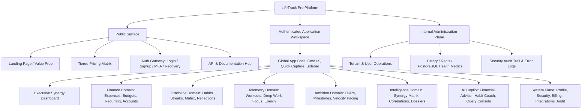

# SECTION 6: INFORMATION ARCHITECTURE

### 6.1 Enterprise Application Hierarchy
The architecture of **LifeTrack Pro** is structured into three primary organizational tiers: **Marketing & Public Surface**, **Authenticated App Shell (Tenant Workspace)**, and **Administrative / Governance Plane**.



### 6.2 Navigation & Routing Architecture
The routing hierarchy is strictly typed and built on React Router v7 with nested layout boundaries:

| Route Path | View / Layout | Access Control | Breadcrumb Hierarchy | Primary Purpose |
| :--- | :--- | :--- | :--- | :--- |
| `/` | `MarketingLayout > LandingPage` | Public | Home | Conversion, product demo, value proposition |
| `/pricing` | `MarketingLayout > PricingPage` | Public | Home > Pricing | Tiered SaaS monetization checkout |
| `/login` | `AuthLayout > LoginPage` | Public / Guest | Home > Login | Credential & OAuth entry |
| `/signup` | `AuthLayout > SignupPage` | Public / Guest | Home > Signup | Account creation & onboarding funnel |
| `/auth/mfa` | `AuthLayout > MFAPage` | Auth-Challenge | Home > Login > Verify | TOTP 2FA challenge resolution |
| `/app` | `AppLayout > DashboardRedirect` | Authenticated | Dashboard | Dynamic redirect to primary dashboard |
| `/app/dashboard` | `AppLayout > DashboardPage` | Authenticated | App > Dashboard | Unified cross-domain life telemetry view |
| `/app/expenses` | `AppLayout > ExpenseListPage` | Authenticated | App > Finance > Expenses | Ledger view, filtering, CSV export, split modal |
| `/app/expenses/recurring` | `AppLayout > RecurringPage` | Authenticated | App > Finance > Recurring | Subscriptions, fixed costs, accrual scheduler |
| `/app/budgets` | `AppLayout > BudgetGridPage` | Authenticated | App > Finance > Budgets | Monthly envelope allocations & burn rates |
| `/app/habits` | `AppLayout > HabitGridPage` | Authenticated | App > Discipline > Habits | Daily completion grid, streaks, freeze management |
| `/app/habits/matrix` | `AppLayout > HabitMatrixPage` | Authenticated | App > Discipline > Matrix | Monthly habit completion heatmaps |
| `/app/activities` | `AppLayout > ActivityFeedPage` | Authenticated | App > Telemetry > Activities | Workout & focus session timeline |
| `/app/activities/focus` | `AppLayout > FocusTimerPage` | Authenticated | App > Telemetry > Focus | Dedicated Pomodoro & deep-work canvas |
| `/app/goals` | `AppLayout > GoalTreePage` | Authenticated | App > Ambition > Goals | OKRs, milestone tracking, linear pacing |
| `/app/analytics` | `AppLayout > AnalyticsHubPage` | Authenticated | App > Intelligence > Analytics | Cross-domain correlation matrices, scatter plots |
| `/app/reports` | `AppLayout > ReportArchivePage` | Authenticated | App > Intelligence > Reports | Weekly/Monthly executive dossiers (Web/PDF) |
| `/app/ai-coach` | `AppLayout > AICoachPage` | Pro / AI Tier | App > AI > Life Coach | Conversational advisor & autonomous recommendations |
| `/app/settings` | `SettingsLayout > ProfilePage` | Authenticated | App > Settings > Profile | Avatar, bio, locale, base currency |
| `/app/settings/security` | `SettingsLayout > SecurityPage` | Authenticated | App > Settings > Security | MFA, passwords, active sessions, API tokens |
| `/app/settings/billing` | `SettingsLayout > BillingPage` | Authenticated | App > Settings > Billing | Stripe Customer Portal, plan tier, invoices |
| `/app/settings/data` | `SettingsLayout > DataMgmtPage` | Authenticated | App > Settings > Data | Import Mint/YNAB, Export JSON/CSV, GDPR Purge |
| `/admin` | `AdminLayout > OverviewPage` | Superuser | Admin > Overview | Platform telemetry, queue lag, active tenants |

### 6.3 Universal Search & Breadcrumb Strategy
* **Breadcrumb Model:** Breadcrumbs are dynamically resolved at runtime from route metadata (`matches` array in React Router), rendering accessible `<nav aria-label="Breadcrumb">` elements with Schema.org microdata for SEO on public pages.
* **Search Strategy:**
  - **Client-Side Fuzzy Filter:** For active data tables (e.g., current month's expenses), utilizing a Web Worker with `uFuzzy` or `Fuse.js` for zero-latency (< 5ms) filtering.
  - **Server-Side Full-Text Search:** The `Cmd+K` global command palette dispatches debounced (200ms) requests to `/api/v1/search/`, which executes PostgreSQL `websearch_to_tsquery` across indexed columns with weighted ranking (`setweight` on titles: 'A', categories: 'B', notes: 'C').

---

# SECTION 7: COMPLETE UI/UX DESIGN SYSTEM

### 7.1 Design Tokens & Thematic Direction
The visual identity of LifeTrack Pro embodies **"Engineering Precision & Tactical Clarity"**, taking direct inspiration from Stripe's high-contrast micro-typography, Linear's keyboard-first dark interface, and Vercel's disciplined monochromatic layout.

```css
/* DESIGN SYSTEM TOKENS - ROOT DEFINITION */
:root {
  /* Surface Color Palette (Light Mode) */
  --bg-canvas: #FAFAFA;
  --bg-surface: #FFFFFF;
  --bg-surface-elevated: #F4F4F5;
  --bg-glass: rgba(255, 255, 255, 0.75);
  --border-subtle: #E4E4E7;
  --border-strong: #D4D4D8;
  --text-primary: #09090B;
  --text-secondary: #71717A;
  --text-muted: #A1A1AA;

  /* Primary Brand (Electric Indigo) */
  --primary-50: #EEF2FF;
  --primary-100: #E0E7FF;
  --primary-500: #6366F1;
  --primary-600: #4F46E5;
  --primary-700: #4338CA;
  --primary-focus: rgba(79, 70, 229, 0.35);

  /* Functional Accents */
  --success-bg: #ECFDF5;
  --success-border: #A7F3D0;
  --success-text: #065F46;
  --success-solid: #10B981;

  --warning-bg: #FFFBEB;
  --warning-border: #FDE68A;
  --warning-text: #92400E;
  --warning-solid: #F59E0B;

  --error-bg: #FEF2F2;
  --error-border: #FECACA;
  --error-text: #991B1B;
  --error-solid: #EF4444;

  --info-bg: #F0F9FF;
  --info-border: #BAE6FD;
  --info-text: #075985;
  --info-solid: #0EA5E9;
}

/* OLED / Dark Mode Matrix */
.dark {
  --bg-canvas: #09090B;
  --bg-surface: #121215;
  --bg-surface-elevated: #18181B;
  --bg-glass: rgba(18, 18, 21, 0.75);
  --border-subtle: #27272A;
  --border-strong: #3F3F46;
  --text-primary: #F4F4F5;
  --text-secondary: #A1A1AA;
  --text-muted: #71717A;

  --primary-50: #1E1B4B;
  --primary-100: #312E81;
  --primary-500: #6366F1;
  --primary-600: #818CF8;
  --primary-700: #A5B4FC;

  --success-bg: #064E3B;
  --success-border: #047857;
  --success-text: #D1FAE5;
  --success-solid: #10B981;

  --warning-bg: #78350F;
  --warning-border: #B45309;
  --warning-text: #FEF3C7;
  --warning-solid: #F59E0B;

  --error-bg: #7F1D1D;
  --error-border: #B91C1C;
  --error-text: #FEE2E2;
  --error-solid: #EF4444;
}
```

### 7.2 Glassmorphism & Depth Layers
To create depth without visual noise, LifeTrack Pro implements a disciplined 3-tier layering model:
1. **Layer 0 (Canvas):** Pure background `--bg-canvas`.
2. **Layer 1 (Card / Grid Surfaces):** Solid `--bg-surface` with a 1px solid `--border-subtle` border and `box-shadow: 0 1px 3px rgba(0, 0, 0, 0.05)`.
3. **Layer 2 (Floating Modals, Quick-Capture, Cmd+K, Navigation Bar):** High-fidelity glassmorphic layer:
   ```css
   background: var(--bg-glass);
   backdrop-filter: blur(16px) saturate(180%);
   -webkit-backdrop-filter: blur(16px) saturate(180%);
   border: 1px solid var(--border-subtle);
   box-shadow: 0 20px 25px -5px rgba(0, 0, 0, 0.1), 0 8px 10px -6px rgba(0, 0, 0, 0.1);
   ```

### 7.3 Typography Scale (Tailwind CSS Extended)
* **Font Families:**
  - *Primary UI Sans:* `Geist Sans`, `Inter`, `-apple-system`, `BlinkMacSystemFont`, `sans-serif`
  - *Data & Numeric Telemetry Mono:* `Geist Mono`, `JetBrains Mono`, `Fira Code`, `monospace`
* **Scale Matrix:**
  | Token | Font Size | Line Height | Tracking | Weight | Recommended Application |
  | :--- | :--- | :--- | :--- | :--- | :--- |
  | `text-display` | 48px / 3.0rem | 1.1 | -0.04em | Bold (700) | Marketing Hero, Milestone Celebrations |
  | `text-h1` | 32px / 2.0rem | 1.2 | -0.03em | SemiBold (600) | Primary View Titles (Dashboard, Ledger) |
  | `text-h2` | 24px / 1.5rem | 1.25 | -0.025em | SemiBold (600) | Module Section Headers, Modal Titles |
  | `text-h3` | 18px / 1.125rem | 1.3 | -0.015em | Medium (500) | Card Headers, Sub-groups |
  | `text-body` | 14px / 0.875rem | 1.5 | -0.01em | Regular (400) | Standard Data Rows, Descriptions |
  | `text-small` | 12px / 0.75rem | 1.4 | 0em | Regular (400) | Metadata, Timestamps, Table Footers |
  | `text-mono-val`| 13px / 0.8125rem | 1.0 | 0.02em | SemiBold (600) | Financial Currency, Timers, Counters |

### 7.4 Spacing & Border Radius System
* **Spacing Scale (Rem-based):** `4px` (0.25rem), `8px` (0.5rem), `12px` (0.75rem), `16px` (1.0rem), `24px` (1.5rem), `32px` (2.0rem), `48px` (3.0rem), `64px` (4.0rem).
* **Border Radii:**
  - Micro (Badges, Pills): `9999px` (full round)
  - Small (Buttons, Input Fields): `6px` (`rounded-md`)
  - Medium (Cards, Panels, Dropdowns): `10px` (`rounded-lg`)
  - Large (Modals, Slide-overs, Floating Drawers): `16px` (`rounded-2xl`)

### 7.5 Motion & Micro-Interactions (Framer Motion Guidelines)
* **Standard Transition Curves:**
  - *Enter Ease:* `cubic-bezier(0.16, 1, 0.3, 1)` (snappy ease-out, duration 220ms).
  - *Exit Ease:* `cubic-bezier(0.7, 0, 0.84, 0)` (accelerated ease-in, duration 150ms).
* **Reduced Motion Compliance:** Every animation query wraps inside `@media (prefers-reduced-motion: reduce)` falling back to instant opacity crossfades.

### 7.6 Accessibility & WCAG 2.1 AA Compliance
1. **Color Contrast:** All body text meets minimum contrast ratio of 4.5:1 against background surfaces; large display headings meet 3.0:1.
2. **Keyboard Navigation:** Universal focus rings (`ring-2 ring-primary-500 ring-offset-2`) displayed on all interactive elements during keyboard tabbing.
3. **Screen Reader Semantics:** Radix UI / Shadcn primitives guarantee complete WAI-ARIA roles (`aria-expanded`, `aria-controls`, `aria-describedby`, `aria-live="polite"` for background calculation updates).

### 7.7 Responsive Breakpoints
* **Mobile (xs/sm):** `< 640px` (Single column stacked cards, bottom navigation tab bar, full-screen dialog modals).
* **Tablet (md):** `640px - 1023px` (Collapsed icon-only sidebar, dual-column analytical grids).
* **Desktop (lg/xl):** `1024px - 1535px` (Expanded 240px persistent sidebar, multi-column dashboard canvas, slide-over detail panels).
* **Ultra-wide (2xl):** `>= 1536px` (Max container width 1440px centered, or full-width data grid with density toggles).

---

# SECTION 8: PAGE BY PAGE DESIGN & COMPONENT SPECIFICATIONS

Below is the complete architectural specification for all 15 key surfaces across LifeTrack Pro.

---

### Page 1: Landing Page (Public Surface)
* **Route:** `/`
* **Purpose:** High-conversion marketing showcase illustrating cross-domain correlation, product speed, and privacy.
* **Component Composition (Shadcn + Vengeance):**
  - `HeroSection`: Typographic headline, real-time interactive widget sandbox, and CTA button (`Button variant="default" size="lg"`).
  - `SynergyDemoInteractive`: Interactive slider connecting simulated sleep/workout hours to simulated discretionary spend.
  - `FeatureBentoGrid`: 6-card bento grid highlighting Financial Ledger, Habit Matrix, AI Coach, Offline PWA, and Security.
  - `TestimonialCarousel`: Verified beta user quotes with authentic persona metrics.
  - `PricingMatrix`: 3-column pricing tier card grid with Monthly/Annual billing switch.
  - `Footer`: GDPR notice, SOC-2 badge, system status link, legal terms.
* **State Management:** Local React state for pricing toggle (Monthly vs Annual) and interactive sandbox sliders.
* **Responsive Behavior:** Bento grid collapses from 3 columns to 1 column on mobile; interactive demo converts to static video on screens < 640px.

---

### Page 2: Login Page
* **Route:** `/login`
* **Purpose:** Frictionless user authentication via email/password, magic link, or OAuth2.
* **Component Composition:**
  - `Card`: Centered card container (`max-w-md w-full`).
  - `OAuthButtonGroup`: Two full-width buttons for Google SSO and Apple Sign-In.
  - `SeparatorWithText`: "Or continue with email".
  - `LoginForm`: Form with `Input` (email), `Input` (password), "Forgot password?" link, and `Button` ("Sign In").
  - `MagicLinkToggle`: Button to toggle into passwordless email flow.
* **State Management:** React Hook Form + Zod schema validation; loading mutation status managed by React Query (`useMutation`).
* **States:**
  - *Loading:* Button displays spinner (`Loader2 className="animate-spin"`), inputs disabled.
  - *Error:* Inline error message on field failure; alert banner for invalid credentials or locked account.
  - *Success:* Immediate transition to `/app/dashboard` or `/auth/mfa` if 2FA is active.

---

### Page 3: Signup Page
* **Route:** `/signup`
* **Purpose:** Fast onboarding with minimal friction to capture new users.
* **Component Composition:**
  - `Card`: Matching login card styling.
  - `OAuthButtonGroup`: One-click Google/Apple registration.
  - `SignupForm`: Email, password (with real-time password strength meter calculating entropy), and terms agreement checkbox.
  - `TemplatePicker`: 3-card selector during onboarding step 2 (Corporate Professional, Freelancer, Student).
* **Validation:** Zod schema requiring: minimum 12 characters, at least 1 uppercase letter, 1 number, and 1 symbol.

---

### Page 4: Unified Life Synergy Dashboard (Core View)
* **Route:** `/app/dashboard`
* **Purpose:** Executive command center summarizing real-time status across all life domains.
* **Component Composition:**
  ```text
  +-----------------------------------------------------------------------------------+
  | TopBar: Date Header | Quick-Capture Button (Cmd+N) | Cmd+K Search | Avatar Menu   |
  +-----------------------------------------------------------------------------------+
  | KPI Row:                                                                          |
  | [ Net Cash Flow ]   [ Habit Discipline Index ]   [ Weekly Active Hours ]   [ Goal Velocity ] |
  +---------------------------------------------------+-------------------------------+
  | Main Content Area (65%):                          | Side Rail (35%):              |
  | +-----------------------------------------------+ | +---------------------------+ |
  | | Synergy Chart: Spend vs. Habits (Multi-axis)  | | | AI Contextual Daily Nudge | |
  | +-----------------------------------------------+ | +---------------------------+ |
  | | Today's Habit Matrix (Interactive Checkboxes) | | | Upcoming Bills & Renewals | |
  | +-----------------------------------------------+ | +---------------------------+ |
  | | Recent Transactions Stream                    | | | Active Focus Session Dock | |
  +---------------------------------------------------+-------------------------------+
  ```
* **Components:** `KPICard`, `SynergyLineChart` (Recharts / Visx), `HabitChecklist`, `TransactionRow`, `AICard`, `PomodoroDock`.
* **State Management:** Server state via React Query `useDashboardSummary()`; polling interval set to 60 seconds or invalidated upon quick-capture mutation.
* **States:**
  - *Loading:* Skeleton loaders matching the exact dimensions of KPI cards and charts.
  - *Empty State:* "Welcome to LifeTrack Pro! Click here to log your first transaction or habit."

---

### Page 5: Expense Ledger & Transaction Hub
* **Route:** `/app/expenses`
* **Purpose:** High-density financial ledger for viewing, searching, adding, and itemizing expenditures.
* **Component Composition:**
  - `LedgerHeader`: Monthly spend total, total income, net savings rate, and "Log Expense" CTA.
  - `FilterToolbar`: Multi-select category filter, date-range picker, amount slider, and tag pills.
  - `DataTable` (TanStack Table + Shadcn): Virtualized table rendering columns: Date, Merchant, Category (with icon badge), Payment Method, Tags, Amount (right-aligned monospaced), Actions (Edit, Split, Delete).
  - `ExpenseModal`: Slide-over drawer containing full transaction form, file drag-and-drop for receipts, and split allocation toggle.
* **Data Requirements:** Paginated `/api/v1/expenses/?page=1&page_size=50` with client-side optimistic UI updates on add/delete.

---

### Page 6: Budget & Cash Allocation Module
* **Route:** `/app/budgets`
* **Purpose:** Zero-based envelope budgeting and category burn-rate surveillance.
* **Component Composition:**
  - `BudgetSummaryHeader`: Total Allocated, Total Spent, Remaining Disposable Runway.
  - `EnvelopeGrid`: Grid of responsive cards for each category showing:
    - Category name & icon
    - Spent vs. Target (e.g., "$420 / $600")
    - Visual progress bar with dynamic threshold colors
    - Daily burn rate projection (e.g., "Trending 12% under budget")
  - `RebalanceModal`: Allows rapid drag-and-drop of funds from a surplus envelope to a depleted envelope.

---

### Page 7: Activity Telemetry & Time Logger
* **Route:** `/app/activities`
* **Purpose:** Log, categorize, and review physical workouts and cognitive focus sessions.
* **Component Composition:**
  - `ActivityMetricsBar`: Total training volume (hours), calories/energy expended, cognitive focus hours.
  - `ActivityTimeline`: Chronological stream of cards showing activity type (Running, Gym, Coding, Reading), duration, RPE badge (1-10), and notes.
  - `ActivityEntryModal`: Form supporting dynamic sub-fields based on category (Distance/Pace for running; Sets/Reps for gym; Focus topic for study).

---

### Page 8: Atomic Habit Tracking Matrix
* **Route:** `/app/habits`
* **Purpose:** Daily habit check-off, streak maintenance, and behavioral consistency visualization.
* **Component Composition:**
  - `WeeklyDateStrip`: Horizontal calendar bar showing current week with active day highlighted.
  - `HabitList`: Grouped by time of day (Morning, Afternoon, Evening):
    - Habit Name & icon
    - Current Streak pill (e.g., "🔥 42 days")
    - Freeze Token indicator
    - Interactive Checkbox / Numeric Incrementer (+1 button)
  - `HabitHeatmap`: GitHub-style calendar contribution grid rendering 365 days of overall habit adherence.
* **Animations:** Checkbox completion triggers a subtle spring scale animation (`scale: [1, 1.25, 1]`) and optional haptic feedback on mobile.

---

### Page 9: Goal Hierarchy & Milestone Velocity
* **Route:** `/app/goals`
* **Purpose:** Long-term goal architecture with objective breakdown and automated pacing calculations.
* **Component Composition:**
  - `GoalTreeCard`: Nested card displaying:
    - Primary Objective (e.g., "Achieve Financial Independence Phase 1")
    - Target Date & Days Remaining
    - Key Results linked to live database telemetry
    - Linear Velocity Graph comparing target pace against actual pacing.
  - `CreateGoalWizard`: 3-step modal to create objective, define key results, and bind telemetry hooks.

---

### Page 10: Cross-Domain Analytics Hub
* **Route:** `/app/analytics`
* **Purpose:** Deep statistical analysis exploring the interplay between money, habits, and physical energy.
* **Component Composition:**
  - `CorrelationScatterMatrix`: Multi-variable interactive scatter plot with customizable X and Y axes (e.g., X = "Hours Slept", Y = "Discretionary Spending").
  - `DomainRadarChart`: 5-axis radar chart showing life balance (Finances, Fitness, Discipline, Focus, Wellbeing).
  - `TrendDecomposition`: Time-series chart with 7-day moving averages and anomaly markers.

---

### Page 11: Executive Reports & Dossier Archive
* **Route:** `/app/reports`
* **Purpose:** Generate, review, and download structured periodic performance dossiers.
* **Component Composition:**
  - `DossierViewer`: Clean, document-style reading layout with printable CSS styles.
  - `ReportHistoryTable`: List of historical weekly and monthly reports with direct "Download PDF" links.
  - `GenerateReportDialog`: Manual trigger to generate an on-demand report for a custom date range.

---

### Page 12: Contextual AI Insights & Coach
* **Route:** `/app/ai-coach`
* **Purpose:** Conversational chat and proactive recommendations from the multi-agent AI system.
* **Component Composition:**
  - `ChatContainer`: Message stream with distinct bubbles for User and AI Coach.
  - `InsightCardWidget`: Embedded interactive cards within the chat stream allowing one-click execution of suggested actions (e.g., "Reallocate $50 to Groceries").
  - `PromptSuggestionPills`: Context-aware quick prompt buttons (e.g., "Analyze my spending anomalies this month", "Why did my habit streak drop?").

---

### Page 13: System Settings & Workspace Configuration
* **Route:** `/app/settings`
* **Purpose:** Manage user profile, regional preferences, and UI themes.
* **Component Composition:**
  - `SettingsNavigation`: Sidebar with links to Profile, Security, Preferences, Billing, Integrations.
  - `PreferencesForm`: Select Base Currency (USD, EUR, GBP, JPY, etc.), First Day of Week (Sunday/Monday), Time Zone, Date Format, Theme (Light/Dark/OLED/System).

---

### Page 14: User Profile & Security Center
* **Route:** `/app/settings/security`
* **Purpose:** Manage passwords, active sessions, TOTP two-factor authentication, and API access tokens.
* **Component Composition:**
  - `PasswordChangeCard`: Old password, new password, confirmation.
  - `TwoFactorSetupCard`: QR code modal, verification input, recovery codes display.
  - `ActiveSessionList`: IP addresses, device fingerprints, and "Revoke" action buttons.
  - `PersonalAccessTokens`: Token generation table with copy-to-clipboard modal.

---

### Page 15: Administration & System Telemetry Panel
* **Route:** `/admin`
* **Purpose:** Internal operational overview for superusers and platform engineers.
* **Component Composition:**
  - `SystemMetricsGrid`: Active WebSocket connections, Celery task queue depth, Redis memory utilization, Database query latency.
  - `TenantManagementTable`: Searchable user table with plan tier, last active date, and account status toggles (Active, Suspended).
  - `AuditLogViewer`: Real-time streaming log of high-severity system events.
