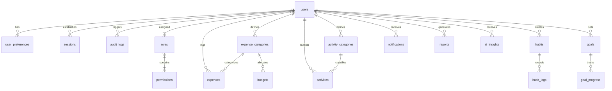
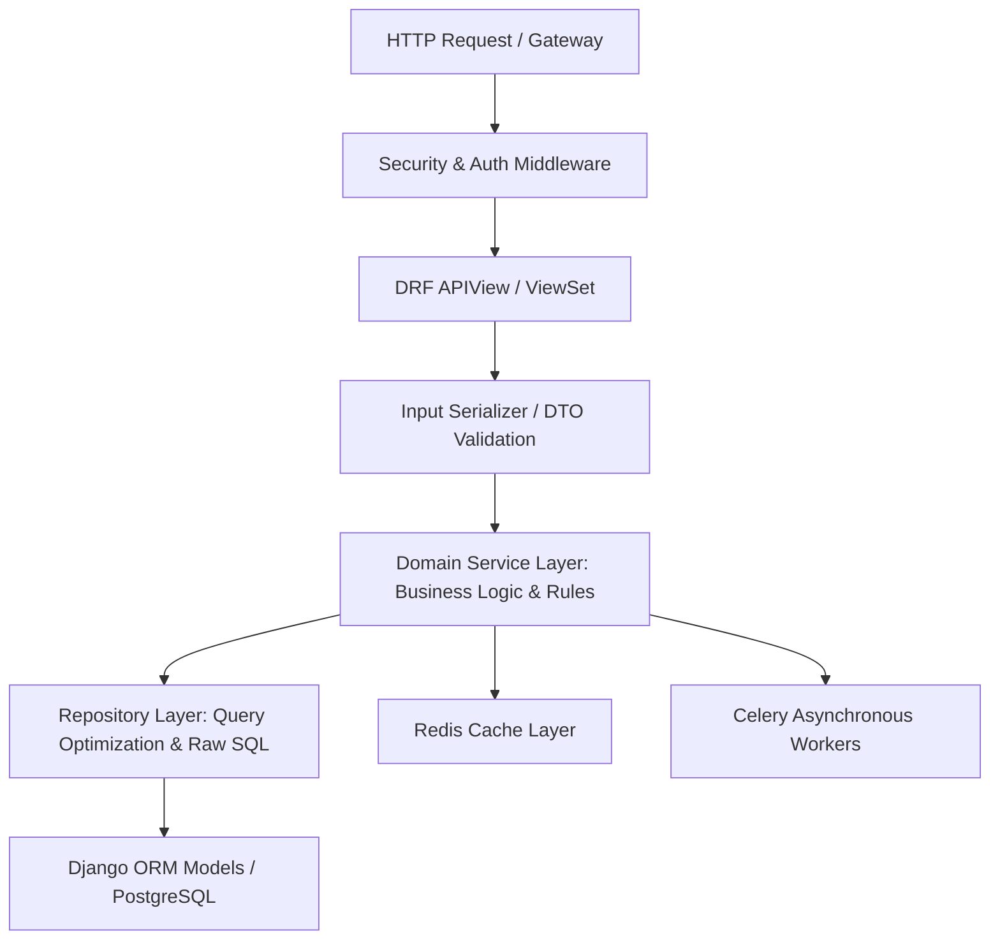

# SECTION 9: DATABASE ARCHITECTURE

### 9.1 Relational Architecture Principles
**LifeTrack Pro** utilizes **PostgreSQL 16+** as its primary persistent relational data store. The database architecture enforces strict multi-tenant isolation, enterprise-grade referential integrity, microsecond-level indexed query performance, and horizontal scalability via table partitioning and read replicas.



### 9.2 Key Architectural Standards
1. **Primary Keys:** Universal **UUIDv7** (RFC 9562) used across all entity tables. UUIDv7 provides 128-bit global uniqueness while embedding a 48-bit UNIX millisecond timestamp prefix, ensuring monotonic B-tree index locality and preventing the severe page-split fragmentation associated with random UUIDv4.
2. **Financial Precision:** Currency values are strictly stored as `BIGINT` representing the minor monetary unit (cents, pence, yen). Zero floating-point types (`FLOAT`, `DOUBLE`) are permitted in financial calculations.
3. **Time Zone Normalization:** Every timestamp column is typed as `TIMESTAMPTZ` and stored in Coordinated Universal Time (UTC). Localized display conversions are handled in application code and frontend presentation layers using the tenant's stored IANA timezone.
4. **Soft Delete Architecture:** Telemetry and financial records implement a unified soft-delete pattern utilizing `deleted_at TIMESTAMPTZ DEFAULT NULL`. Queries utilize partial indexes (e.g., `WHERE deleted_at IS NULL`) to maintain high index efficiency.
5. **Multi-Tenancy Isolation:** Every resource table contains an indexed, foreign-keyed `user_id` column with PostgreSQL Row-Level Security (RLS) policies acting as a defense-in-depth barrier behind application-level tenant filtering.

### 9.3 Partitioning Strategy
To support petabyte-scale telemetry growth without query degradation:
* **`expenses` Table:** Partitioned by `RANGE (transaction_date)` in monthly intervals (e.g., `expenses_y2026m01`, `expenses_y2026m02`). An automated maintenance worker creates upcoming monthly partitions 60 days in advance.
* **`habit_logs` & `activities` Tables:** Partitioned by `RANGE (logged_at)` in quarterly intervals.
* **`audit_logs` Table:** Partitioned by `RANGE (created_at)` with automated rotation into compressed columnar storage (pg_analytics / Parquet S3 archival) after 365 days.

---

# SECTION 10: COMPLETE DATABASE SCHEMA (PRODUCTION DDL)

```sql
-- ============================================================================
-- LIFE TRACK PRO - COMPLETE PRODUCTION POSTGRESQL DDL SPECIFICATION
-- Database Version: PostgreSQL 16+
-- Schema: public
-- ============================================================================

CREATE EXTENSION IF NOT EXISTS "uuid-ossp";
CREATE EXTENSION IF NOT EXISTS "pgcrypto";
CREATE EXTENSION IF NOT EXISTS "citext";

-- ----------------------------------------------------------------------------
-- 1. ROLES & PERMISSIONS
-- ----------------------------------------------------------------------------
CREATE TABLE roles (
    id UUID PRIMARY KEY DEFAULT gen_random_uuid(),
    code VARCHAR(50) UNIQUE NOT NULL,
    name VARCHAR(100) NOT NULL,
    description TEXT,
    created_at TIMESTAMPTZ NOT NULL DEFAULT CURRENT_TIMESTAMP,
    updated_at TIMESTAMPTZ NOT NULL DEFAULT CURRENT_TIMESTAMP
);

CREATE TABLE permissions (
    id UUID PRIMARY KEY DEFAULT gen_random_uuid(),
    code VARCHAR(100) UNIQUE NOT NULL,
    module VARCHAR(50) NOT NULL,
    description TEXT,
    created_at TIMESTAMPTZ NOT NULL DEFAULT CURRENT_TIMESTAMP
);

CREATE TABLE role_permissions (
    role_id UUID NOT NULL REFERENCES roles(id) ON DELETE CASCADE,
    permission_id UUID NOT NULL REFERENCES permissions(id) ON DELETE CASCADE,
    PRIMARY KEY (role_id, permission_id)
);

-- ----------------------------------------------------------------------------
-- 2. USERS & IDENTITY
-- ----------------------------------------------------------------------------
CREATE TYPE subscription_tier AS ENUM ('free', 'pro', 'ai_power', 'enterprise');
CREATE TYPE user_status AS ENUM ('active', 'pending_verification', 'suspended', 'deactivated');

CREATE TABLE users (
    id UUID PRIMARY KEY DEFAULT gen_random_uuid(),
    email CITEXT UNIQUE NOT NULL,
    password_hash VARCHAR(255) NOT NULL,
    first_name VARCHAR(100) NOT NULL,
    last_name VARCHAR(100) NOT NULL,
    status user_status NOT NULL DEFAULT 'pending_verification',
    tier subscription_tier NOT NULL DEFAULT 'free',
    is_superuser BOOLEAN NOT NULL DEFAULT FALSE,
    mfa_enabled BOOLEAN NOT NULL DEFAULT FALSE,
    mfa_secret VARCHAR(128),
    failed_login_attempts INT NOT NULL DEFAULT 0,
    locked_until TIMESTAMPTZ,
    last_login_at TIMESTAMPTZ,
    created_at TIMESTAMPTZ NOT NULL DEFAULT CURRENT_TIMESTAMP,
    updated_at TIMESTAMPTZ NOT NULL DEFAULT CURRENT_TIMESTAMP,
    deleted_at TIMESTAMPTZ
);

CREATE INDEX idx_users_email ON users(email);
CREATE INDEX idx_users_status_tier ON users(status, tier) WHERE deleted_at IS NULL;

CREATE TABLE user_roles (
    user_id UUID NOT NULL REFERENCES users(id) ON DELETE CASCADE,
    role_id UUID NOT NULL REFERENCES roles(id) ON DELETE CASCADE,
    assigned_at TIMESTAMPTZ NOT NULL DEFAULT CURRENT_TIMESTAMP,
    PRIMARY KEY (user_id, role_id)
);

CREATE TABLE user_preferences (
    user_id UUID PRIMARY KEY REFERENCES users(id) ON DELETE CASCADE,
    base_currency VARCHAR(3) NOT NULL DEFAULT 'USD',
    timezone VARCHAR(50) NOT NULL DEFAULT 'UTC',
    date_format VARCHAR(20) NOT NULL DEFAULT 'YYYY-MM-DD',
    theme VARCHAR(20) NOT NULL DEFAULT 'system',
    email_notifications BOOLEAN NOT NULL DEFAULT TRUE,
    push_notifications BOOLEAN NOT NULL DEFAULT TRUE,
    weekly_digest_enabled BOOLEAN NOT NULL DEFAULT TRUE,
    created_at TIMESTAMPTZ NOT NULL DEFAULT CURRENT_TIMESTAMP,
    updated_at TIMESTAMPTZ NOT NULL DEFAULT CURRENT_TIMESTAMP
);

CREATE TABLE sessions (
    id UUID PRIMARY KEY DEFAULT gen_random_uuid(),
    user_id UUID NOT NULL REFERENCES users(id) ON DELETE CASCADE,
    refresh_token_hash VARCHAR(64) NOT NULL UNIQUE,
    ip_address INET NOT NULL,
    user_agent TEXT NOT NULL,
    expires_at TIMESTAMPTZ NOT NULL,
    revoked_at TIMESTAMPTZ,
    created_at TIMESTAMPTZ NOT NULL DEFAULT CURRENT_TIMESTAMP
);

CREATE INDEX idx_sessions_lookup ON sessions(user_id, expires_at) WHERE revoked_at IS NULL;

-- ----------------------------------------------------------------------------
-- 3. FINANCIAL TELEMETRY: CATEGORIES, EXPENSES & BUDGETS
-- ----------------------------------------------------------------------------
CREATE TABLE expense_categories (
    id UUID PRIMARY KEY DEFAULT gen_random_uuid(),
    user_id UUID NOT NULL REFERENCES users(id) ON DELETE CASCADE,
    name VARCHAR(100) NOT NULL,
    icon VARCHAR(50) NOT NULL DEFAULT 'folder',
    color_hex VARCHAR(7) NOT NULL DEFAULT '#6366F1',
    is_system BOOLEAN NOT NULL DEFAULT FALSE,
    created_at TIMESTAMPTZ NOT NULL DEFAULT CURRENT_TIMESTAMP,
    updated_at TIMESTAMPTZ NOT NULL DEFAULT CURRENT_TIMESTAMP,
    deleted_at TIMESTAMPTZ,
    UNIQUE(user_id, name)
);

CREATE TABLE expenses (
    id UUID NOT NULL DEFAULT gen_random_uuid(),
    user_id UUID NOT NULL REFERENCES users(id) ON DELETE CASCADE,
    category_id UUID NOT NULL REFERENCES expense_categories(id) ON DELETE RESTRICT,
    amount_cents BIGINT NOT NULL,
    currency VARCHAR(3) NOT NULL DEFAULT 'USD',
    amount_base_currency_cents BIGINT NOT NULL,
    merchant_name VARCHAR(150) NOT NULL,
    transaction_date DATE NOT NULL,
    payment_method VARCHAR(50) NOT NULL DEFAULT 'credit_card',
    is_recurring BOOLEAN NOT NULL DEFAULT FALSE,
    is_tax_deductible BOOLEAN NOT NULL DEFAULT FALSE,
    notes TEXT,
    receipt_url TEXT,
    created_at TIMESTAMPTZ NOT NULL DEFAULT CURRENT_TIMESTAMP,
    updated_at TIMESTAMPTZ NOT NULL DEFAULT CURRENT_TIMESTAMP,
    deleted_at TIMESTAMPTZ,
    PRIMARY KEY (id, transaction_date)
) PARTITION BY RANGE (transaction_date);

CREATE INDEX idx_expenses_user_date ON expenses(user_id, transaction_date DESC) WHERE deleted_at IS NULL;
CREATE INDEX idx_expenses_category ON expenses(category_id, transaction_date) WHERE deleted_at IS NULL;

-- Example Monthly Partitions (Generated automatically by maintenance worker)
CREATE TABLE expenses_y2026m01 PARTITION OF expenses FOR VALUES FROM ('2026-01-01') TO ('2026-02-01');
CREATE TABLE expenses_y2026m02 PARTITION OF expenses FOR VALUES FROM ('2026-02-01') TO ('2026-03-01');
CREATE TABLE expenses_y2026m03 PARTITION OF expenses FOR VALUES FROM ('2026-03-01') TO ('2026-04-01');
CREATE TABLE expenses_y2026m04 PARTITION OF expenses FOR VALUES FROM ('2026-04-01') TO ('2026-05-01');

CREATE TABLE budgets (
    id UUID PRIMARY KEY DEFAULT gen_random_uuid(),
    user_id UUID NOT NULL REFERENCES users(id) ON DELETE CASCADE,
    category_id UUID NOT NULL REFERENCES expense_categories(id) ON DELETE CASCADE,
    limit_cents BIGINT NOT NULL,
    period_start DATE NOT NULL,
    period_end DATE NOT NULL,
    rollover_enabled BOOLEAN NOT NULL DEFAULT FALSE,
    created_at TIMESTAMPTZ NOT NULL DEFAULT CURRENT_TIMESTAMP,
    updated_at TIMESTAMPTZ NOT NULL DEFAULT CURRENT_TIMESTAMP,
    UNIQUE(user_id, category_id, period_start, period_end)
);

CREATE INDEX idx_budgets_lookup ON budgets(user_id, period_start, period_end);

-- ----------------------------------------------------------------------------
-- 4. DISCIPLINE TELEMETRY: HABITS & STREAK LOGS
-- ----------------------------------------------------------------------------
CREATE TYPE habit_frequency AS ENUM ('daily', 'weekdays', 'target_days_per_week', 'custom');
CREATE TYPE habit_type AS ENUM ('boolean', 'numeric');

CREATE TABLE habits (
    id UUID PRIMARY KEY DEFAULT gen_random_uuid(),
    user_id UUID NOT NULL REFERENCES users(id) ON DELETE CASCADE,
    name VARCHAR(150) NOT NULL,
    description TEXT,
    frequency habit_frequency NOT NULL DEFAULT 'daily',
    target_days_per_week INT,
    type habit_type NOT NULL DEFAULT 'boolean',
    target_value NUMERIC(10, 2) DEFAULT 1.0,
    unit VARCHAR(30),
    preferred_time_window VARCHAR(30) DEFAULT 'anytime',
    current_streak INT NOT NULL DEFAULT 0,
    best_streak INT NOT NULL DEFAULT 0,
    created_at TIMESTAMPTZ NOT NULL DEFAULT CURRENT_TIMESTAMP,
    updated_at TIMESTAMPTZ NOT NULL DEFAULT CURRENT_TIMESTAMP,
    deleted_at TIMESTAMPTZ
);

CREATE INDEX idx_habits_user ON habits(user_id) WHERE deleted_at IS NULL;

CREATE TABLE habit_logs (
    id UUID PRIMARY KEY DEFAULT gen_random_uuid(),
    habit_id UUID NOT NULL REFERENCES habits(id) ON DELETE CASCADE,
    user_id UUID NOT NULL REFERENCES users(id) ON DELETE CASCADE,
    log_date DATE NOT NULL,
    logged_value NUMERIC(10, 2) NOT NULL DEFAULT 1.0,
    is_frozen BOOLEAN NOT NULL DEFAULT FALSE,
    friction_rating INT CHECK (friction_rating BETWEEN 1 AND 5),
    notes TEXT,
    created_at TIMESTAMPTZ NOT NULL DEFAULT CURRENT_TIMESTAMP,
    UNIQUE(habit_id, log_date)
);

CREATE INDEX idx_habit_logs_user_date ON habit_logs(user_id, log_date DESC);

-- ----------------------------------------------------------------------------
-- 5. PHYSICAL & COGNITIVE TELEMETRY: ACTIVITIES
-- ----------------------------------------------------------------------------
CREATE TABLE activity_categories (
    id UUID PRIMARY KEY DEFAULT gen_random_uuid(),
    user_id UUID NOT NULL REFERENCES users(id) ON DELETE CASCADE,
    name VARCHAR(100) NOT NULL,
    type VARCHAR(50) NOT NULL, -- 'fitness', 'deep_work', 'study', 'creative'
    icon VARCHAR(50) NOT NULL DEFAULT 'activity',
    created_at TIMESTAMPTZ NOT NULL DEFAULT CURRENT_TIMESTAMP
);

CREATE TABLE activities (
    id UUID PRIMARY KEY DEFAULT gen_random_uuid(),
    user_id UUID NOT NULL REFERENCES users(id) ON DELETE CASCADE,
    category_id UUID NOT NULL REFERENCES activity_categories(id) ON DELETE RESTRICT,
    name VARCHAR(150) NOT NULL,
    duration_minutes INT NOT NULL,
    rpe_score INT CHECK (rpe_score BETWEEN 1 AND 10),
    pre_energy_score INT CHECK (pre_energy_score BETWEEN 1 AND 10),
    post_energy_score INT CHECK (post_energy_score BETWEEN 1 AND 10),
    metric_payload JSONB NOT NULL DEFAULT '{}'::jsonb, -- stores distance, sets, reps, pace
    logged_at TIMESTAMPTZ NOT NULL,
    created_at TIMESTAMPTZ NOT NULL DEFAULT CURRENT_TIMESTAMP,
    deleted_at TIMESTAMPTZ
);

CREATE INDEX idx_activities_user_date ON activities(user_id, logged_at DESC) WHERE deleted_at IS NULL;

-- ----------------------------------------------------------------------------
-- 6. AMBITION TELEMETRY: GOALS & VELOCITY
-- ----------------------------------------------------------------------------
CREATE TYPE goal_status AS ENUM ('active', 'completed', 'abandoned', 'paused');

CREATE TABLE goals (
    id UUID PRIMARY KEY DEFAULT gen_random_uuid(),
    user_id UUID NOT NULL REFERENCES users(id) ON DELETE CASCADE,
    title VARCHAR(200) NOT NULL,
    description TEXT,
    target_metric VARCHAR(100) NOT NULL,
    initial_value NUMERIC(12, 2) NOT NULL DEFAULT 0.0,
    current_value NUMERIC(12, 2) NOT NULL DEFAULT 0.0,
    target_value NUMERIC(12, 2) NOT NULL,
    deadline DATE NOT NULL,
    status goal_status NOT NULL DEFAULT 'active',
    linked_category_id UUID REFERENCES expense_categories(id) ON DELETE SET NULL,
    created_at TIMESTAMPTZ NOT NULL DEFAULT CURRENT_TIMESTAMP,
    updated_at TIMESTAMPTZ NOT NULL DEFAULT CURRENT_TIMESTAMP,
    deleted_at TIMESTAMPTZ
);

CREATE TABLE goal_progress (
    id UUID PRIMARY KEY DEFAULT gen_random_uuid(),
    goal_id UUID NOT NULL REFERENCES goals(id) ON DELETE CASCADE,
    recorded_value NUMERIC(12, 2) NOT NULL,
    note TEXT,
    recorded_at TIMESTAMPTZ NOT NULL DEFAULT CURRENT_TIMESTAMP
);

-- ----------------------------------------------------------------------------
-- 7. INTELLIGENCE, REPORTS & NOTIFICATIONS
-- ----------------------------------------------------------------------------
CREATE TYPE insight_domain AS ENUM ('finance', 'discipline', 'health', 'cross_synergy');

CREATE TABLE ai_insights (
    id UUID PRIMARY KEY DEFAULT gen_random_uuid(),
    user_id UUID NOT NULL REFERENCES users(id) ON DELETE CASCADE,
    domain insight_domain NOT NULL,
    title VARCHAR(200) NOT NULL,
    content TEXT NOT NULL,
    suggested_action JSONB,
    applied_at TIMESTAMPTZ,
    dismissed_at TIMESTAMPTZ,
    created_at TIMESTAMPTZ NOT NULL DEFAULT CURRENT_TIMESTAMP
);

CREATE INDEX idx_ai_insights_user ON ai_insights(user_id, created_at DESC) WHERE dismissed_at IS NULL;

CREATE TABLE reports (
    id UUID PRIMARY KEY DEFAULT gen_random_uuid(),
    user_id UUID NOT NULL REFERENCES users(id) ON DELETE CASCADE,
    report_type VARCHAR(30) NOT NULL, -- 'weekly_dossier', 'monthly_executive'
    period_start DATE NOT NULL,
    period_end DATE NOT NULL,
    pdf_s3_key TEXT,
    summary_data JSONB NOT NULL,
    created_at TIMESTAMPTZ NOT NULL DEFAULT CURRENT_TIMESTAMP
);

CREATE TABLE notifications (
    id UUID PRIMARY KEY DEFAULT gen_random_uuid(),
    user_id UUID NOT NULL REFERENCES users(id) ON DELETE CASCADE,
    type VARCHAR(50) NOT NULL,
    title VARCHAR(150) NOT NULL,
    body TEXT NOT NULL,
    read_at TIMESTAMPTZ,
    created_at TIMESTAMPTZ NOT NULL DEFAULT CURRENT_TIMESTAMP
);

CREATE INDEX idx_notifications_user_unread ON notifications(user_id) WHERE read_at IS NULL;

-- ----------------------------------------------------------------------------
-- 8. SYSTEM GOVERNANCE & AUDIT LOGS
-- ----------------------------------------------------------------------------
CREATE TABLE audit_logs (
    id UUID PRIMARY KEY DEFAULT gen_random_uuid(),
    user_id UUID REFERENCES users(id) ON DELETE SET NULL,
    action VARCHAR(100) NOT NULL,
    entity_table VARCHAR(50) NOT NULL,
    entity_id UUID,
    ip_address INET,
    old_state JSONB,
    new_state JSONB,
    created_at TIMESTAMPTZ NOT NULL DEFAULT CURRENT_TIMESTAMP
);

CREATE INDEX idx_audit_user_created ON audit_logs(user_id, created_at DESC);

CREATE TABLE system_settings (
    key VARCHAR(100) PRIMARY KEY,
    value JSONB NOT NULL,
    description TEXT,
    updated_at TIMESTAMPTZ NOT NULL DEFAULT CURRENT_TIMESTAMP
);
```

---

# SECTION 11: DJANGO BACKEND ARCHITECTURE & DESIGN

### 11.1 Clean Architectural Layers
LifeTrack Pro implements a strict **Domain-Driven, Service-Repository Pattern** inside Django 5.x + Django REST Framework (DRF):



### 11.2 Directory & Application Structure
```text
backend/
├── config/
│   ├── __init__.py
│   ├── asgi.py
│   ├── wsgi.py
│   ├── urls.py
│   ├── celery.py
│   └── settings/
│       ├── base.py
│       ├── development.py
│       ├── production.py
│       └── testing.py
├── apps/
│   ├── authentication/     # Identity, MFA, JWT, OAuth2
│   ├── users/              # User entity, Preferences, RBAC
│   ├── expenses/           # Ledger, Split, Recurring, Budgets
│   ├── habits/             # Habits, Streak Freeze Engine, Matrix
│   ├── activities/         # Workout telemetry, Focus sessions
│   ├── goals/              # OKRs, Milestones, Velocity linear regression
│   ├── analytics/          # Cross-domain correlation engines
│   ├── ai_copilot/         # Multi-agent OpenAI integration & prompts
│   ├── notifications/      # WebPush, Email, WebSocket dispatcher
│   └── core/               # Base models, middleware, exception handlers
├── manage.py
└── requirements/
    ├── base.txt
    ├── dev.txt
    └── prod.txt
```

### 11.3 Middleware Pipeline Specification
The middleware stack is configured in strict execution order:
1. `django.middleware.security.SecurityMiddleware`: HSTS headers, X-Content-Type-Options.
2. `corsheaders.middleware.CorsMiddleware`: CORS validation on API requests.
3. `core.middleware.RequestCorrelationMiddleware`: Injects a unique `X-Request-ID` (UUIDv4) into every request and logger context.
4. `core.middleware.RateLimitMiddleware`: Redis-backed token bucket rate limiter.
5. `apps.authentication.middleware.JWTAuthenticationMiddleware`: Validates authorization header without hitting DB via Redis token cache.
6. `core.middleware.AuditLoggingMiddleware`: Emits high-risk mutations (DELETE, POST to sensitive paths) to `audit_logs`.

### 11.4 Service-Repository Code Blueprint (Expense Domain Example)

```python
# apps/expenses/repositories.py
from typing import List, Optional
from uuid import UUID
from datetime import date
from django.db.models import Sum, Q
from .models import Expense

class ExpenseRepository:
    """Repository handling optimized, index-aware queries for Expense telemetry."""
    
    @staticmethod
    def get_by_id(user_id: UUID, expense_id: UUID) -> Optional[Expense]:
        return Expense.objects.filter(id=expense_id, user_id=user_id, deleted_at__isnull=True).first()

    @staticmethod
    def get_user_expenses_range(
        user_id: UUID, 
        start_date: date, 
        end_date: date,
        category_id: Optional[UUID] = None
    ) -> List[Expense]:
        qs = Expense.objects.filter(
            user_id=user_id,
            transaction_date__gte=start_date,
            transaction_date__lte=end_date,
            deleted_at__isnull=True
        ).select_related('category')
        
        if category_id:
            qs = qs.filter(category_id=category_id)
            
        return list(qs.order_date('-transaction_date'))

    @staticmethod
    def calculate_monthly_spend_cents(user_id: UUID, year: int, month: int) -> int:
        result = Expense.objects.filter(
            user_id=user_id,
            transaction_date__year=year,
            transaction_date__month=month,
            deleted_at__isnull=True
        ).aggregate(total=Sum('amount_base_currency_cents'))
        
        return result['total'] or 0
```

```python
# apps/expenses/services.py
from uuid import UUID
from datetime import date
from django.db import transaction
from django.core.exceptions import ValidationError
from .repositories import ExpenseRepository
from .models import Expense
from apps.analytics.tasks import recalculate_user_velocity_task

class ExpenseService:
    """Domain business service encapsulating validation, currency normalization, and event triggers."""
    
    def __init__(self, repo: ExpenseRepository = ExpenseRepository()):
        self.repo = repo

    @transaction.atomic
    def record_expense(
        self,
        user_id: UUID,
        category_id: UUID,
        amount_cents: int,
        currency: str,
        merchant_name: str,
        transaction_date: date,
        payment_method: str = "credit_card",
        notes: str = ""
    ) -> Expense:
        if amount_cents <= 0:
            raise ValidationError("Transaction amount must be strictly greater than zero.")

        # Business Logic: Compute base currency conversion
        base_currency_cents = self._convert_to_base_currency(amount_cents, currency, transaction_date)

        expense = Expense.objects.create(
            user_id=user_id,
            category_id=category_id,
            amount_cents=amount_cents,
            currency=currency,
            amount_base_currency_cents=base_currency_cents,
            merchant_name=merchant_name.strip(),
            transaction_date=transaction_date,
            payment_method=payment_method,
            notes=notes
        )

        # Dispatch async task for goal pacing & telemetry recalculation
        recalculate_user_velocity_task.delay(str(user_id), str(transaction_date))

        return expense

    def _convert_to_base_currency(self, amount: int, currency: str, txn_date: date) -> int:
        if currency == "USD":
            return amount
        # Integration hook with Redis-cached daily currency rate lookup
        rate = 1.0 # Resolved via CurrencyService
        return int(amount * rate)
```
