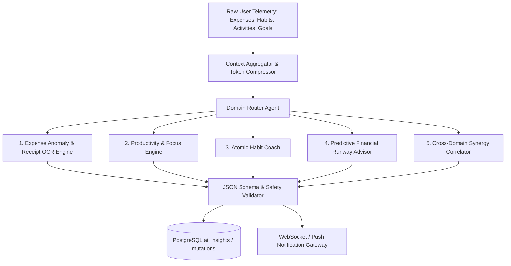

# SECTION 14: AI SYSTEM DESIGN & MULTI-AGENT ARCHITECTURE

### 14.1 Intelligent Copilot Architecture
The AI subsystem in LifeTrack Pro operates as an asynchronous, deterministic synthesis engine rather than an unconstrained chatbot. It is comprised of 5 specialized micro-engines:



### 14.2 Prompt Engineering Architecture & JSON Schema Enforcement
All OpenAI API calls enforce **Structured Outputs** (`response_format: { type: "json_schema" }`) ensuring 100% deterministic parsing by the backend.

```python
# apps/ai_copilot/prompts.py
HABIT_COACH_SYSTEM_PROMPT = """
You are the LifeTrack Pro Autonomous Behavioral Coach.
Your purpose is to analyze the user's weekly habit adherence, friction logs, and energy scores
to deliver ONE concise, evidence-based habit modification recommendation.

Guidelines:
1. Apply the principles of Atomic Habits (cue, craving, response, reward) and behavioral economics.
2. If completion is below 40%, recommend reducing the habit's minimum threshold (scale down).
3. If friction is high (> 4), recommend habit-stacking after an established anchor habit.
4. Output must strictly conform to the provided JSON Schema.
"""

HABIT_COACH_JSON_SCHEMA = {
    "name": "habit_recommendation",
    "strict": True,
    "schema": {
        "type": "object",
        "properties": {
            "habit_id": {"type": "string"},
            "title": {"type": "string"},
            "diagnosis": {"type": "string"},
            "action_type": {"type": "string", "enum": ["scale_down", "reschedule", "habit_stack", "celebrate"]},
            "suggested_payload": {
                "type": "object",
                "properties": {
                    "new_target_value": {"type": "number"},
                    "new_preferred_time": {"type": "string"},
                    "anchor_habit_name": {"type": "string"}
                },
                "additionalProperties": False,
                "required": ["new_target_value", "new_preferred_time", "anchor_habit_name"]
            }
        },
        "additionalProperties": False,
        "required": ["habit_id", "title", "diagnosis", "action_type", "suggested_payload"]
    }
}
```

### 14.3 Token Cost & Latency Optimization
1. **Context Compression:** Pre-aggregate 30-day telemetry into numeric vectors before injecting into system prompts, reducing token consumption by ~85% compared to raw JSON transaction dumps.
2. **Model Tiering:**
   - Rapid Text Parsing & OCR: `gpt-4o-mini` (Ultra-fast, < 800ms latency, $0.15/1M input tokens).
   - Deep Weekly Correlation & Financial Modeling: `gpt-4o` (High reasoning, scheduled weekly via Celery).
3. **Semantic Response Caching:** Hash the input telemetry vector with SHA-256; if the weekly telemetry has not changed, serve cached insights from Redis directly.

---

# SECTION 15: REDIS ARCHITECTURE & CACHE STRATEGY

### 15.1 Dedicated Redis Key Taxonomy
LifeTrack Pro runs Redis 7.2+ with strict namespacing and TTL (Time-To-Live) enforcement:

| Key Pattern | Data Structure | TTL | Purpose | Invalidation Event |
| :--- | :--- | :--- | :--- | :--- |
| `session:{user_id}:{token_hash}` | String (JSON) | 14 days | Active refresh token & device fingerprint | Logout or security revocation |
| `ratelimit:{ip_or_user}:{endpoint}` | String (Counter) | 60 sec | Sliding-window token bucket | Natural expiration |
| `user:prefs:{user_id}` | Hash | 24 hours | Cached currency, timezone, theme | User updates settings |
| `finance:summary:{user_id}:{year}:{month}` | Hash | 1 hour | Monthly spend total and burn rate | New expense created, edited, deleted |
| `habits:streaks:{user_id}` | Hash | 12 hours | Current & longest streaks per habit | Habit checked off or frozen |
| `leaderboard:global_discipline` | Sorted Set (ZSET) | 1 hour | Opt-in community consistency rank | Scheduled hourly aggregation |

### 15.2 Cache Invalidation Architecture
Instead of sweeping cache purges, LifeTrack Pro employs **Granular Key Invalidation via Django Signals**:
```python
# apps/expenses/signals.py
from django.db.models.signals import post_save, post_delete
from django.dispatch import receiver
from django.core.cache import cache
from .models import Expense

@receiver([post_save, post_delete], sender=Expense)
def invalidate_expense_caches(sender, instance, **kwargs):
    user_id = str(instance.user_id)
    year = instance.transaction_date.year
    month = instance.transaction_date.month
    
    # Invalidate specific user monthly summary
    cache.delete(f"finance:summary:{user_id}:{year}:{month}")
    cache.delete(f"dashboard:synergy:{user_id}")
```

---

# SECTION 16: CELERY WORKER ARCHITECTURE & ASYNCHRONOUS TASKS

### 16.1 Distributed Worker Queues
Celery tasks are partitioned into dedicated priority queues to prevent heavy background reporting from blocking latency-critical transactional notifications:
* `queue_high`: User-initiated actions (MFA emails, receipt OCR, password reset tokens).
* `queue_default`: Standard async workflows (currency exchange sync, goal velocity recalculation).
* `queue_low_reports`: Heavy batch jobs (PDF dossier rendering, monthly database partitioning).
* `queue_ai`: Scheduled OpenAI API queries and insight generation.

### 16.2 Scheduled Periodic Tasks (Celery Beat Matrix)
```python
# config/celery.py
from celery.schedules import crontab

CELERY_BEAT_SCHEDULE = {
    'daily-midnight-habit-evaluation': {
        'task': 'apps.habits.tasks.evaluate_daily_streaks_task',
        'schedule': crontab(hour=0, minute=5), # 00:05 UTC daily
    },
    'generate-upcoming-database-partitions': {
        'task': 'apps.core.tasks.maintain_database_partitions_task',
        'schedule': crontab(hour=2, minute=0, day_of_month=1), # 1st of month
    },
    'fetch-daily-exchange-rates': {
        'task': 'apps.expenses.tasks.sync_fx_rates_task',
        'schedule': crontab(hour=6, minute=0), # 06:00 UTC daily
    },
    'weekly-ai-dossier-compilation': {
        'task': 'apps.analytics.tasks.generate_weekly_dossiers_task',
        'schedule': crontab(hour=20, minute=0, day_of_week=0), # Sunday 20:00 UTC
    },
    'purge-revoked-sessions': {
        'task': 'apps.authentication.tasks.cleanup_expired_sessions_task',
        'schedule': crontab(hour=3, minute=30), # Daily maintenance
    }
}
```

---

# SECTION 17: SECURITY, GOVERNANCE & COMPLIANCE

### 17.1 Cryptographic Identity & Password Hashing
* **Password Hashing:** **Argon2id** (RFC 9106) configured with parameters: `time_cost=3`, `memory_cost=65536` (64MB), `parallelism=4`. This provides maximum resistance against GPU/ASIC brute-force cracking.
* **Token Architecture:**
  - Access Tokens: RS256 asymmetric signing. Backend services verify token validity using the public key without making round-trip database or cache queries.
  - Refresh Tokens: 256-bit cryptographically secure pseudorandom strings (CSPRNG), hashed with SHA-256 before storage in database and Redis.

### 17.2 Defense-in-Depth & OWASP Mitigation Matrix
1. **Injection (SQL & NoSQL):** 100% parameterized queries via Django ORM and raw queries utilizing explicit `%s` parameter bindings. Zero raw string concatenation.
2. **Broken Object-Level Authorization (BOLA / IDOR):** All database query sets filter unconditionally on `request.user.id`. Row-Level Security (RLS) policies in PostgreSQL enforce tenant isolation at the database layer.
3. **Cross-Site Scripting (XSS):** React JSX escapes variables by default; `Content-Security-Policy` header restricts script execution:
   ```http
   Content-Security-Policy: default-src 'self'; script-src 'self'; style-src 'self' 'unsafe-inline'; img-src 'self' data: https://s3.amazonaws.com; font-src 'self'; connect-src 'self' https://api.lifetrackpro.com wss://api.lifetrackpro.com;
   ```
4. **Cross-Site Request Forgery (CSRF):** SameSite=Strict cookies enforced; state-changing mutations require valid custom headers (`X-Requested-With: XMLHttpRequest`).
5. **Data at Rest Encryption:** Sensitive fields (e.g., MFA secrets, OAuth tokens) are encrypted at the application layer using AES-256-GCM via the `cryptography` Python library before writing to disk.

### 17.3 GDPR & Privacy-First Architecture
* **Right of Access (Article 15):** One-click data export compiles user records into an encrypted ZIP containing structured CSVs and raw JSON within 10 minutes.
* **Right to Erasure (Article 17):** Account deletion executes an immediate database transaction deleting user rows, clearing Redis keys, and submitting an asynchronous S3 job to delete uploaded receipts.
