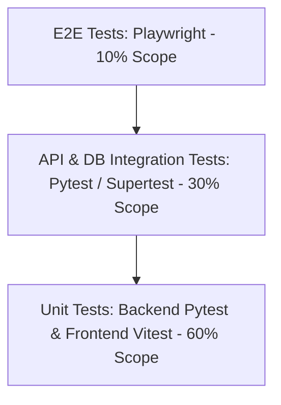
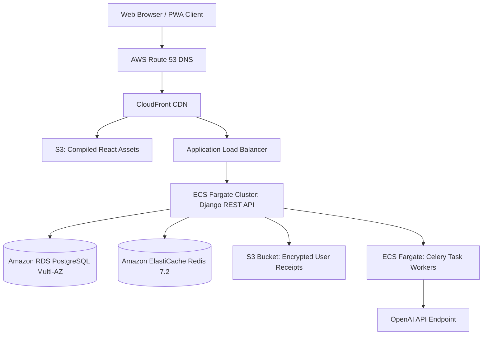
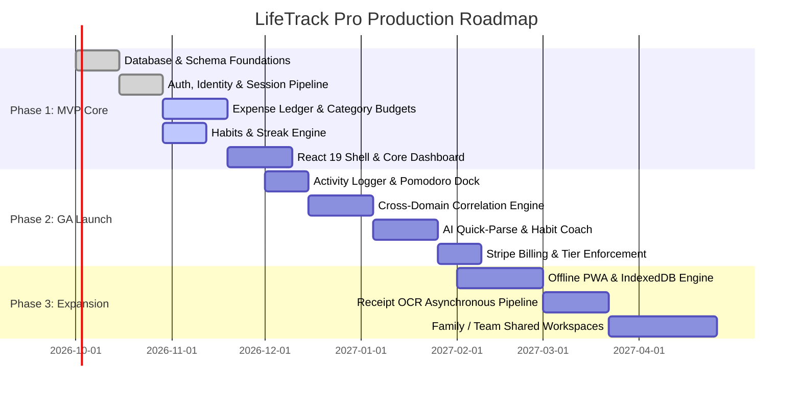

# SECTION 18: QUALITY ASSURANCE & TESTING STRATEGY

### 18.1 Testing Pyramid & Coverage Thresholds
LifeTrack Pro enforces strict automated testing gates across the development lifecycle:



* **Coverage Mandate:** Minimum **85% line coverage** and **80% branch coverage** enforced via CI pipelines before merge to `main`.
* **Automated Quality Gates:**
  1. **Backend Unit & Service Tests:** `pytest --cov=apps --cov-fail-under=85`
  2. **API Integration Tests:** Complete request-response verification with live PostgreSQL and Redis test containers.
  3. **Frontend Component & Store Tests:** Vitest + React Testing Library verifying user interactions and optimistic state.
  4. **End-to-End (E2E) Browser Suites:** Playwright executing headless Chromium/Firefox tests against critical paths (Onboarding, Expense Logging, Habit Checkoff, Checkout).
  5. **Load & Stress Testing:** k6 performance scripts targeting 1,500 requests/sec with p99 latency < 200ms.
  6. **Static Analysis & Security Scans:** `ruff` (Python linting), `mypy` (strict typing), `Bandit` (Python AST security scan), and `Trivy` (container vulnerability scanning).

---

# SECTION 19: DEVOPS, INFRASTRUCTURE & CLOUD ARCHITECTURE

### 19.1 Multi-Stage Production Dockerfile (Backend Example)
```dockerfile
# backend/Dockerfile
FROM python:3.12-slim-bookworm AS builder

ENV PYTHONUNBUFFERED=1 \
    PYTHONDONTWRITEBYTECODE=1 \
    PIP_NO_CACHE_DIR=off

WORKDIR /build

RUN apt-get update && apt-get install -y --no-install-recommends \
    build-essential \
    libpq-dev \
    curl \
    && rm -rf /var/lib/apt/lists/*

COPY requirements/prod.txt requirements.txt
RUN pip install --prefix=/install -r requirements.txt

# Final Distroless-Style Production Image
FROM python:3.12-slim-bookworm AS runner

WORKDIR /app

RUN apt-get update && apt-get install -y --no-install-recommends \
    libpq5 \
    curl \
    && rm -rf /var/lib/apt/lists/* \
    && addgroup --system --gid 1001 appgroup \
    && adduser --system --uid 1001 --gid 1001 appuser

COPY --from=builder /install /usr/local
COPY . /app

USER appuser
EXPOSE 8000

HEALTHCHECK --interval=15s --timeout=3s --retries=3 \
  CMD curl -f http://localhost:8000/api/v1/health/ || exit 1

CMD ["gunicorn", "config.wsgi:application", "--bind", "0.0.0.0:8000", "--workers", "4", "--threads", "2"]
```

### 19.2 Production Docker Compose Stack
```yaml
version: '3.8'

services:
  postgres:
    image: postgres:16-alpine
    restart: unless-stopped
    environment:
      POSTGRES_DB: lifetrack_pro
      POSTGRES_USER: ${DB_USER:-lifetrack}
      POSTGRES_PASSWORD: ${DB_PASSWORD:-secure_db_pass}
    volumes:
      - postgres_data:/var/lib/postgresql/data
    ports:
      - "5432:5432"
    healthcheck:
      test: ["CMD-SHELL", "pg_isready -U lifetrack -d lifetrack_pro"]
      interval: 5s
      timeout: 5s
      retries: 5

  redis:
    image: redis:7.2-alpine
    restart: unless-stopped
    command: ["redis-server", "--appendonly", "yes", "--requirepass", "${REDIS_PASSWORD:-secure_redis_pass}"]
    volumes:
      - redis_data:/data
    ports:
      - "6379:6379"
    healthcheck:
      test: ["CMD", "redis-cli", "ping"]
      interval: 5s
      timeout: 3s
      retries: 5

  api:
    build:
      context: ./backend
      dockerfile: Dockerfile
    restart: unless-stopped
    environment:
      - DATABASE_URL=postgres://${DB_USER:-lifetrack}:${DB_PASSWORD:-secure_db_pass}@postgres:5432/lifetrack_pro
      - REDIS_URL=redis://:${REDIS_PASSWORD:-secure_redis_pass}@redis:6379/0
      - DJANGO_SETTINGS_MODULE=config.settings.production
      - SECRET_KEY=${DJANGO_SECRET_KEY}
    depends_on:
      postgres:
        condition: service_healthy
      redis:
        condition: service_healthy
    ports:
      - "8000:8000"

  celery_worker:
    build:
      context: ./backend
      dockerfile: Dockerfile
    command: ["celery", "-A", "config", "worker", "-l", "info", "-Q", "queue_high,queue_default"]
    restart: unless-stopped
    depends_on:
      - api
      - redis

  celery_beat:
    build:
      context: ./backend
      dockerfile: Dockerfile
    command: ["celery", "-A", "config", "beat", "-l", "info"]
    restart: unless-stopped
    depends_on:
      - api
      - redis

volumes:
  postgres_data:
  redis_data:
```

### 19.3 AWS Cloud Architecture Overview


---

# SECTION 20: PRODUCT & BUSINESS TELEMETRY

### 20.1 Core Metric Definitions
1. **Financial Velocity Index (FVI):** `(Net Monthly Savings Cents) / (Total Income Cents) * 100`.
2. **Habit Consistency Rate (HCR):** `(Completions in 30 Days) / (Scheduled Target Days) * 100`.
3. **Synergy Multiplier:** Ratio correlating days with high physical activity to days under budget.

### 20.2 Standardized Event Naming Convention
All client and server telemetry events adhere to the **`object:action`** standard (Segment / PostHog compatible):
* `user:signed_up`: `{ method: 'google_oauth', referral_source: 'linkedin' }`
* `expense:recorded`: `{ currency: 'USD', amount_cents: 4500, category_id: '...', is_recurring: false }`
* `habit:checked`: `{ habit_id: '...', streak: 12, friction_rating: 1 }`
* `goal:milestone_reached`: `{ goal_id: '...', percentage: 50, days_ahead_of_pace: 4 }`
* `ai_insight:interacted`: `{ insight_id: '...', action_taken: 'accepted' }`

---

# SECTION 21: DEVELOPMENT ROADMAP & PHASING



---

# SECTION 22: COMPLETE PRODUCTION PROJECT TREE

```text
LifeMetrics/
├── .github/
│   └── workflows/
│       ├── ci.yml                 # Lint, Typecheck, Pytest, Vitest
│       ├── e2e.yml                # Playwright headless test runs
│       └── deploy.yml             # AWS ECS Fargate automated deployment
├── backend/
│   ├── Dockerfile
│   ├── manage.py
│   ├── requirements/
│   │   ├── base.txt
│   │   ├── dev.txt
│   │   └── prod.txt
│   ├── config/
│   │   ├── settings/
│   │   │   ├── base.py
│   │   │   ├── production.py
│   │   │   └── testing.py
│   │   ├── asgi.py
│   │   ├── wsgi.py
│   │   ├── urls.py
│   │   └── celery.py
│   └── apps/
│       ├── authentication/
│       ├── users/
│       ├── expenses/
│       ├── habits/
│       ├── activities/
│       ├── goals/
│       ├── analytics/
│       ├── ai_copilot/
│       └── core/
├── frontend/
│   ├── Dockerfile
│   ├── package.json
│   ├── tsconfig.json
│   ├── vite.config.ts
│   ├── tailwind.config.js
│   ├── public/
│   └── src/
│       ├── components/
│       ├── hooks/
│       ├── stores/
│       ├── services/
│       ├── routes/
│       ├── types/
│       └── App.tsx
├── infrastructure/
│   ├── terraform/                 # AWS VPC, ECS, RDS, S3 definitions
│   └── docker-compose.yml
└── docs/
    └── LIFE_TRACK_PRO_SDS.md      # Master Production Blueprint
```

---

# SECTION 23: IMPLEMENTATION SEQUENCE & COMPLEXITY ESTIMATES

| Sequence | Domain Phase | Core Deliverables | Estimated Hours | Complexity | Primary Risk & Mitigation |
| :---: | :--- | :--- | :---: | :---: | :--- |
| **01** | **Identity & RBAC** | PostgreSQL User schema, Argon2id, JWT sessions, Redis token storage, TOTP MFA. | 60 hrs | Medium | Token replay attacks -> Mitigated via Redis-backed refresh token rotation. |
| **02** | **Expense Ledger** | Partitioned `expenses` table, Category manager, multi-currency conversion, CRUD APIs. | 85 hrs | High | Floating-point rounding errors -> Mitigated via strict `BIGINT` minor unit (cents). |
| **03** | **Budget Engine** | Envelope budget models, rollover logic, burn-rate calculation views. | 50 hrs | Medium | Edge cases in monthly date boundaries -> Normalized via UTC date arithmetic. |
| **04** | **Habit Engine** | Habit schedules, streak ledger, freeze tokens, atomic check-off endpoint. | 65 hrs | High | Race conditions in streak updates -> Mitigated via database row-level locking (`select_for_update`). |
| **05** | **Activity Logger** | Session tracking, Pomodoro focus timer, RPE score records. | 40 hrs | Small | Tab background timer drift -> Mitigated via Web Worker high-resolution timestamps. |
| **06** | **Goal Pacing** | Objective tree, live telemetry binding, linear velocity forecasting. | 55 hrs | Medium | Performance lag on recursive goal queries -> Cached via Redis. |
| **07** | **Analytics Engine** | PostgreSQL correlation window queries, scatter plot serialization, weekly report generator. | 90 hrs | High | Heavy query lockups -> Offloaded to read replica and pre-computed Celery rollups. |
| **08** | **AI Copilot** | OpenAI prompt pipelines, JSON schema validator, quick-parse natural language ingestion. | 75 hrs | High | LLM hallucination / schema violations -> Enforced via strict OpenAI Structured Outputs. |
| **09** | **React Frontend** | Design system token setup, TanStack Query integration, virtualized data tables, Glassmorphic UI. | 140 hrs | High | Client-side memory leaks on large tables -> Virtualized via TanStack Table. |
| **10** | **DevOps & Deploy** | Multi-stage Dockerfiles, Docker Compose, GitHub Actions CI/CD, AWS ECS/RDS setup. | 80 hrs | High | Database migration downtime -> Zero-downtime Blue/Green deployments. |
| **TOTAL** | **Full Production** | **Complete Production-Ready LifeTrack Pro Platform** | **740 hrs** | **Enterprise** | **End-to-end integration and rigorous automated test gates.** |
